# 🌉 MCP SSH Bridge

<div align="center">

[](https://github.com/muchiny/mcp-ssh-bridge/actions/workflows/ci.yml)
[](https://github.com/muchiny/mcp-ssh-bridge/actions/workflows/release.yml)
[](https://crates.io/crates/mcp-ssh-bridge)
[](LICENSE)
[](https://modelcontextprotocol.io)
[](https://www.rust-lang.org)

**A Rust MCP (Model Context Protocol) server that enables Claude Code to securely execute commands on air-gapped environments via SSH. 197 tools for DevOps, Docker, Kubernetes, databases, Windows Server, and more.**

[What is this?](#-what-is-this) · [Quick Start](#-quick-start) · [Features](#-features) · [Configuration](#️-configuration) · [Security](#-security) · [Tools (197)](#-tools-197) · [Development](#️-development)

</div>

---

## 🤔 What is this?

**MCP SSH Bridge** acts as a secure gateway between **Claude Code** (or any MCP client) and your **remote servers**.

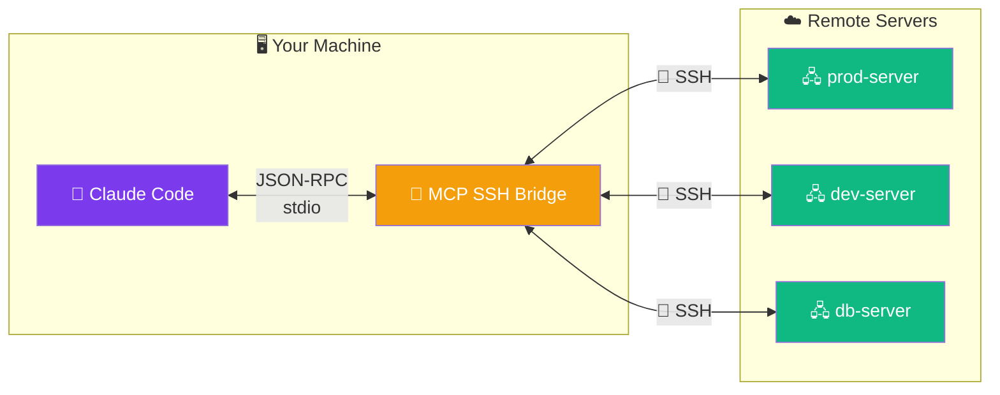

### 💡 In simple terms

| Without MCP SSH Bridge | With MCP SSH Bridge |
|------------------------|---------------------|
| ❌ Claude cannot access your servers | ✅ Claude can execute commands on your servers |
| ❌ You must copy/paste outputs manually | ✅ Claude reads outputs directly |
| ❌ No file transfer capability | ✅ Upload/download files seamlessly |
| ❌ No system monitoring | ✅ Real-time metrics (CPU, RAM, disk) |
| ❌ No Windows server management | ✅ 74 Windows tools (services, IIS, AD, Hyper-V, etc.) |

### 🎯 Use Cases

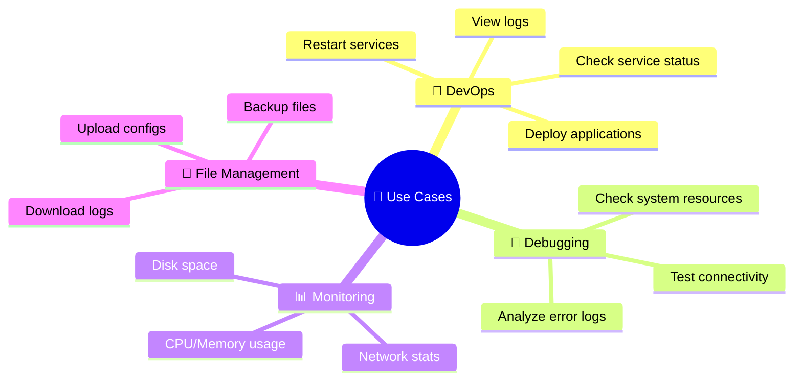

> [!IMPORTANT]
> **Security first**: All commands pass through whitelist/blacklist validation. Sensitive data (passwords, API keys) is automatically masked in outputs.

---

## ⚡ Quick Start

### Install

**Option A** — From crates.io:

```bash
cargo install mcp-ssh-bridge
```

**Option B** — From source:

```bash
git clone https://github.com/muchiny/mcp-ssh-bridge && cd mcp-ssh-bridge
make release
```

**Option C** — Download prebuilt binary from [GitHub Releases](https://github.com/muchiny/mcp-ssh-bridge/releases/latest) (Linux, macOS, Windows).

**Option D** — Docker:

```bash
docker pull ghcr.io/muchiny/mcp-ssh-bridge:latest
```

### Step 2 - Configure

```bash
mkdir -p ~/.config/mcp-ssh-bridge
cp config/config.example.yaml ~/.config/mcp-ssh-bridge/config.yaml
```

Edit `config.yaml` with your SSH hosts (see [Configuration](#️-configuration) below).

### Step 3 - Add to Claude Code

Add to `~/.claude/settings.json`:

```json
{
  "mcpServers": {
    "ssh-bridge": {
      "command": "/path/to/mcp-ssh-bridge/target/release/mcp-ssh-bridge"
    }
  }
}
```

> [!TIP]
> Verify your SSH connection first: `ssh user@host "echo OK"`

---

## 🎯 Features

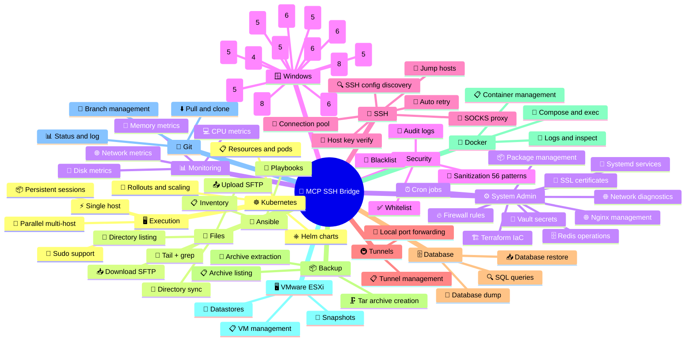

<details>
<summary><strong>📋 Full features list (click to expand)</strong></summary>

| Feature | Description |
|---------|-------------|
| ⚡ **Command Execution** | Execute commands on configured remote hosts |
| 🔄 **Parallel Execution** | Execute a command on multiple hosts simultaneously |
| 📤 **File Transfer** | Upload and download via SFTP (streaming, no size limit, SHA256 checksum) |
| 📄 **File Reading** | Tail with grep filtering on remote files |
| 📊 **System Metrics** | CPU, memory, disk, network, load as structured JSON |
| 🌐 **Multi-Host Metrics** | Parallel metrics collection with rayon parsing |
| 📦 **Persistent Sessions** | Interactive shell with persistent state (cwd, env) |
| 📜 **History** | View executed command history |
| 💬 **MCP Prompts** | Pre-defined templates (diagnostics, deployment, audit) |
| 📂 **MCP Resources** | Direct access via URI (metrics://, file://, log://) |
| 🏰 **Jump Hosts** | Connect via bastion/proxy with `proxy_jump` |
| 🧦 **SOCKS Proxy** | Connect through SOCKS4/5 proxy with `socks_proxy` |
| 🔒 **Security** | Command whitelist/blacklist, output sanitization |
| 🔐 **Host Key Verification** | MITM protection via ~/.ssh/known_hosts |
| 🔑 **SSH Agent** | Support for ssh-agent authentication |
| 🔄 **Connection Pool** | SSH connection reuse for better performance |
| 🔁 **Auto Retry** | Reconnection with exponential backoff |
| ⏱️ **Rate Limiting** | Per-host rate limiting (Token Bucket) |
| 🔥 **Hot-Reload** | Automatic configuration reload |
| 🚀 **Concurrent** | Parallel MCP request processing |
| ✂️ **Smart Truncation** | Head+tail for large outputs (20K chars) |
| 🔑 **Sudo Support** | Execute commands with sudo (configurable password per host) |
| 🔄 **Directory Sync** | Recursive directory upload/download via SFTP |
| 📂 **Directory Listing** | Structured directory listings with recursive support |
| 🚇 **SSH Tunnels** | Local port forwarding with tunnel lifecycle management |
| 🗄️ **Database Tools** | Execute SQL queries, dump/restore MySQL and PostgreSQL |
| 📦 **Backup & Restore** | Create/list/extract tar archives with optional compression |
| ⚙️ **Tool Groups** | Enable/disable tool groups to reduce LLM context |
| 🔍 **SSH Config Discovery** | Auto-discover hosts from ~/.ssh/config (enabled by default) |
| 🐳 **Docker Support** | Ready-made Docker image for containerized deployment |
| 🪟 **Windows Support** | 74 tools for Windows Server (services, events, AD, IIS, Hyper-V, etc.) |

</details>

---

## 🏗️ Architecture

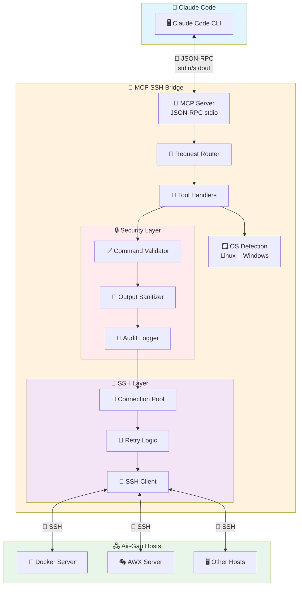

---

## ⚙️ Configuration

Create `~/.config/mcp-ssh-bridge/config.yaml`:

```yaml
# 🖧 SSH Hosts
hosts:
  my-server:
    hostname: 192.168.1.100
    port: 22
    user: admin
    auth:
      type: key
      path: ~/.ssh/id_ed25519
    description: "Production server"

# 🔒 Security
security:
  mode: strict  # strict = whitelist only, permissive = all except blacklist
  whitelist:
    - "^docker (ps|logs|inspect).*"
    - "^kubectl (get|describe|logs).*"
    - "^ls.*"
    - "^cat /var/log/.*"
  blacklist:
    - "rm -rf /"
    - "mkfs"
    - "chmod 777"

# ⏱️ Limits
limits:
  command_timeout_seconds: 60
  connection_timeout_seconds: 10
  retry_attempts: 3
```

> [!TIP]
> See [`config/config.example.yaml`](config/config.example.yaml) for the full configuration reference with all options (audit, sessions, tool groups, etc.).

### 🔑 Authentication

| Method | Config | Recommended |
|--------|--------|-------------|
| 🔑 **SSH Key** | `type: key` + `path: ~/.ssh/id_ed25519` | ⭐⭐⭐ Yes |
| 🤖 **SSH Agent** | `type: agent` (uses `SSH_AUTH_SOCK`) | ⭐⭐⭐ Yes |
| 🔒 **Password** | `type: password` + `password: "..."` | ⭐ Avoid |

### 🔐 Security Modes

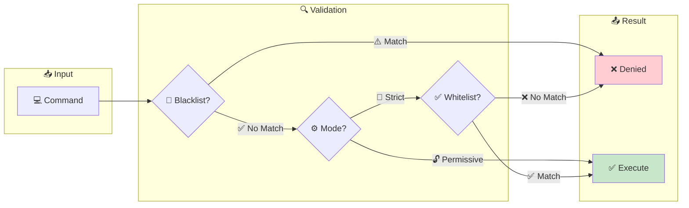

| Mode | Description |
|------|-------------|
| 🔐 **Strict** (recommended) | Only commands matching the whitelist are allowed |
| 🔓 **Permissive** | All commands allowed except blacklist |

### 🔧 Advanced Configuration

<details>
<summary><strong>🏰 Jump Hosts (Bastion)</strong></summary>

Connect to internal hosts via a bastion server.

```yaml
hosts:
  bastion:
    hostname: bastion.example.com
    port: 22
    user: admin
    auth:
      type: agent

  internal-server:
    hostname: 10.0.0.5  # Private IP
    port: 22
    user: deploy
    proxy_jump: bastion  # Go through bastion
    auth:
      type: key
      path: ~/.ssh/id_ed25519
```

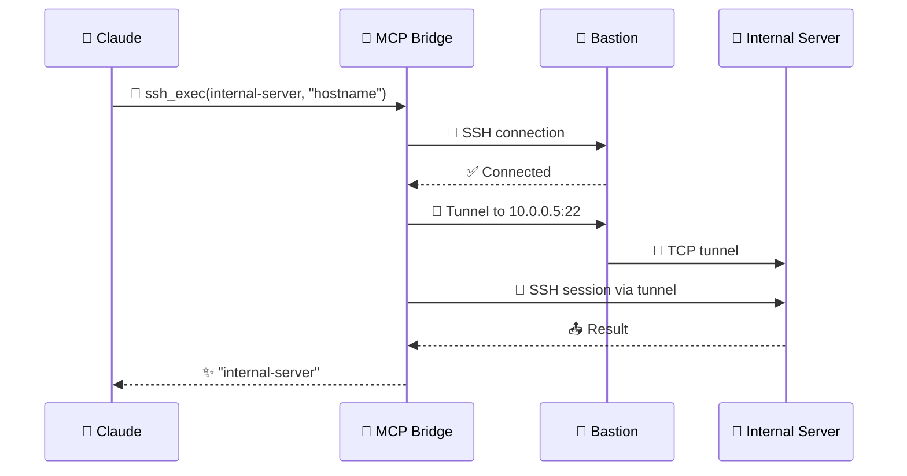

</details>

<details>
<summary><strong>🧦 SOCKS Proxy</strong></summary>

Connect to SSH hosts through a SOCKS4 or SOCKS5 proxy server.

```yaml
hosts:
  remote-via-proxy:
    hostname: 10.0.0.5
    port: 22
    user: deploy
    socks_proxy:
      hostname: proxy.example.com
      port: 1080             # Default: 1080
      version: socks5        # socks5 (default) or socks4
      # username: proxyuser  # Optional (SOCKS5 only)
      # password: proxypass  # Optional (SOCKS5 only)
    auth:
      type: key
      path: ~/.ssh/id_ed25519
```

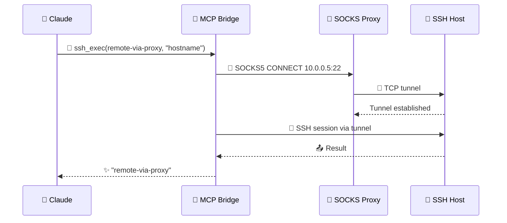

> [!CAUTION]
> `proxy_jump` and `socks_proxy` are mutually exclusive on the same host.

</details>

<details>
<summary><strong>⚙️ Tool Groups (reduce LLM context)</strong></summary>

Disable tool groups you don't need to reduce the MCP context sent to the LLM:

```yaml
tool_groups:
  groups:
    sessions: false      # Disable persistent shell sessions
    monitoring: false     # Disable metrics and tail tools
    tunnels: false        # Disable SSH port forwarding
    database: false       # Disable database tools
    backup: false         # Disable backup tools
```

#### Linux Groups (25 groups, 123 tools)

| Group | Tools |
|-------|-------|
| `core` | ssh_exec, ssh_exec_multi, ssh_status, ssh_health, ssh_history, ssh_output_fetch |
| `file_transfer` | ssh_upload, ssh_download, ssh_sync |
| `sessions` | ssh_session_create, ssh_session_exec, ssh_session_list, ssh_session_close |
| `monitoring` | ssh_metrics, ssh_metrics_multi, ssh_tail, ssh_disk_usage |
| `tunnels` | ssh_tunnel_create, ssh_tunnel_list, ssh_tunnel_close |
| `directory` | ssh_ls, ssh_find |
| `database` | ssh_db_query, ssh_db_dump, ssh_db_restore |
| `backup` | ssh_backup_create, ssh_backup_list, ssh_backup_restore |
| `docker` | ssh_docker_ps, ssh_docker_logs, ssh_docker_inspect, ssh_docker_exec, ssh_docker_compose, ssh_docker_images, ssh_docker_stats, ssh_docker_network_ls, ssh_docker_network_inspect, ssh_docker_volume_ls, ssh_docker_volume_inspect |
| `esxi` | ssh_esxi_vm_list, ssh_esxi_vm_info, ssh_esxi_vm_power, ssh_esxi_snapshot, ssh_esxi_host_info, ssh_esxi_datastore_list, ssh_esxi_network_list |
| `git` | ssh_git_status, ssh_git_log, ssh_git_diff, ssh_git_pull, ssh_git_clone, ssh_git_branch, ssh_git_checkout |
| `kubernetes` | ssh_k8s_get, ssh_k8s_logs, ssh_k8s_describe, ssh_k8s_apply, ssh_k8s_delete, ssh_k8s_rollout, ssh_k8s_scale, ssh_k8s_exec, ssh_k8s_top, ssh_helm_list, ssh_helm_status, ssh_helm_upgrade, ssh_helm_install, ssh_helm_rollback, ssh_helm_history, ssh_helm_uninstall |
| `ansible` | ssh_ansible_playbook, ssh_ansible_inventory, ssh_ansible_adhoc |
| `systemd` | ssh_service_status, ssh_service_start, ssh_service_stop, ssh_service_restart, ssh_service_list, ssh_service_logs, ssh_service_daemon_reload, ssh_service_enable, ssh_service_disable |
| `network` | ssh_net_connections, ssh_net_interfaces, ssh_net_routes, ssh_net_ping, ssh_net_traceroute, ssh_net_dns |
| `process` | ssh_process_list, ssh_process_kill, ssh_process_top |
| `package` | ssh_pkg_list, ssh_pkg_search, ssh_pkg_install, ssh_pkg_update, ssh_pkg_remove |
| `firewall` | ssh_firewall_status, ssh_firewall_list, ssh_firewall_allow, ssh_firewall_deny |
| `cron` | ssh_cron_list, ssh_cron_add, ssh_cron_remove |
| `certificates` | ssh_cert_check, ssh_cert_info, ssh_cert_expiry |
| `nginx` | ssh_nginx_status, ssh_nginx_test, ssh_nginx_reload, ssh_nginx_list_sites |
| `redis` | ssh_redis_info, ssh_redis_cli, ssh_redis_keys |
| `terraform` | ssh_terraform_init, ssh_terraform_plan, ssh_terraform_apply, ssh_terraform_state, ssh_terraform_output |
| `vault` | ssh_vault_status, ssh_vault_read, ssh_vault_list, ssh_vault_write |
| `config` | ssh_config_get, ssh_config_set |

#### Windows Groups (13 groups, 74 tools)

| Group | Tools |
|-------|-------|
| `windows_services` | ssh_win_service_list, ssh_win_service_status, ssh_win_service_start, ssh_win_service_stop, ssh_win_service_restart, ssh_win_service_enable, ssh_win_service_disable, ssh_win_service_config |
| `windows_events` | ssh_win_event_query, ssh_win_event_logs, ssh_win_event_sources, ssh_win_event_tail, ssh_win_event_export |
| `active_directory` | ssh_ad_user_list, ssh_ad_user_info, ssh_ad_group_list, ssh_ad_group_members, ssh_ad_computer_list, ssh_ad_domain_info |
| `scheduled_tasks` | ssh_schtask_list, ssh_schtask_info, ssh_schtask_run, ssh_schtask_enable, ssh_schtask_disable |
| `windows_firewall` | ssh_win_firewall_status, ssh_win_firewall_list, ssh_win_firewall_allow, ssh_win_firewall_deny, ssh_win_firewall_remove |
| `iis` | ssh_iis_list_sites, ssh_iis_list_pools, ssh_iis_status, ssh_iis_start, ssh_iis_stop, ssh_iis_restart |
| `windows_updates` | ssh_win_update_list, ssh_win_update_search, ssh_win_update_install, ssh_win_update_history, ssh_win_update_reboot |
| `windows_perf` | ssh_win_perf_overview, ssh_win_perf_cpu, ssh_win_perf_memory, ssh_win_perf_disk, ssh_win_perf_network, ssh_win_disk_usage |
| `hyperv` | ssh_hyperv_vm_list, ssh_hyperv_vm_info, ssh_hyperv_vm_start, ssh_hyperv_vm_stop, ssh_hyperv_host_info, ssh_hyperv_switch_list, ssh_hyperv_snapshot_list, ssh_hyperv_snapshot_create |
| `windows_registry` | ssh_reg_query, ssh_reg_list, ssh_reg_set, ssh_reg_delete, ssh_reg_export |
| `windows_features` | ssh_win_feature_list, ssh_win_feature_info, ssh_win_feature_install, ssh_win_feature_remove |
| `windows_network` | ssh_win_net_ip, ssh_win_net_adapters, ssh_win_net_connections, ssh_win_net_routes, ssh_win_net_ping, ssh_win_net_dns |
| `windows_process` | ssh_win_process_list, ssh_win_process_top, ssh_win_process_info, ssh_win_process_by_name, ssh_win_process_kill |

> [!NOTE]
> All groups are enabled by default. Disable unused groups to reduce the MCP context sent to the LLM.

</details>

<details>
<summary><strong>🔍 SSH Config Auto-Discovery</strong></summary>

Automatically discover hosts from your `~/.ssh/config`. **Enabled by default** — no configuration needed.

```yaml
ssh_config:
  enabled: true            # Default: true
  # path: ~/.ssh/config    # Default path
  exclude:
    - personal-server      # Skip this host
```

Discovered hosts are merged with YAML-defined hosts (YAML takes precedence). Discovered hosts use `AcceptNew` host key verification by default.

</details>

<details>
<summary><strong>🔄 Connection Pool & Retry</strong></summary>

**Connection Pool** — SSH connections are reused automatically:

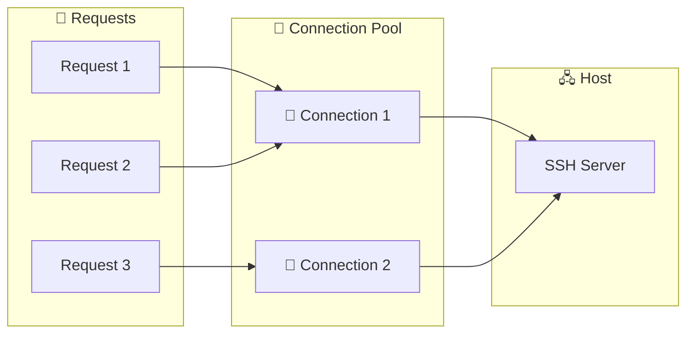

| Parameter | Default | Description |
|-----------|---------|-------------|
| 🔢 Max connections/host | 5 | Limit per host |
| ⏰ Max idle | 5 min | Close if inactive |
| 📅 Max age | 1 hour | Forced reconnection |

**Auto Retry** — Exponential backoff for transient errors:

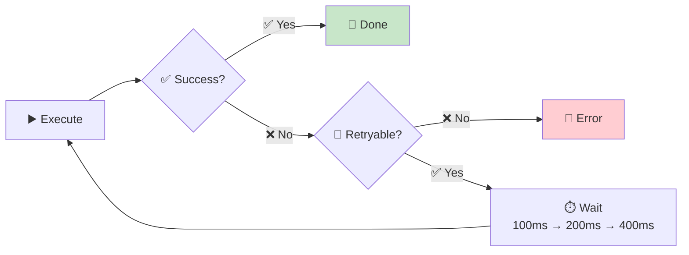

Retryable errors: connection lost, timeout, channel error.

</details>

---

## 🔒 Security

### 🔐 Host Key Verification

Protection against MITM (Man-in-the-Middle) attacks via `~/.ssh/known_hosts`.

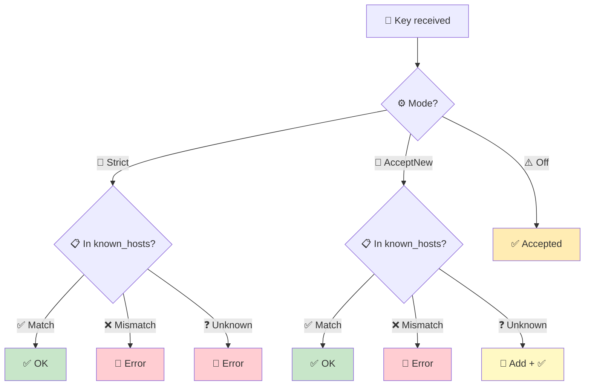

| Mode | Behavior |
|------|----------|
| 🔐 **Strict** (default) | Rejects unknown hosts and modified keys |
| 📝 **AcceptNew** | Accepts new hosts, rejects modifications |
| ⚠️ **Off** | Accepts all (testing only!) |

> [!TIP]
> If you get "Unknown host key", add the key: `ssh-keyscan hostname >> ~/.ssh/known_hosts`

### 🧹 Output Sanitization

Outputs are automatically cleaned to mask **56 types of secrets**:

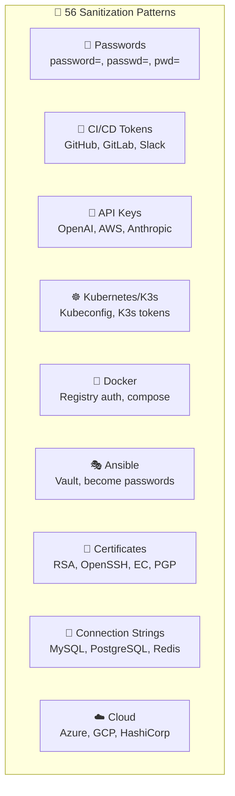

**⚡ Optimized Architecture**:

- 🔍 **Aho-Corasick**: Fast keyword detection
- 📋 **RegexSet**: Single-pass match detection
- 🚀 **Zero-copy**: `Cow<str>` when no secrets found
- 🔄 **Rayon**: Parallel processing for large outputs (>512KB)

### 📝 Audit

All commands are logged to the audit file:

| Field | Description |
|-------|-------------|
| ⏰ Timestamp | When the command was executed |
| 🖧 Host | Target host |
| 💻 Command | Executed command |
| ✅/❌ Result | Success or failure |
| 🔢 Exit Code | Command exit code |
| ⏱️ Duration | Execution time |

---

## 🔧 Tools (197)

### Overview

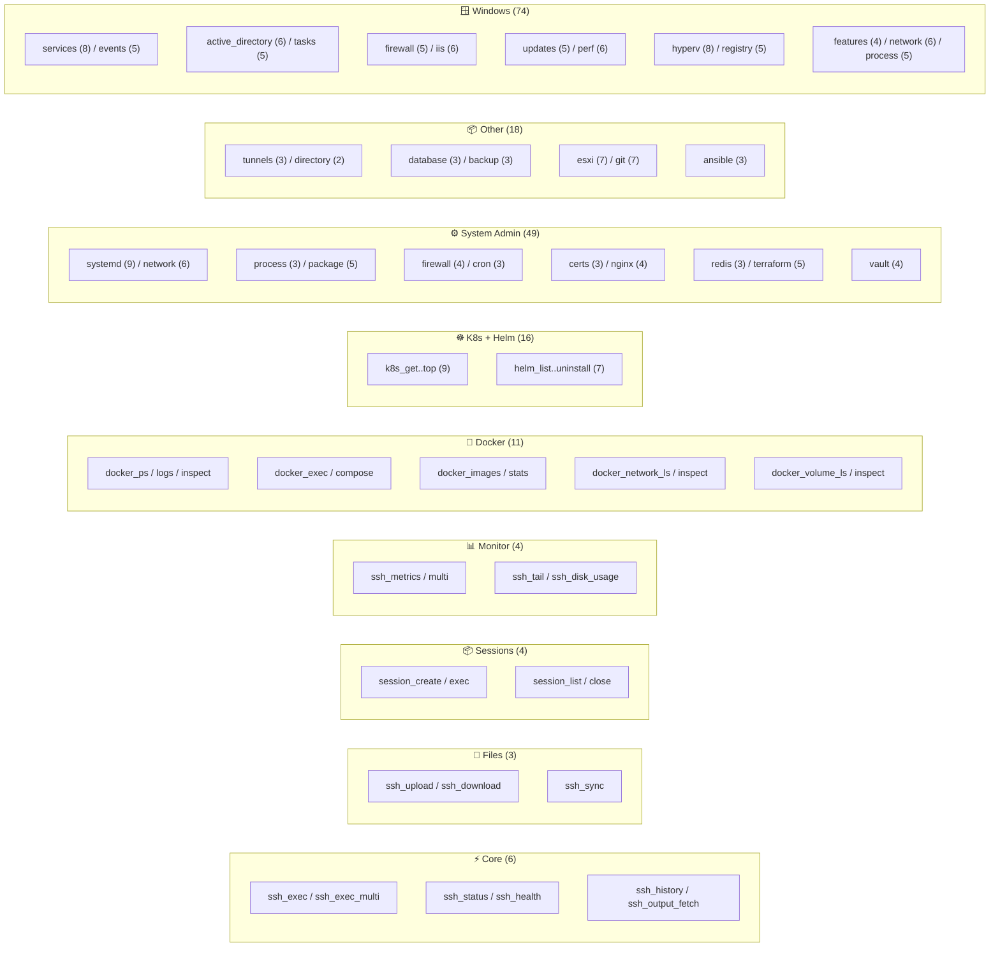

<details>
<summary><strong>📋 Detailed Tool Reference (click to expand)</strong></summary>

#### ⚡ `ssh_exec` - Execute a Command

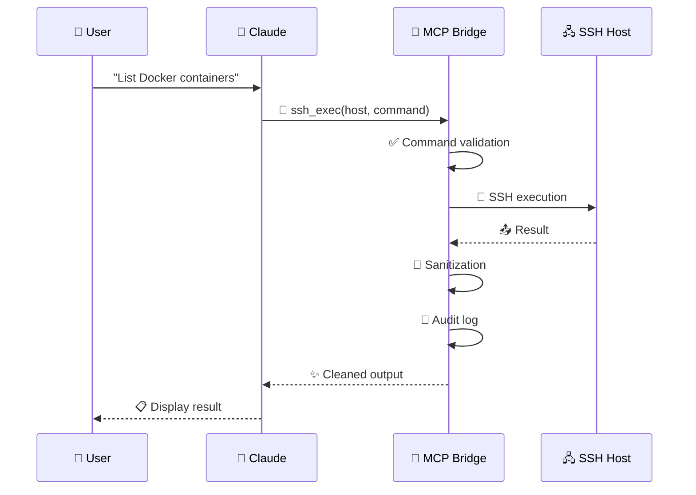

```
Use ssh_exec to list Docker containers on airgap-docker
```

| Parameter | Required | Description |
|-----------|----------|-------------|
| 🖧 `host` | ✅ Yes | Host alias defined in config |
| 💻 `command` | ✅ Yes | Command to execute |
| ⏱️ `timeout_seconds` | ❌ No | Custom timeout |
| 📂 `working_dir` | ❌ No | Working directory |
| 📏 `max_output` | ❌ No | Max output chars (default: 20000, 0 = disabled) |

> [!TIP]
> **Smart Truncation**: Large outputs are truncated keeping the beginning (20%) and end (80%), to preserve context and final result. The message `[truncated: X lines total, Y lines omitted]` indicates truncation.

---

#### 📊 `ssh_status` - View Configured Hosts

```
Use ssh_status to see available hosts
```

📋 Displays the list of configured hosts and security mode.

---

#### 📜 `ssh_history` - Command History

```
Use ssh_history to see the last 10 commands
```

| Parameter | Required | Description |
|-----------|----------|-------------|
| 🔢 `limit` | ❌ No | Number of entries (default: 10, max: 100) |
| 🖧 `host` | ❌ No | Filter by host |

---

#### 📤 `ssh_upload` - Send a File

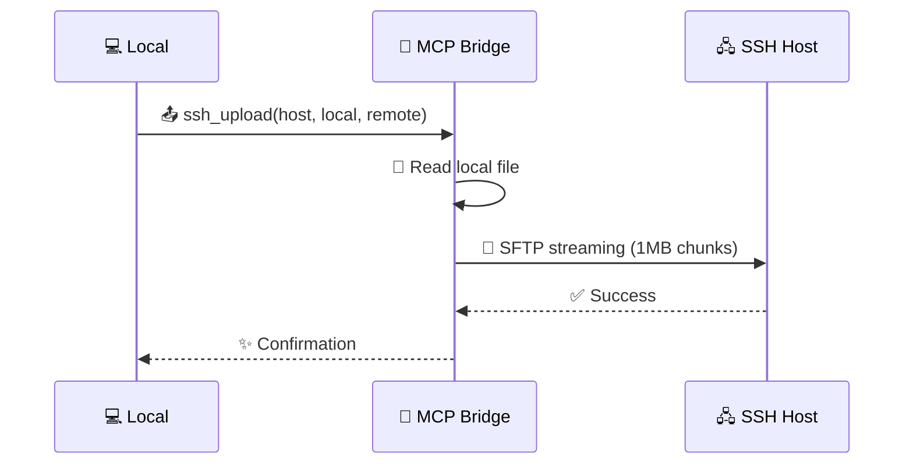

```
Use ssh_upload to send /tmp/script.sh to /home/admin/script.sh on airgap-docker
```

| Parameter | Required | Description |
|-----------|----------|-------------|
| 🖧 `host` | ✅ Yes | Host alias |
| 📂 `local_path` | ✅ Yes | Local file path |
| 📁 `remote_path` | ✅ Yes | Destination on remote host |

> [!TIP]
> **SFTP Streaming**: No size limit, 1 MB chunks, optional resume and SHA256 checksum.

---

#### 📥 `ssh_download` - Download a File

```
Use ssh_download to get /var/log/app.log from airgap-docker to /tmp/app.log
```

| Parameter | Required | Description |
|-----------|----------|-------------|
| 🖧 `host` | ✅ Yes | Host alias |
| 📁 `remote_path` | ✅ Yes | Remote file path |
| 📂 `local_path` | ✅ Yes | Local destination |

> [!TIP]
> **SFTP Streaming**: No size limit, 1 MB chunks, optional resume and SHA256 checksum.

---

#### 📄 `ssh_tail` - Read Last Lines of a File

```
Use ssh_tail to see the last lines of /var/log/syslog on airgap-docker
```

| Parameter | Required | Description |
|-----------|----------|-------------|
| 🖧 `host` | ✅ Yes | Host alias |
| 📁 `file` | ✅ Yes | Absolute path to remote file |
| 🔢 `lines` | ❌ No | Number of lines (default: 100, max: 100000) |
| 🔍 `grep` | ❌ No | Regex pattern to filter lines |
| 📏 `max_output` | ❌ No | Max output chars (default: 20000) |

---

#### 📊 `ssh_metrics` - System Metrics

```
Use ssh_metrics to see CPU and memory metrics for airgap-docker
```

| Parameter | Required | Description |
|-----------|----------|-------------|
| 🖧 `host` | ✅ Yes | Host alias |
| 📊 `metrics` | ✅ Yes | Array: `cpu`, `memory`, `disk`, `network`, `load` |
| ⏱️ `timeout_seconds` | ❌ No | Custom timeout |

📤 Returns structured JSON with requested metrics.

---

#### 🔄 `ssh_exec_multi` - Parallel Execution

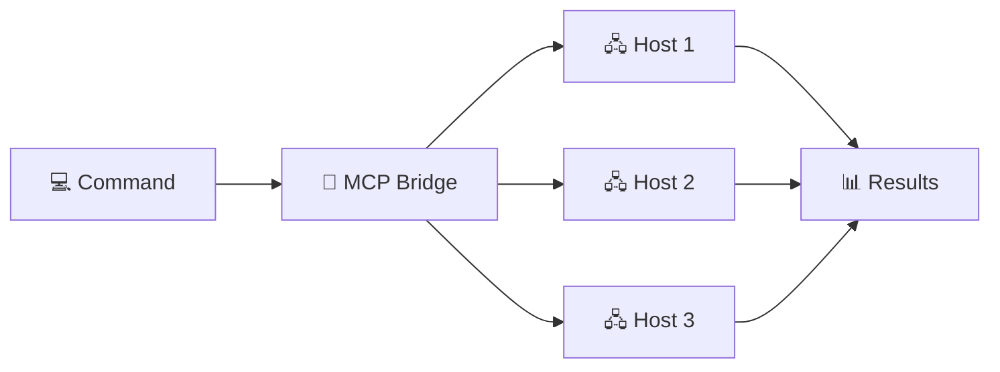

```
Use ssh_exec_multi to check uptime on all servers
```

| Parameter | Required | Description |
|-----------|----------|-------------|
| 🖧 `hosts` | ✅ Yes | Array of host aliases (max 50) |
| 💻 `command` | ✅ Yes | Command to execute |
| ⚡ `fail_fast` | ❌ No | Stop on first failure (default: false) |
| ⏱️ `timeout_seconds` | ❌ No | Per-host timeout |
| 📏 `max_output` | ❌ No | Max chars per host (default: 20000) |
| 📂 `working_dir` | ❌ No | Working directory |

---

#### 🌐 `ssh_metrics_multi` - Multi-Host Metrics

```
Use ssh_metrics_multi to collect CPU and memory metrics on all servers
```

| Parameter | Required | Description |
|-----------|----------|-------------|
| 🖧 `hosts` | ✅ Yes | Array of host aliases (max 50) |
| 📊 `metrics` | ✅ Yes | Array: `cpu`, `memory`, `disk`, `network`, `load` |
| ⚡ `fail_fast` | ❌ No | Stop on first failure (default: false) |
| ⏱️ `timeout_seconds` | ❌ No | Per-host timeout |

> [!TIP]
> **Parallel Parsing**: Uses rayon to parse results in parallel.

---

#### 📦 Session Management

**🆕 `ssh_session_create`** - Create a Persistent Session

```
Use ssh_session_create to open a session on airgap-docker
```

| Parameter | Required | Description |
|-----------|----------|-------------|
| 🖧 `host` | ✅ Yes | Host alias |
| ⏱️ `timeout_seconds` | ❌ No | Connection timeout |

📤 Returns a `session_id` to use with other session commands.

**▶️ `ssh_session_exec`** - Execute in a Session

```
Use ssh_session_exec to execute a command in the session
```

| Parameter | Required | Description |
|-----------|----------|-------------|
| 🔑 `session_id` | ✅ Yes | Session ID |
| 💻 `command` | ✅ Yes | Command to execute |
| ⏱️ `timeout_seconds` | ❌ No | Custom timeout |
| 📏 `max_output` | ❌ No | Max output chars (default: 20000) |

> [!TIP]
> **Persistence**: Working directory and environment variables are preserved between commands.

**📋 `ssh_session_list`** - List Sessions (no parameters)

**🔚 `ssh_session_close`** - Close a Session (`session_id` required)

---

#### 🩺 `ssh_health` - Bridge Diagnostics

```
Use ssh_health to check the internal state of the SSH bridge
```

No parameters required. Returns:

- 🔄 **Connection Pool**: Active connections per host
- 📦 **Sessions**: Persistent shell sessions (id, host, cwd, age)
- 📜 **History**: Command statistics (total, success, failures)
- ⚙️ **Config**: Current settings (hosts, timeouts, security mode)

---

#### 🚇 SSH Tunnels

**🔗 `ssh_tunnel_create`** - Create a Port Forwarding Tunnel

```
Use ssh_tunnel_create to forward local port 5432 to the PostgreSQL server on internal-db
```

| Parameter | Required | Description |
|-----------|----------|-------------|
| 🖧 `host` | ✅ Yes | SSH host alias |
| 🔢 `local_port` | ✅ Yes | Local port to listen on |
| 🌐 `remote_host` | ❌ No | Remote target host (default: localhost) |
| 🔢 `remote_port` | ✅ Yes | Remote target port |

**📋 `ssh_tunnel_list`** - List Active Tunnels (no parameters)

**🔚 `ssh_tunnel_close`** - Close a Tunnel (`tunnel_id` required)

---

#### 📂 Directory Operations

**📂 `ssh_ls`** - List Directory Contents

```
Use ssh_ls to list files in /var/log on airgap-docker
```

| Parameter | Required | Description |
|-----------|----------|-------------|
| 🖧 `host` | ✅ Yes | Host alias |
| 📁 `path` | ✅ Yes | Directory path |
| 🔄 `recursive` | ❌ No | Recurse into subdirectories |
| 🔢 `max_depth` | ❌ No | Max recursion depth (default: 3) |
| 👁️ `include_hidden` | ❌ No | Include hidden files |
| 📊 `sort_by` | ❌ No | Sort: `name`, `size`, `type` |

**🔍 `ssh_find`** - Search for Files

```
Use ssh_find to search for *.log files in /var/log on airgap-docker
```

| Parameter | Required | Description |
|-----------|----------|-------------|
| 🖧 `host` | ✅ Yes | Host alias |
| 📁 `path` | ✅ Yes | Starting directory |
| 🔍 `name` | ❌ No | Filename pattern (glob) |
| 📊 `type` | ❌ No | `file`, `directory`, or `link` |
| 🔢 `max_depth` | ❌ No | Maximum search depth |
| 📏 `max_results` | ❌ No | Limit number of results |

**🔄 `ssh_sync`** - Recursive Directory Transfer

```
Use ssh_sync to upload the local ./config directory to /etc/myapp/ on airgap-docker
```

| Parameter | Required | Description |
|-----------|----------|-------------|
| 🖧 `host` | ✅ Yes | Host alias |
| 📂 `source` | ✅ Yes | Source path |
| 📁 `destination` | ✅ Yes | Destination path |
| 🔄 `direction` | ✅ Yes | `upload` or `download` |
| 🚫 `exclude` | ❌ No | Glob patterns to exclude |

---

#### 🗄️ Database Tools

**🔍 `ssh_db_query`** - Execute SQL Query

```
Use ssh_db_query to run SELECT * FROM users on the PostgreSQL database
```

| Parameter | Required | Description |
|-----------|----------|-------------|
| 🖧 `host` | ✅ Yes | SSH host alias |
| 🗄️ `db_type` | ✅ Yes | `mysql` or `postgresql` |
| 💬 `query` | ✅ Yes | SQL query |
| 📁 `database` | ✅ Yes | Database name |
| 🌐 `db_host` | ❌ No | DB host (default: localhost) |
| 🔢 `db_port` | ❌ No | DB port (default: 3306/5432) |
| 👤 `db_user` | ❌ No | DB user (default: root/postgres) |
| 🔑 `db_password` | ❌ No | DB password |
| 📊 `format` | ❌ No | `table` or `csv` |

> [!WARNING]
> **Security**: Dangerous queries (DROP, TRUNCATE, DELETE FROM, GRANT, REVOKE) are automatically blocked.

**💾 `ssh_db_dump`** - Database Dump

```
Use ssh_db_dump to dump the production database to /tmp/backup.sql.gz
```

| Parameter | Required | Description |
|-----------|----------|-------------|
| 🖧 `host` | ✅ Yes | SSH host alias |
| 🗄️ `db_type` | ✅ Yes | `mysql` or `postgresql` |
| 📁 `database` | ✅ Yes | Database name |
| 📄 `output_file` | ✅ Yes | Remote output path |
| 📋 `tables` | ❌ No | Specific tables to dump |
| 🗜️ `compress` | ❌ No | `gzip`, `bzip2`, or `xz` |

**📥 `ssh_db_restore`** - Database Restore

```
Use ssh_db_restore to restore /tmp/backup.sql into the staging database
```

| Parameter | Required | Description |
|-----------|----------|-------------|
| 🖧 `host` | ✅ Yes | SSH host alias |
| 🗄️ `db_type` | ✅ Yes | `mysql` or `postgresql` |
| 📁 `database` | ✅ Yes | Target database name |
| 📄 `input_file` | ✅ Yes | Remote dump file path |

---

#### 📦 Backup & Restore

**🗜️ `ssh_backup_create`** - Create Archive

```
Use ssh_backup_create to archive /var/www and /etc/nginx to /tmp/backup.tar.gz
```

| Parameter | Required | Description |
|-----------|----------|-------------|
| 🖧 `host` | ✅ Yes | SSH host alias |
| 📁 `source_paths` | ✅ Yes | Paths to include |
| 📄 `output_file` | ✅ Yes | Archive output path |
| 🗜️ `compress` | ❌ No | `gzip`, `bzip2`, or `xz` |
| 🚫 `exclude` | ❌ No | Patterns to exclude |

**📋 `ssh_backup_list`** - List Archive Contents

```
Use ssh_backup_list to see contents of /tmp/backup.tar.gz
```

| Parameter | Required | Description |
|-----------|----------|-------------|
| 🖧 `host` | ✅ Yes | SSH host alias |
| 📄 `archive_file` | ✅ Yes | Archive file path |
| 👁️ `verbose` | ❌ No | Show details (default: true) |

**📂 `ssh_backup_restore`** - Extract Archive

```
Use ssh_backup_restore to extract /tmp/backup.tar.gz to /var/www
```

| Parameter | Required | Description |
|-----------|----------|-------------|
| 🖧 `host` | ✅ Yes | SSH host alias |
| 📄 `archive_file` | ✅ Yes | Archive file path |
| 📁 `destination` | ❌ No | Extraction directory |
| 🔢 `strip_components` | ❌ No | Strip N leading path components |

</details>

### 💬 MCP Prompts

Pre-defined conversation templates for Claude:

| Prompt | Description | Arguments |
|--------|-------------|-----------|
| 🩺 `system-health` | System health diagnostics | `host` (required) |
| 🚀 `deploy` | Application deployment guide | `host`, `app` (required), `version` |
| 🔐 `security-audit` | Security audit | `host` (required), `scope` |

```
Use the system-health prompt to diagnose my-server
```

### 📂 MCP Resources

Direct access to host data via standardized URIs:

| URI | Description | Format |
|-----|-------------|--------|
| 📊 `metrics://{host}` | System metrics (CPU, mem, disk, net, load) | JSON |
| 📄 `file://{host}/{path}` | Remote file content | Text |
| 📜 `log://{host}/{path}` | Last lines of a log file | Text |

```
Read the metrics://airgap-docker resource to see metrics
```

---

## 🛠️ Development

```bash
make build        # 🔨 Debug build
make test         # 🧪 Run tests
make lint         # 🔍 Linter (clippy)
make fmt          # 📝 Format code
make ci           # 🚀 Quick CI (fmt + lint + test + audit + typos)
make ci-full      # 🌟 Full CI (ci + hack + geiger)
make release      # 📦 Optimized release build with LTO
make release-all  # 🌍 Cross-compile all 5 platforms
```

### 📁 Code Structure

```
src/
├── 📄 main.rs              # 🚀 CLI entry point
├── 📄 lib.rs               # 📚 Library exports
├── 📄 error.rs             # ❌ Error types (thiserror)
├── 📂 config/              # ⚙️ YAML loading
├── 📂 domain/              # 💎 Business logic
├── 📂 ports/               # 🔗 Traits (interfaces)
├── 📂 mcp/                 # 📡 MCP Protocol
│   ├── 📂 tool_handlers/   # 🔧 Handlers (197)
│   └── 📂 resources/       # 📂 Resource handlers
├── 📂 ssh/                 # 🔑 SSH Client
└── 📂 security/            # 🔒 Security
```

📚 Each module has its own `README.md` with Mermaid diagrams.

### 🏷️ Feature Flags

| Feature | Default | Description |
|---------|---------|-------------|
| 🖥️ `cli` | ✅ Yes | CLI module and binary (clap) |
| 🧠 `mimalloc` | ❌ No | Alternative allocator |
| 🌟 `full` | ❌ No | All features |

```bash
cargo build --no-default-features   # Library only (no CLI)
cargo build --all-features          # All features
```

### 🔄 CI/CD

Fully automated via **GitHub Actions**:

| Workflow | Trigger | Description |
|----------|---------|-------------|
| **CI** | Push / PR | Format, clippy, tests, deny, typos, markdownlint |
| **Release** | Tag `v*` | Cross-compile 5 platforms, SBOM, provenance attestation |
| **Security** | Weekly + PR | Cargo audit, security tests, mutation testing |
| **Docker** | Tag `v*` | Build, Trivy scan, push to GHCR |
| **Fuzz** | Nightly | 53 fuzz targets with crash detection |
| **Deps** | Weekly | Outdated and unused dependency checks |

### 📚 Examples & Benchmarks

```bash
cargo run --example basic_usage   # 📖 Run the example
cargo bench                       # ⚡ Run benchmarks (HTML report at target/criterion/)
```

<details>
<summary><strong>🎨 Design Patterns</strong></summary>

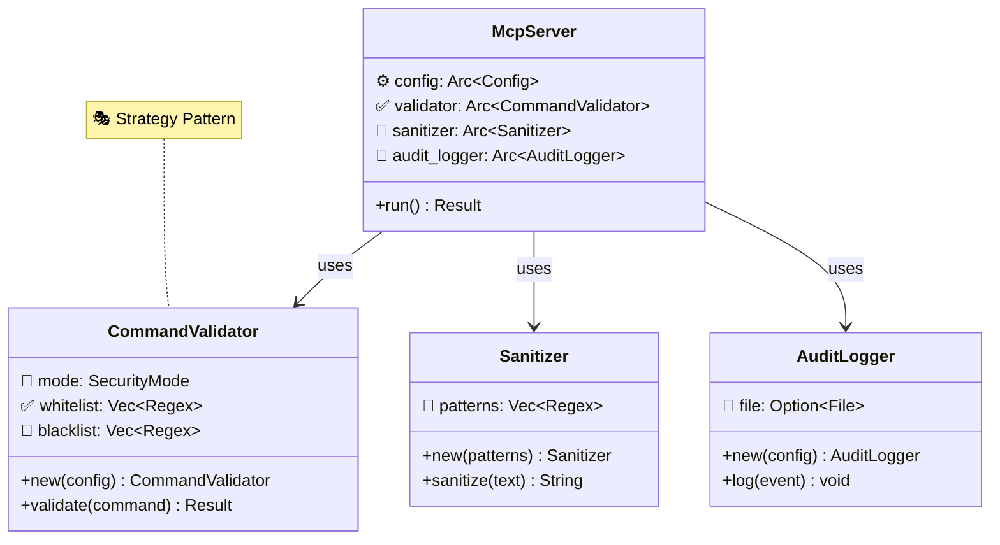

| Pattern | Usage |
|---------|-------|
| 🔌 **Hexagonal** | Separation Domain / Ports / Adapters |
| 🎭 **Strategy** | `CommandValidator` - Validation with pre-compiled regex |
| 🏭 **Factory** | `create_default_registry()` - Tool creation |
| 🔄 **Pool** | SSH connection reuse |
| 🔁 **Retry** | Exponential backoff for transient errors |
| 🔐 **Open/Closed** | Add tools without modifying existing code |
| 🔗 **Arc/Shared State** | Thread-safe component sharing |
| 💉 **Dependency Injection** | `ToolContext` injects dependencies |

</details>

---

## ❓ Troubleshooting

### 🚫 "Unknown host: xxx"

The host is not defined in the configuration. Check `config.yaml`.

### 🔒 "Command denied"

The command is not in the whitelist (strict mode) or is in the blacklist.

### 📡 "SSH connection failed"

Solutions:

- 🔍 Verify the host is reachable: `ping <hostname>`
- 🧪 Test the SSH connection manually: `ssh user@host`
- 🔑 Check SSH key permissions (must be 600)

### 🔑 "SSH key not found"

The SSH key path in the config is incorrect or the file doesn't exist.

---

## 📄 License

[MIT](LICENSE)

---

## 📜 Changelog

See [CHANGELOG.md](CHANGELOG.md) for version history.
