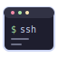
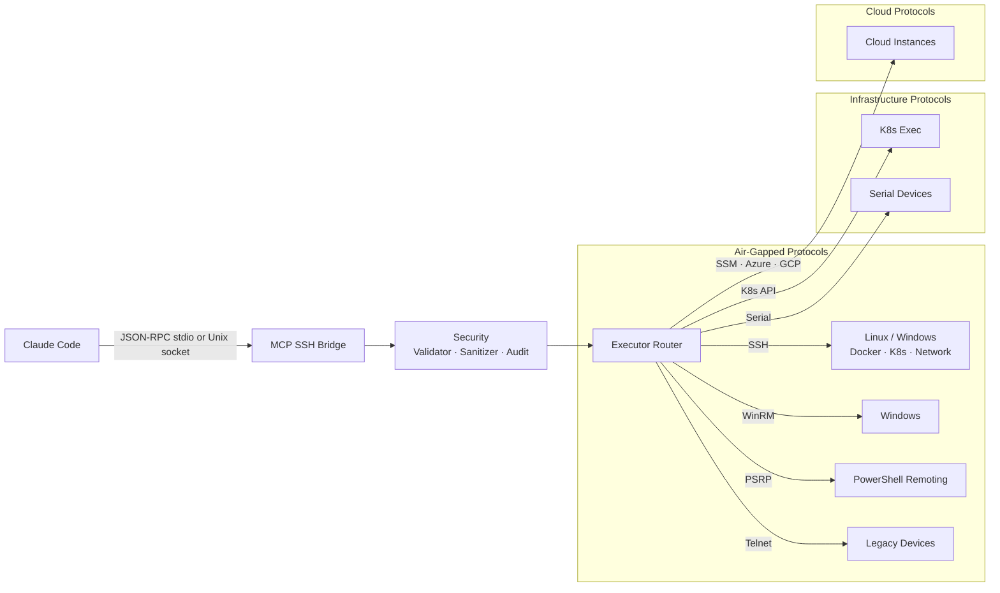

# MCP SSH Bridge

<!-- markdownlint-disable MD033 -->
<div align="center">



[](https://github.com/muchiny/mcp-ssh-bridge/actions/workflows/ci.yml)
[](https://crates.io/crates/mcp-ssh-bridge)
[](https://docs.rs/mcp-ssh-bridge)
[](https://crates.io/crates/mcp-ssh-bridge)
[](LICENSE)
[](https://modelcontextprotocol.io)

**A Rust MCP server for secure remote infrastructure management — 357 tools, 9 protocols.**

```
Claude Code  ◄──JSON-RPC──►  MCP SSH Bridge  ◄──9 protocols──►  Your Infrastructure
```

</div>

---

## Table of Contents

- [Features](#features)
- [Hero Workflows](#hero-workflows)
- [Quick Start](#quick-start)
- [Architecture](#architecture)
- [Configuration](#configuration)
- [Tool Groups](#tool-groups)
- [MCP Prompts & Resources](#mcp-prompts--resources)
- [CLI Usage](#cli-usage)
- [Daemon Mode](#daemon-mode)
- [Troubleshooting](#troubleshooting)
- [Development](#development)
- [License](#license)

---

## Features

- **357 tools, 75 groups** — manage Linux, Windows, Docker, Kubernetes, Podman, AWX, databases, LDAP, network equipment, certificates, and more
- **9 protocol adapters** — SSH, WinRM, PSRP (PowerShell Remoting), Telnet, K8s Exec, Serial, AWS SSM, Azure, GCP
- **Security-first** — command whitelist/blacklist, 62 secret-redaction patterns + entropy detection, tamper-proof session recording, opt-in MCP elicitation confirmation for destructive operations
- **Auto-discovery** — reads `~/.ssh/config` automatically, merges with YAML config
- **Smart output** — server-side `jq_filter` / `yq_filter` / `columns` / `limit`, TSV mode (60-80% token savings), pagination via `ssh_output_fetch`, per-client size limits (see [Token-efficient output](#token-efficient-output))
- **Progressive MCP discovery** — three meta-tools (`mcp_list_tool_groups`, `mcp_search_tools`, `mcp_describe_tool`) let clients browse the registry on demand instead of loading all 357 schemas up front
- **MCP Tasks support** — every tool advertises `taskSupport: "optional"`, enabling async cancellation and progress notifications for long-running operations
- **CLI + MCP** — all tools available as CLI commands (10-32x token savings) or via MCP JSON-RPC
- **Daemon mode** — Unix-socket transport for multi-client local usage; built-in `WinRmPool` (120 s TTL) and `K8sExecPool` (300 s TTL) amortize TLS handshakes across calls
- **7500+ tests** — `#![forbid(unsafe_code)]`, Rust 2024 edition, strict clippy

---

## Hero Workflows

Four end-to-end recipes that show why this exists. Every command runs through one CLI binary; all 357 tools sit behind the same flag conventions (`--jq`, `--columns`, `--limit`, `--output-format`).

### 1. Diagnose a Linux service in 4 commands

```bash
mcp-ssh-bridge status                                       # check host reachability
mcp-ssh-bridge tool ssh_service_status host=web1 service=nginx
mcp-ssh-bridge tool ssh_service_logs   host=web1 service=nginx lines=200
mcp-ssh-bridge tool ssh_journal_query  host=web1 unit=nginx priority=err since="-1h"
```

Built-in validation rejects unknown hosts before any SSH bytes leave your machine; outputs are sanitized through 62 secret-redaction patterns + entropy detection.

### 2. Inspect Kubernetes with 80% fewer tokens

```bash
# Dump all pods → 50 KB JSON. Pipe through server-side jq → ~6 KB TSV.
mcp-ssh-bridge --jq '.items[] | [.metadata.name, .status.phase, .spec.nodeName]' \
  --output-format=tsv \
  tool ssh_k8s_get host=k8s resource=pods namespace=default

mcp-ssh-bridge tool ssh_k8s_describe host=k8s resource=pod name=api-7d-xyz namespace=default
mcp-ssh-bridge tool ssh_k8s_logs     host=k8s pod=api-7d-xyz container=app tail=100
```

Filtering happens **server-side, before truncation** — you never lose data to the output cap. Same pattern works for `ssh_docker_inspect`, `ssh_helm_status`, `ssh_awx_*`, etc.

### 3. Cross-platform: Windows + Linux from one CLI

```bash
# Linux host
mcp-ssh-bridge tool ssh_service_status   host=web1 service=postgres
# Windows host (WinRM/PSRP under the hood — no agent install on the target)
mcp-ssh-bridge tool ssh_win_service_status host=appsrv service=W3SVC
mcp-ssh-bridge tool ssh_iis_restart        host=appsrv name=DefaultAppPool
mcp-ssh-bridge tool ssh_win_event_query    host=appsrv log=System level=Error since="-1h"
```

13 Windows tool groups (services, events, AD, IIS, scheduled tasks, registry, Hyper-V, …) map cleanly onto the same `ssh_*` namespace, no protocol switch in your prompts.

### 4. Audited destructive ops with elicitation

```yaml
# config.yaml
security:
  require_elicitation_on_destructive: true   # MCP elicitation/create before any destructive_hint:true tool
  recording:
    enabled: true                            # tamper-proof asciinema recordings
audit:
  log_path: /var/log/mcp-ssh-bridge/audit.jsonl
```

```bash
mcp-ssh-bridge tool ssh_helm_rollback host=k8s release=api revision=7
# → MCP client (Claude Code etc.) shows a confirmation dialog before the call leaves the bridge.
# → Audit log records the prompt, args, sanitized stdout, exit code, duration.
```

The dispatcher distinguishes `read_only` vs `mutating` vs `mutating_idempotent` vs `destructive` per tool (audited via `tests/annotation_audit.rs`), so confirmations only fire when state actually changes.

---

## Quick Start

### 1. Install

```bash
# Linux x86_64 (recommended)
curl -fsSL https://github.com/muchiny/mcp-ssh-bridge/releases/latest/download/mcp-ssh-bridge-linux-x86_64.tar.gz | tar xz
sudo mv mcp-ssh-bridge /usr/local/bin/
```

<details>
<summary>Other platforms & methods</summary>

```bash
# Linux aarch64 (Raspberry Pi, ARM servers)
curl -fsSL https://github.com/muchiny/mcp-ssh-bridge/releases/latest/download/mcp-ssh-bridge-linux-arm64.tar.gz | tar xz
sudo mv mcp-ssh-bridge /usr/local/bin/

# macOS (Apple Silicon)
curl -fsSL https://github.com/muchiny/mcp-ssh-bridge/releases/latest/download/mcp-ssh-bridge-macos-arm64.tar.gz | tar xz
sudo mv mcp-ssh-bridge /usr/local/bin/

# Docker
docker pull ghcr.io/muchiny/mcp-ssh-bridge:latest

# From source
git clone https://github.com/muchiny/mcp-ssh-bridge && cd mcp-ssh-bridge && make release
```

**Claude Desktop (DXT):** download the `.dxt` file from [Releases](https://github.com/muchiny/mcp-ssh-bridge/releases/latest) and drag-and-drop into Claude Desktop.

</details>

### 2. Configure

```bash
mkdir -p ~/.config/mcp-ssh-bridge
cp config/config.example.yaml ~/.config/mcp-ssh-bridge/config.yaml
```

Edit `~/.config/mcp-ssh-bridge/config.yaml` with your hosts:

```yaml
hosts:
  my-server:
    hostname: 192.168.1.100
    port: 22
    user: admin
    auth:
      type: key
      path: ~/.ssh/id_ed25519
    description: "My server"
```

> **Tip:** Hosts from `~/.ssh/config` are auto-discovered — you may not need to configure anything.

### 3. Add to Claude Code

Add to `~/.claude/settings.json`:

```json
{
  "mcpServers": {
    "ssh-bridge": {
      "command": "mcp-ssh-bridge"
    }
  }
}
```

### 4. Verify

Restart Claude Code, then ask: *"Check the health of my-server"* — or run:

```bash
mcp-ssh-bridge status
```

---

## Architecture

MCP SSH Bridge sits between Claude Code and your infrastructure. It routes commands through 9 protocol adapters with built-in security validation, output sanitization, and audit logging.


```mermaid
graph LR
    CC[Claude Code] -->|JSON-RPC stdio or Unix socket| BR[MCP SSH Bridge]

    BR --> SEC[Security<br/>Validator · Sanitizer · Audit]
    SEC --> ER[Executor Router]

    subgraph "Air-Gapped Protocols"
        ER -->|SSH| P1[Linux / Windows<br/>Docker · K8s · Network]
        ER -->|WinRM| P2[Windows]
        ER -->|PSRP| P2b[PowerShell Remoting]
        ER -->|Telnet| P3[Legacy Devices]
    end

    subgraph "Infrastructure Protocols"
        ER -->|K8s API| P6[K8s Exec]
        ER -->|Serial| P7[Serial Devices]
    end

    subgraph "Cloud Protocols"
        ER -->|SSM · Azure · GCP| P9[Cloud Instances]
    end
```

---

## Configuration

Config file: `~/.config/mcp-ssh-bridge/config.yaml` — see [config.example.yaml](config/config.example.yaml) for full reference.

<details>
<summary><strong>Authentication methods</strong></summary>

| Method | Config | Notes |
|--------|--------|-------|
| SSH Key | `type: key` + `path: ~/.ssh/id_ed25519` | Recommended. Supports optional `passphrase`. |
| SSH Agent | `type: agent` | Uses `SSH_AUTH_SOCK`. Recommended. |
| Password | `type: password` + `password: "..."` | Avoid if possible. |

Verify your SSH access first: `ssh user@hostname "echo OK"`

</details>

<details>
<summary><strong>Security rules</strong></summary>

Three modes control which commands Claude can run:

| Mode | Behavior |
|------|----------|
| `strict` | Only whitelisted commands allowed (safest) |
| `standard` | Whitelist for `ssh_exec`, built-in tools only check blacklist (default) |
| `permissive` | Only blacklist checked (most open) |

The **blacklist is always checked first** — matched commands are always denied.

```yaml
security:
  mode: standard
  whitelist:
    - "^docker\\s+(ps|logs|inspect).*"
    - "^kubectl\\s+(get|describe|logs).*"
    - "^(ls|cat|head|tail|grep|df|free)\\s*.*"
  blacklist:
    - "rm\\s+(-[a-zA-Z]*r|--(recursive|force))"
    - "mkfs\\."
    - "dd\\s+if="
    - "curl.*\\|.*sh"
```

</details>

<details>
<summary><strong>Advanced hosts (jump hosts, SOCKS proxy, Windows, sudo)</strong></summary>

**Jump hosts (bastion):**

```yaml
hosts:
  bastion:
    hostname: bastion.example.com
    user: admin
    auth: { type: agent }

  internal-db:
    hostname: 10.0.0.5
    proxy_jump: bastion
    user: deploy
    auth: { type: key, path: ~/.ssh/id_ed25519 }
```

**SOCKS proxy:**

```yaml
hosts:
  behind-proxy:
    hostname: 10.0.0.50
    user: deploy
    socks_proxy:
      hostname: proxy.corp.com
      port: 1080
      version: socks5
    auth: { type: key, path: ~/.ssh/id_ed25519 }
```

> `proxy_jump` and `socks_proxy` are mutually exclusive on the same host.

**Windows servers** — add `os_type: windows` to enable 74 Windows-specific tools:

```yaml
hosts:
  windows-dc:
    hostname: 192.168.1.200
    user: Administrator
    os_type: windows
    shell: powershell
    auth: { type: key, path: ~/.ssh/id_ed25519 }
```

**Sudo support:**

```yaml
hosts:
  prod-server:
    hostname: 192.168.1.100
    user: deploy
    sudo_password: "your-sudo-password"
    auth: { type: key, path: ~/.ssh/id_ed25519 }
```

**SSH config auto-discovery** — hosts from `~/.ssh/config` are merged automatically. To exclude specific hosts:

```yaml
ssh_config:
  enabled: true
  exclude: [personal-server]
```

</details>

<details>
<summary><strong>Limits, sanitization & audit</strong></summary>

**Limits:**

```yaml
limits:
  command_timeout_seconds: 60
  connection_timeout_seconds: 10
  max_concurrent_commands: 5
  max_output_chars: 20000          # 0 = unlimited
  rate_limit_per_second: 0         # 0 = disabled
  retry_attempts: 3
  client_overrides:                # Per-client output limits
    - name_contains: claude
      max_output_chars: 80000
```

Truncated outputs include an `output_id` — use `ssh_output_fetch` to retrieve the full content page by page.

**Output sanitization** — 56 built-in regex patterns + Shannon entropy detection for secrets:

```yaml
security:
  sanitize:
    enabled: true
    entropy_detection: true
    entropy_threshold: 4.5
    custom_patterns:
      - pattern: "INTERNAL_[A-Z0-9]{32}"
        replacement: "[INTERNAL_REDACTED]"
```

**Destructive-op confirmation** — opt-in gate that asks the user to confirm via MCP `elicitation/create` before any tool annotated `destructive_hint: true` (`ssh_terraform_apply`, `ssh_k8s_delete`, `ssh_cron_remove`, `ssh_win_update_reboot`, …) executes. Requires a client that advertises the elicitation capability (Claude Desktop, Claude Code):

```yaml
security:
  require_elicitation_on_destructive: true  # default: false
```

**Audit logging:**

```yaml
audit:
  enabled: true
  path: ~/.local/share/mcp-ssh-bridge/audit.log
  max_size_mb: 100
  retain_days: 30
```

**Session recording** — asciinema v2 format with HMAC-SHA256 hash-chain (SOC2, HIPAA, PCI-DSS):

```yaml
recording:
  enabled: true
  path: ~/.local/share/mcp-ssh-bridge/recordings/
  hash_chain: true
  hash_key_env: MCP_RECORDING_KEY
```

</details>

---

## Tool Groups

357 tools organized in 75 groups — all enabled by default. Disable groups you don't need:

```yaml
tool_groups:
  groups:
    sessions: false
    tunnels: false
    database: false
```

<details>
<summary><strong>Linux & cross-platform groups (41 groups)</strong></summary>

| Group | Tools |
|-------|-------|
| `core` | ssh_exec, ssh_exec_multi (with `diff` / `diff_baseline` / `normalize` for cross-host drift detection), ssh_status, ssh_health, ssh_history, ssh_output_fetch |
| `config` | ssh_config_get, ssh_config_set |
| `file_transfer` | ssh_upload, ssh_download, ssh_sync |
| `file_ops` | ssh_file_read, ssh_file_write, ssh_file_chmod, ssh_file_chown, ssh_file_stat, ssh_file_diff, ssh_file_patch, ssh_file_template |
| `sessions` | ssh_session_create, ssh_session_exec, ssh_session_list, ssh_session_close |
| `monitoring` | ssh_metrics, ssh_metrics_multi, ssh_tail, ssh_disk_usage |
| `tunnels` | ssh_tunnel_create, ssh_tunnel_list, ssh_tunnel_close |
| `directory` | ssh_ls, ssh_find |
| `database` | ssh_db_query, ssh_db_dump, ssh_db_restore |
| `redis` | ssh_redis_info, ssh_redis_cli, ssh_redis_keys |
| `postgresql` | ssh_postgresql_query, ssh_postgresql_status |
| `mysql` | ssh_mysql_query, ssh_mysql_status |
| `mongodb` | ssh_mongodb_status |
| `backup` | ssh_backup_create, ssh_backup_list, ssh_backup_restore, ssh_backup_snapshot, ssh_backup_verify, ssh_backup_schedule |
| `docker` | ssh_docker_ps, ssh_docker_logs, ssh_docker_inspect, ssh_docker_exec, ssh_docker_compose, ssh_docker_images, ssh_docker_stats, ssh_docker_volume_ls, ssh_docker_network_ls, ssh_docker_volume_inspect, ssh_docker_network_inspect |
| `podman` | ssh_podman_ps, ssh_podman_logs, ssh_podman_inspect, ssh_podman_exec, ssh_podman_images, ssh_podman_compose |
| `esxi` | ssh_esxi_vm_list, ssh_esxi_vm_info, ssh_esxi_vm_power, ssh_esxi_snapshot, ssh_esxi_host_info, ssh_esxi_datastore_list, ssh_esxi_network_list |
| `kubernetes` | ssh_k8s_get, ssh_k8s_logs, ssh_k8s_describe, ssh_k8s_apply, ssh_k8s_delete, ssh_k8s_rollout, ssh_k8s_scale, ssh_k8s_exec, ssh_k8s_top, ssh_helm_list, ssh_helm_status, ssh_helm_upgrade, ssh_helm_install, ssh_helm_rollback, ssh_helm_history, ssh_helm_uninstall |
| `git` | ssh_git_status, ssh_git_log, ssh_git_diff, ssh_git_pull, ssh_git_clone, ssh_git_branch, ssh_git_checkout |
| `ansible` | ssh_ansible_playbook, ssh_ansible_inventory, ssh_ansible_adhoc |
| `awx` | ssh_awx_status, ssh_awx_inventories, ssh_awx_inventory_hosts, ssh_awx_templates, ssh_awx_template_detail, ssh_awx_job_launch, ssh_awx_job_status, ssh_awx_job_summary, ssh_awx_job_stdout, ssh_awx_job_events, ssh_awx_job_follow, ssh_awx_job_cancel, ssh_awx_project_sync |
| `terraform` | ssh_terraform_init, ssh_terraform_plan, ssh_terraform_apply, ssh_terraform_state, ssh_terraform_output |
| `vault` | ssh_vault_status, ssh_vault_read, ssh_vault_list, ssh_vault_write |
| `systemd` | ssh_service_status, ssh_service_start, ssh_service_stop, ssh_service_restart, ssh_service_list, ssh_service_logs, ssh_service_enable, ssh_service_disable, ssh_service_daemon_reload |
| `systemd_timers` | ssh_timer_list, ssh_timer_info, ssh_timer_enable, ssh_timer_disable, ssh_timer_trigger |
| `network` | ssh_net_connections, ssh_net_interfaces, ssh_net_routes, ssh_net_ping, ssh_net_traceroute, ssh_net_dns |
| `process` | ssh_process_list, ssh_process_kill, ssh_process_top |
| `package` | ssh_pkg_list, ssh_pkg_search, ssh_pkg_install, ssh_pkg_update, ssh_pkg_remove |
| `firewall` | ssh_firewall_status, ssh_firewall_list, ssh_firewall_allow, ssh_firewall_deny |
| `cron` | ssh_cron_list, ssh_cron_add, ssh_cron_remove |
| `cron_analysis` | ssh_cron_analyze, ssh_cron_history, ssh_at_jobs |
| `certificates` | ssh_cert_check, ssh_cert_info, ssh_cert_expiry |
| `letsencrypt` | ssh_letsencrypt_status |
| `nginx` | ssh_nginx_status, ssh_nginx_test, ssh_nginx_reload, ssh_nginx_list_sites |
| `apache` | ssh_apache_status, ssh_apache_vhosts |
| `user_management` | ssh_user_list, ssh_user_info, ssh_user_add, ssh_user_modify, ssh_user_delete, ssh_group_list, ssh_group_add, ssh_group_delete |
| `storage` | ssh_storage_lsblk, ssh_storage_df, ssh_storage_mount, ssh_storage_umount, ssh_storage_lvm, ssh_storage_fdisk, ssh_storage_fstab |
| `journald` | ssh_journal_query, ssh_journal_follow, ssh_journal_boots, ssh_journal_disk_usage |
| `security_modules` | ssh_selinux_status, ssh_selinux_booleans, ssh_apparmor_status, ssh_apparmor_profiles, ssh_security_audit |
| `network_equipment` | ssh_net_equip_show_run, ssh_net_equip_show_interfaces, ssh_net_equip_show_routes, ssh_net_equip_show_arp, ssh_net_equip_show_version, ssh_net_equip_show_vlans, ssh_net_equip_config, ssh_net_equip_save |
| `ldap` | ssh_ldap_search, ssh_ldap_user_info, ssh_ldap_group_members, ssh_ldap_add, ssh_ldap_modify |

</details>

<details>
<summary><strong>Windows groups (13 groups)</strong></summary>

| Group | Tools |
|-------|-------|
| `windows_services` | ssh_win_service_list, ssh_win_service_status, ssh_win_service_start, ssh_win_service_stop, ssh_win_service_restart, ssh_win_service_enable, ssh_win_service_disable, ssh_win_service_config |
| `windows_events` | ssh_win_event_query, ssh_win_event_logs, ssh_win_event_sources, ssh_win_event_tail, ssh_win_event_export |
| `active_directory` | ssh_ad_user_list, ssh_ad_user_info, ssh_ad_group_list, ssh_ad_group_members, ssh_ad_computer_list, ssh_ad_domain_info |
| `scheduled_tasks` | ssh_schtask_list, ssh_schtask_info, ssh_schtask_run, ssh_schtask_enable, ssh_schtask_disable |
| `windows_firewall` | ssh_win_firewall_status, ssh_win_firewall_list, ssh_win_firewall_allow, ssh_win_firewall_deny, ssh_win_firewall_remove |
| `iis` | ssh_iis_list_sites, ssh_iis_list_pools, ssh_iis_status, ssh_iis_start, ssh_iis_stop, ssh_iis_restart |
| `windows_updates` | ssh_win_update_list, ssh_win_update_search, ssh_win_update_install, ssh_win_update_history, ssh_win_update_reboot |
| `windows_perf` | ssh_win_perf_overview, ssh_win_perf_cpu, ssh_win_perf_memory, ssh_win_perf_disk, ssh_win_perf_network, ssh_win_disk_usage |
| `hyperv` | ssh_hyperv_vm_list, ssh_hyperv_vm_info, ssh_hyperv_vm_start, ssh_hyperv_vm_stop, ssh_hyperv_host_info, ssh_hyperv_switch_list, ssh_hyperv_snapshot_list, ssh_hyperv_snapshot_create |
| `windows_registry` | ssh_reg_query, ssh_reg_list, ssh_reg_set, ssh_reg_delete, ssh_reg_export |
| `windows_features` | ssh_win_feature_list, ssh_win_feature_info, ssh_win_feature_install, ssh_win_feature_remove |
| `windows_network` | ssh_win_net_ip, ssh_win_net_adapters, ssh_win_net_connections, ssh_win_net_routes, ssh_win_net_ping, ssh_win_net_dns |
| `windows_process` | ssh_win_process_list, ssh_win_process_top, ssh_win_process_info, ssh_win_process_by_name, ssh_win_process_kill |

</details>

<details>
<summary><strong>Advanced groups (21 groups)</strong></summary>

| Group | Tools | Description |
|-------|-------|-------------|
| `diagnostics` | ssh_diagnose, ssh_incident_triage, ssh_compare_state | Intelligent single-call diagnostics with symptom-based triage |
| `runbooks` | ssh_runbook_list, ssh_runbook_execute, ssh_runbook_validate | YAML-defined multi-step operational procedures ([docs](config/runbooks/README.md)) |
| `orchestration` | ssh_canary_exec, ssh_rolling_exec, ssh_fleet_diff | Canary deployments, rolling updates, fleet-wide comparison |
| `recording` | ssh_recording_start, ssh_recording_stop, ssh_recording_list, ssh_recording_replay, ssh_recording_verify | Tamper-proof session recording (SOC2/HIPAA/PCI-DSS) |
| `drift` | ssh_env_snapshot, ssh_env_diff, ssh_env_drift | Environment state capture and drift detection |
| `security_scan` | ssh_sbom_generate, ssh_vuln_scan, ssh_compliance_check | SBOM, vulnerability scanning, CIS compliance checks |
| `performance` | ssh_perf_trace, ssh_io_trace, ssh_latency_test, ssh_benchmark | Performance profiling, I/O tracing, benchmarks |
| `container_logs` | ssh_container_log_search, ssh_container_log_stats, ssh_container_events, ssh_container_health_history | Container log analysis and health tracking |
| `network_security` | ssh_port_scan, ssh_ssl_audit, ssh_network_capture, ssh_fail2ban_status | Port scanning, SSL audit, traffic capture, fail2ban |
| `compliance` | ssh_cis_benchmark, ssh_stig_check, ssh_compliance_score, ssh_compliance_report | CIS/STIG benchmarks and compliance reporting |
| `cloud` | ssh_aws_cli, ssh_cloud_metadata, ssh_cloud_tags, ssh_cloud_cost | Cloud provider interaction |
| `inventory` | ssh_discover_hosts, ssh_inventory_sync, ssh_host_tags | Host discovery and CMDB sync |
| `multicloud` | ssh_multicloud_list, ssh_multicloud_sync, ssh_multicloud_compare | Multi-cloud resource management |
| `alerting` | ssh_alert_check, ssh_alert_list, ssh_alert_set | Metric monitoring, threshold checking, alert rules |
| `capacity` | ssh_capacity_collect, ssh_capacity_trend, ssh_capacity_predict | Capacity data collection, trending, prediction |
| `incident` | ssh_incident_timeline, ssh_incident_correlate | Incident response timeline and log correlation |
| `log_aggregation` | ssh_log_aggregate, ssh_log_search_multi, ssh_log_tail_multi | Cross-host log aggregation, search, tail |
| `key_management` | ssh_key_generate, ssh_key_distribute, ssh_key_audit | SSH key generation, distribution, audit |
| `chatops` | ssh_webhook_send, ssh_notify | Slack/Teams/webhook notifications |
| `templates` | ssh_template_list, ssh_template_show, ssh_template_apply, ssh_template_validate, ssh_template_diff | Config template management |
| `pty` | ssh_pty_exec, ssh_pty_interact, ssh_pty_resize | Interactive PTY sessions |

</details>

---

## MCP Prompts & Resources

<details>
<summary><strong>Pre-built prompts</strong></summary>

| Prompt | Description | Required args |
|--------|-------------|---------------|
| `system-health` | Full system health check (CPU, memory, disk, services) | `host` |
| `deploy` | Step-by-step deployment workflow | `host`, `service` |
| `security-audit` | Security posture assessment | `host` |
| `troubleshoot` | Systematic troubleshooting guide | `host`, `symptom` |
| `docker-health` | Docker/container health assessment | `host` |
| `k8s-overview` | Kubernetes cluster state overview | `host` |
| `backup-verify` | Backup integrity verification | `host` |

</details>

<details>
<summary><strong>Direct data resources</strong></summary>

| URI pattern | Description |
|-------------|-------------|
| `metrics://{host}` | System metrics (CPU, memory, disk, network, load) as JSON |
| `file://{host}/{path}` | Remote file content |
| `log://{host}/{path}` | Last lines of a log file |
| `health://{host}` | Health check summary for a host (connectivity, load, key services) |
| `history://{host}` | Recent command history captured by the bridge for that host |
| `services://{host}` | Snapshot of active systemd services on the host |

</details>

---

## CLI Usage

The binary works standalone (outside MCP mode) with **10-32x token savings** for AI agent workflows.

### Basic commands

```bash
mcp-ssh-bridge status                       # Show configured hosts & security
mcp-ssh-bridge exec <host> "<command>"      # Execute a command directly
mcp-ssh-bridge history [--limit 20]         # Show command history
mcp-ssh-bridge upload <host> <local> <remote>   # SFTP upload
mcp-ssh-bridge download <host> <remote> <local> # SFTP download
mcp-ssh-bridge validate                     # Validate config file
mcp-ssh-bridge config-diff                  # Compare config vs defaults
```

### Tool invocation (all 357 MCP tools)

```bash
# Invoke any tool with key=value pairs
mcp-ssh-bridge tool ssh_docker_ps host=prod
mcp-ssh-bridge tool ssh_exec host=prod command="df -h"

# Or with JSON arguments
mcp-ssh-bridge tool ssh_k8s_get --json-args '{"host":"k8s","resource":"pods","namespace":"default"}'

# JSON output (for scripting/parsing)
mcp-ssh-bridge --json tool ssh_docker_ps host=prod
```

### Progressive discovery

From the CLI:

```bash
mcp-ssh-bridge list-tools --groups-only       # 75 groups (~2K tokens)
mcp-ssh-bridge list-tools --group docker      # Tools in a group (~500 tokens)
mcp-ssh-bridge list-tools --search kubernetes # Keyword search
mcp-ssh-bridge describe-tool ssh_docker_ps    # Full schema for 1 tool (~200 tokens)
```

From an MCP client (Claude Desktop / Claude Code), the same progressive-discovery pattern is available as three top-level tools so the model can walk the registry without loading all 357 schemas up front:

| Tool | Purpose | Typical cost |
|---|---|---|
| `mcp_list_tool_groups` | List the 75 groups with counts | ~2 K tokens |
| `mcp_search_tools` | Keyword search (`query`, `group?`, `limit=20`) | ~3 K tokens / page |
| `mcp_describe_tool` | Full schema + reduction strategy for one tool | ~500 tokens |

### Token-efficient output

Every tool automatically exposes reduction parameters based on its output type. Server-side filtering runs **before** truncation, so you never lose data to the output cap. Use `describe-tool <name>` — its top-of-output **Reduction Strategy** line tells you exactly which params apply.

| Output kind | Available params | Strategy | Example tools |
|---|---|---|---|
| **Tabular** | `columns`, `limit` | Pick columns + cap rows | `docker_ps`, `service_list`, `process_list` |
| **Json** | `jq_filter`, `output_format`, `limit` | jq + TSV for 60-80% savings | `docker_inspect`, `k8s_get`, `ansible_facts` |
| **Yaml** | `yq_filter`, `output_format`, `limit` | yq + TSV | kubectl/helm YAML output |
| **Auto** | All of the above | Tool auto-detects JSON vs tabular | `vault_status`, mixed outputs |
| **RawText** | — | `save_output=/path` then read the file locally | `ssh_exec`, logs, arbitrary commands |

**Common params** available on every tool: `host`, `timeout_seconds`, `max_output`, `save_output`.

```bash
# Filter JSON with jq + TSV output (60-80% token savings on list data)
mcp-ssh-bridge tool ssh_k8s_get host=k8s resource=pods \
  jq_filter='.items[] | [.metadata.name, .status.phase]' output_format=tsv

# Pick columns from tabular output
mcp-ssh-bridge tool ssh_docker_ps host=prod columns='["NAMES","STATUS","IMAGE"]' limit=20

# Or use the ergonomic global flags (equivalent)
mcp-ssh-bridge --jq '.items[] | {name, phase}' --output-format=tsv tool ssh_k8s_get host=k8s resource=pods
mcp-ssh-bridge --columns NAMES,STATUS,IMAGE --limit 20 tool ssh_docker_ps host=prod

# Persist full untruncated output to a file
mcp-ssh-bridge tool ssh_docker_logs host=prod container=nginx save_output=/tmp/nginx.log
```

**Pagination.** Truncated results print `[output_id: abc123]`. Fetch the rest with:

```bash
mcp-ssh-bridge tool ssh_output_fetch output_id=abc123 offset=40000
```

### Global flags

| Flag | Description |
|------|-------------|
| `--config` / `-c` | Path to config file |
| `--json` | JSON output for all commands |
| `--dry-run` | Preview without executing |

### Exit codes

| Code | Meaning |
|------|---------|
| 0 | Success |
| 1 | Tool/command execution error |
| 2 | CLI usage error (unknown tool, bad args) |
| 3 | SSH connection error |
| 4 | Security denial |
| 5 | Configuration error |

### Shell completions

```bash
mcp-ssh-bridge completions bash > ~/.bash_completion.d/mcp-ssh-bridge
mcp-ssh-bridge completions zsh > ~/.zfunc/_mcp-ssh-bridge
mcp-ssh-bridge completions fish > ~/.config/fish/completions/mcp-ssh-bridge.fish
```

### Claude Code integration (optional)

If you use [Claude Code](https://claude.com/claude-code), copy the provided rule and skill to get CLI-aware assistance:

```bash
# Copy the CLI rule (tells Claude to prefer CLI over MCP for token efficiency)
mkdir -p .claude/rules
cp config/claude-code/rules/cli-bridge.md .claude/rules/

# Copy the /bridge skill (interactive CLI workflows and config help)
mkdir -p .claude/skills/bridge
cp config/claude-code/skills/bridge/SKILL.md .claude/skills/bridge/
```

This enables:

- Claude automatically uses the CLI via Bash instead of MCP tools
- `/bridge` command for interactive tool discovery and config management
- `/bridge config` for guided configuration setup
- `/bridge docker` to explore tools in a group

---

## Daemon Mode

In addition to the default stdio transport, the bridge can run as a long-lived daemon listening on a Unix socket. Multiple local clients (Claude Code, Claude Desktop, scripts) can connect concurrently to the same daemon, each getting an isolated MCP session that shares the same audit log, output cache, and connection pools.

```bash
# Start the daemon (foreground)
mcp-ssh-bridge --daemon /tmp/mcp-ssh-bridge.sock

# Connect a client to the socket via the standard MCP `--transport unix` flag,
# or any tool that speaks JSON-RPC over a Unix socket.
```

**Built-in connection pools** kick in automatically when you build with the corresponding feature flags:

| Pool | Default TTL | Effect |
|---|---|---|
| `WinRmPool` (`--features winrm`) | 120 s | Reuses the per-host `reqwest::Client` so back-to-back WinRM calls skip the TLS handshake. |
| `K8sExecPool` (`--features k8s-exec`) | 300 s | Caches the `kube::Client` (kubeconfig walk + auth-plugin refresh) across `ssh_k8s_*` calls. |

Both pools clean up idle entries automatically; nothing is required to enable them beyond compiling the relevant feature.

---

## Troubleshooting

<details>
<summary><strong>Common issues</strong></summary>

**"Unknown host: xxx"** — The host alias is not in your config. Run `ssh_status` or `mcp-ssh-bridge status` to see configured hosts.

**"Command denied"** — The command doesn't match a whitelist pattern (strict/standard mode) or matches a blacklist pattern. Check your `security` config.

**"SSH connection failed"** — Verify: (1) the host is reachable (`ping hostname`), (2) SSH works manually (`ssh user@host`), (3) key permissions are correct (`chmod 600 ~/.ssh/id_*`).

**"Unknown host key"** — Add it: `ssh-keyscan hostname >> ~/.ssh/known_hosts`

**Host key verification modes:**

| Mode | Behavior |
|------|----------|
| `Strict` (default) | Rejects unknown and changed host keys |
| `AcceptNew` | Accepts new keys, rejects changed keys |
| `Off` | Accepts all keys (testing only) |

Set per-host: `host_key_verification: AcceptNew`

</details>

---

## Development

```bash
make build              # Debug build
make release            # Optimized release with LTO
make test               # Run tests (uses nextest if available)
make lint               # Clippy with strict warnings
make ci                 # Quick CI (fmt-check, lint, test, audit, typos)
make ci-full            # Full CI (ci + hack + geiger)
make dxt                # Build DXT package for Claude Desktop
```

Rust edition 2024, MSRV 1.94+. `#![forbid(unsafe_code)]`. 7500+ tests.

**Adding a new tool — 3 steps:** annotate the struct with `#[mcp_tool]` (or `#[mcp_standard_tool]`), add the `mod` + `pub use` line, and (only if introducing a new group) update `ToolGroupsConfig`. The `inventory` crate auto-registers the handler at compile time — no test-count assertions to update.

See [CHANGELOG.md](CHANGELOG.md) for version history and [THREAT_MODEL.md](docs/THREAT_MODEL.md) for security design.

---

## License

[MIT](LICENSE)
