# ⚡ Benchmarks

Performance benchmarks using [Criterion](https://github.com/bheisler/criterion.rs).

## 📁 Contents

| Benchmark | Description |
|-----------|-------------|
| 🔒 `validator_bench.rs` | `CommandValidator` performance |

## 🚀 Execution

```bash
# Run all benchmarks
cargo bench

# Specific benchmark
cargo bench --bench validator_bench

# With baseline for comparison
cargo bench -- --save-baseline main
```

## 📊 Results

HTML reports are generated in `target/criterion/`.

```mermaid
flowchart LR
    BENCH["cargo bench"] --> RUN["⚡ Execution"]
    RUN --> STATS["📊 Statistics"]
    STATS --> HTML["📄 target/criterion/<br/>report/index.html"]
    STATS --> JSON["📋 target/criterion/<br/>*/new/estimates.json"]
```



Open `target/criterion/report/index.html` to view interactive graphs.

## 🔒 validator_bench.rs

Measures command validation performance.

### Tests

```mermaid
graph TB
    subgraph Permissive["🔓 Permissive Mode"]
        P1["simple command<br/>ls -la"]
        P2["complex command<br/>docker run ..."]
        P3["blacklisted command<br/>rm -rf /"]
    end

    subgraph Strict["🔐 Strict Mode"]
        S1["simple command<br/>ls -la"]
        S2["complex command<br/>docker run ..."]
        S3["unlisted command<br/>rm file.txt"]
    end

    subgraph Creation["🏭 Creation"]
        C1["validator creation<br/>7 patterns"]
    end
```



| Test | Description | Expected |
|------|-------------|----------|
| `permissive: simple command` | `ls -la` in permissive mode | ~100ns |
| `strict: simple command` | `ls -la` in strict mode | ~200ns |
| `permissive: complex command` | Long Docker command | ~150ns |
| `strict: complex command` | Docker command in strict | ~300ns |
| `permissive: blacklisted command` | `rm -rf /` (fast rejection) | ~50ns |
| `strict: unlisted command` | Non-whitelisted command | ~250ns |
| `validator creation` | Creation with 7 patterns | ~5µs |

### Code

```rust
use criterion::{black_box, criterion_group, criterion_main, Criterion};
use mcp_ssh_bridge::config::SecurityConfig;
use mcp_ssh_bridge::security::CommandValidator;

fn benchmark_validation(c: &mut Criterion) {
    let config = SecurityConfig::default();
    let validator = CommandValidator::new(&config);

    c.bench_function("validate simple command", |b| {
        b.iter(|| validator.validate(black_box("ls -la")))
    });
}

criterion_group!(benches, benchmark_validation);
criterion_main!(benches);
```

## ➕ Adding a Benchmark

### 1️⃣ Create the file

```rust
// benches/my_bench.rs
use criterion::{criterion_group, criterion_main, Criterion};

fn my_benchmark(c: &mut Criterion) {
    c.bench_function("test name", |b| {
        b.iter(|| /* code to measure */)
    });
}

criterion_group!(benches, my_benchmark);
criterion_main!(benches);
```

### 2️⃣ Declare in Cargo.toml

```toml
[[bench]]
name = "my_bench"
harness = false
```

### 3️⃣ Run

```bash
cargo bench --bench my_bench
```

## 📈 Interpreting Results

```
validate simple command
                        time:   [98.234 ns 100.12 ns 102.45 ns]
                        change: [-2.1234% +0.5678% +3.4567%] (p = 0.12 > 0.05)
                        No change in performance detected.
```

| Metric | Description |
|--------|-------------|
| `time` | [min, average, max] |
| `change` | Variation vs baseline |
| `p` | Statistical significance |

## 🎯 Best Practices

```mermaid
flowchart TD
    A["🎯 Best Practices"]

    A --> B["🔲 black_box()"]
    A --> C["🔄 Sufficient iterations"]
    A --> D["📊 Compare with baseline"]
    A --> E["🧪 Isolate measured code"]

    B --> B1["Prevents compiler<br/>optimizations"]
    C --> C1["Criterion handles<br/>automatically"]
    D --> D1["cargo bench --<br/>--save-baseline main"]
    E --> E1["Setup outside<br/>b.iter()"]
```



| Practice | Description |
|----------|-------------|
| 🔲 `black_box()` | Prevents compiler from optimizing measured code |
| 🔄 Warm-up | Criterion does automatic warm-up |
| 📊 Baseline | Save a baseline for comparison |
| 🧪 Isolation | Only measure relevant code |
