# ⚙️ Configuration

Configuration files for MCP SSH Bridge.

## 📁 Contents

| File | Description |
|------|-------------|
| 📄 `config.example.yaml` | Complete configuration example |

## 📍 Location

Configuration is loaded from:

```
~/.config/mcp-ssh-bridge/config.yaml
```

Or specified via `--config`:

```bash
mcp-ssh-bridge --config /path/to/config.yaml
```

## 🏗️ Configuration Structure

```mermaid
graph TB
    subgraph Config["⚙️ config.yaml"]
        HOSTS["🖧 hosts"]
        SECURITY["🔒 security"]
        LIMITS["⏱️ limits"]
        AUDIT["📝 audit"]
    end

    subgraph Hosts["🖧 hosts: HashMap"]
        H1["my-server:"]
        H1 --> HN["hostname: String"]
        H1 --> HP["port: u16 = 22"]
        H1 --> HU["user: String"]
        H1 --> HA["auth: AuthConfig"]
        H1 --> HD["description: Option"]
        H1 --> HK["host_key_verification"]
        H1 --> HJ["proxy_jump: Option"]
        H1 --> HS["socks_proxy: Option"]
        H1 --> HO["os_type: linux/windows = linux"]
        H1 --> HSH["shell: Option (posix/cmd/powershell)"]
    end

    subgraph Security["🔒 security"]
        SM["mode: strict/permissive"]
        SW["whitelist: Vec<Regex>"]
        SB["blacklist: Vec<Regex>"]
        SS["sanitize_patterns: Vec"]
    end

    subgraph Limits["⏱️ limits"]
        LT["command_timeout_seconds"]
        LC["connection_timeout_seconds"]
        LO["max_output_bytes"]
        LR["retry_attempts"]
        LOC["max_output_chars = 20000"]
        LCC["client_overrides"]
        LTTL["output_cache_ttl_seconds"]
        LCE["output_cache_max_entries"]
    end

    subgraph Audit["📝 audit"]
        AE["enabled: bool"]
        AP["path: PathBuf"]
        AM["max_size_mb: u64"]
        AR["retain_days: u32"]
    end
```



## 📋 Complete Example

```yaml
# ~/.config/mcp-ssh-bridge/config.yaml

# 🖧 SSH Hosts
hosts:
  prod-server:
    hostname: "192.168.1.100"
    port: 22
    user: "admin"
    description: "Production server"
    host_key_verification: strict
    auth:
      type: key
      path: "~/.ssh/id_rsa"
      # passphrase: "optional"

  dev-server:
    hostname: "dev.example.com"
    user: "developer"
    host_key_verification: acceptnew
    auth:
      type: agent

  # Example with jump host
  internal-db:
    hostname: "10.0.0.5"
    user: "dbadmin"
    proxy_jump: prod-server  # Connect via prod-server
    auth:
      type: key
      path: "~/.ssh/id_ed25519"

  # Example with SOCKS proxy
  # remote-via-proxy:
  #   hostname: "10.0.0.10"
  #   user: "deploy"
  #   socks_proxy:
  #     hostname: "proxy.example.com"
  #     port: 1080
  #     version: socks5     # socks5 (default) or socks4
  #   auth:
  #     type: key
  #     path: "~/.ssh/id_ed25519"

  # Windows Server (with OpenSSH)
  # windows-dc:
  #   hostname: "192.168.1.200"
  #   user: "Administrator"
  #   description: "Windows Domain Controller"
  #   os_type: windows
  #   shell: powershell
  #   auth:
  #     type: key
  #     path: "~/.ssh/id_ed25519"

# 🔒 Security
security:
  mode: strict  # strict or permissive
  whitelist:
    - "^ls\\b"
    - "^cat\\b"
    - "^docker\\s+"
    - "^kubectl\\s+"
  blacklist:
    - "rm\\s+-rf\\s+/"
    - "mkfs\\."
    - "chmod\\s+777"
  sanitize_patterns:
    - "(?i)password[=:]\\s*\\S+"
    - "(?i)api[_-]?key[=:]\\s*\\S+"

# ⏱️ Limits
limits:
  command_timeout_seconds: 120
  connection_timeout_seconds: 30
  max_output_bytes: 10485760  # 10 MB
  max_concurrent_commands: 5
  retry_attempts: 3
  retry_initial_delay_ms: 100
  max_output_chars: 20000       # Smart truncation limit (0 = disabled)
  output_cache_ttl_seconds: 300 # Cache for ssh_output_fetch pagination
  output_cache_max_entries: 100

# 📝 Audit
audit:
  enabled: true
  path: "~/.local/share/mcp-ssh-bridge/audit.log"
  max_size_mb: 100
  retain_days: 30

# 🔍 SSH Config Auto-Discovery
ssh_config:
  enabled: true
  # path: ~/.ssh/config
  # exclude:
  #   - personal-server

# 🔧 Tool Groups (38 groups, 197 tools - all enabled by default)
tool_groups:
  groups:
    # Disable groups you don't need to reduce LLM context
    # sessions: false
    # database: false
    # terraform: false
    # vault: false
    #
    # Windows groups (require os_type: windows on target host):
    # windows_services: false
    # windows_events: false
    # active_directory: false
    # scheduled_tasks: false
    # windows_firewall: false
    # iis: false
    # windows_updates: false
    # windows_perf: false
    # hyperv: false
    # windows_registry: false
    # windows_features: false
    # windows_network: false
    # windows_process: false
```

## 🔑 Authentication Methods

```mermaid
flowchart TD
    AUTH{Auth type?}

    AUTH -->|"key"| KEY["🔑 SSH Key"]
    AUTH -->|"agent"| AGENT["🤖 SSH Agent"]
    AUTH -->|"password"| PASS["🔒 Password"]

    KEY --> KEY_CFG["path: ~/.ssh/id_rsa<br/>passphrase: (optional)"]
    AGENT --> AGENT_CFG["Uses SSH_AUTH_SOCK<br/>(Unix only)"]
    PASS --> PASS_CFG["password: secret<br/>⚠️ Not recommended"]

    KEY_CFG --> REC1["⭐⭐⭐ Recommended"]
    AGENT_CFG --> REC2["⭐⭐⭐ Recommended"]
    PASS_CFG --> REC3["⭐ Avoid"]
```



### SSH Key (Recommended)

```yaml
auth:
  type: key
  path: "~/.ssh/id_rsa"
  passphrase: "optional"  # If the key is protected
```

### SSH Agent (Recommended)

```yaml
auth:
  type: agent
```

Requires `SSH_AUTH_SOCK` (Unix only).

### Password (Not recommended)

```yaml
auth:
  type: password
  password: "secret"
```

## 🔐 Host Key Verification

```mermaid
flowchart TD
    MODE{host_key_verification?}

    MODE -->|"strict<br/>(default)"| STRICT["🔒 Strict"]
    MODE -->|"acceptnew"| ACCEPT["📝 AcceptNew"]
    MODE -->|"off"| OFF["⚠️ Off"]

    STRICT --> S1["❌ Rejects unknown hosts"]
    STRICT --> S2["❌ Rejects key changes"]

    ACCEPT --> A1["✅ Accepts new hosts"]
    ACCEPT --> A2["❌ Rejects key changes"]

    OFF --> O1["⚠️ Accepts everything"]
    OFF --> O2["🚨 Testing only!"]
```



| Mode | Unknown host | Key changed | Security |
|------|--------------|-------------|----------|
| 🔒 `strict` | ❌ Rejected | ❌ Rejected | ⭐⭐⭐ |
| 📝 `acceptnew` | ✅ Added | ❌ Rejected | ⭐⭐ |
| ⚠️ `off` | ✅ Accepted | ✅ Accepted | ⭐ |

## 🚀 Jump Hosts (Bastion)

Connect to internal hosts via a bastion server.

```mermaid
flowchart LR
    CLIENT["🖥️ Client"] --> BASTION["🏰 Bastion"]
    BASTION --> TARGET["🎯 Internal Server"]

    style BASTION fill:#f9f,stroke:#333,stroke-width:2px
```



### Configuration

```yaml
hosts:
  # Bastion / Jump host
  bastion:
    hostname: bastion.example.com
    port: 22
    user: admin
    auth:
      type: agent

  # Internal server (accessible via bastion)
  internal-db:
    hostname: 10.0.0.5  # Private IP
    port: 22
    user: deploy
    proxy_jump: bastion  # 🚀 Goes through bastion
    auth:
      type: key
      path: ~/.ssh/id_ed25519
```

### Notes

- `proxy_jump` references the alias of another configured host
- SSH tunnel is established via `channel_open_direct_tcpip`
- Jump chains (bastion → jump2 → target) are supported

## 🧦 SOCKS Proxy

Connect to SSH hosts through a SOCKS4/5 proxy (alternative to jump hosts).

### Configuration

```yaml
hosts:
  remote-via-proxy:
    hostname: 10.0.0.5
    user: deploy
    socks_proxy:
      hostname: proxy.example.com
      port: 1080             # Default: 1080
      version: socks5        # socks5 (default) or socks4
      # username: proxyuser  # Optional (SOCKS5 only)
      # password: proxypass  # Optional (SOCKS5 only)
    auth:
      type: key
      path: ~/.ssh/id_ed25519
```

### Notes

- `socks_proxy` and `proxy_jump` are mutually exclusive on the same host
- SOCKS5 supports optional username/password authentication
- SOCKS4 does not support authentication
- Default port is 1080

## 🔒 Security Modes

```mermaid
flowchart LR
    CMD["💻 Command"] --> BL{"🚫 Blacklist?"}

    BL -->|"Match"| DENY["❌ Denied"]
    BL -->|"No match"| MODE{"Mode?"}

    MODE -->|"Permissive"| ALLOW["✅ Allowed"]
    MODE -->|"Strict"| WL{"✅ Whitelist?"}

    WL -->|"Match"| ALLOW
    WL -->|"No match"| DENY
```



| Mode | Description |
|------|-------------|
| 🔐 `strict` | Only whitelisted commands pass |
| 🔓 `permissive` | Everything passes except blacklist |

## ✅ Validation

The file is validated on load:

| Validation | Error |
|------------|-------|
| Valid YAML | `ConfigInvalid` |
| At least 1 host | `ConfigInvalid` |
| hostname not empty | `ConfigInvalid` |
| user not empty | `ConfigInvalid` |
| SSH key exists | `SshKeyNotFound` |
| Valid regex | Log warning, pattern ignored |

## 🧪 Test the Configuration

```bash
# Verify config loads
mcp-ssh-bridge status

# Test a connection
mcp-ssh-bridge exec my-server "echo test"
```

## 📝 Create a New Configuration

```bash
# Create the directory
mkdir -p ~/.config/mcp-ssh-bridge

# Copy the example
cp config/config.example.yaml ~/.config/mcp-ssh-bridge/config.yaml

# Edit
vim ~/.config/mcp-ssh-bridge/config.yaml
```
