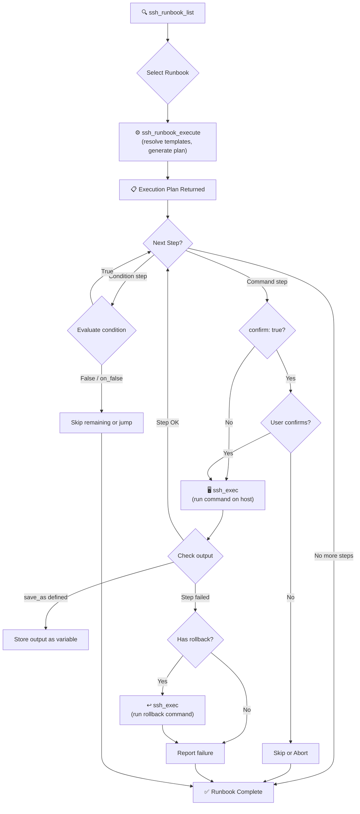

# 📒 MCP SSH Bridge — Runbook System

## 📖 What Are Runbooks?

Runbooks are **YAML-defined multi-step operational procedures** that codify common sysadmin tasks into repeatable, auditable workflows. Instead of remembering a sequence of diagnostic and remediation commands, you define them once in a YAML file and execute them through MCP SSH Bridge.

Each runbook consists of:
- **Parameters** with types, defaults, and descriptions
- **Steps** that are executed sequentially, with support for conditional logic, output capture, user confirmation, and rollback commands
- **Template variables** (`{{ variable }}`) that get resolved from parameters before execution

Runbooks are **not executed automatically end-to-end**. Instead, `ssh_runbook_execute` resolves all templates and returns an **execution plan**. You (or Claude) then run each step individually via `ssh_exec`, observing output before proceeding. This gives you full control and visibility at every stage.

---

## 🔧 YAML Schema

```yaml
name: my_runbook                    # Unique identifier (required)
description: "What this runbook does" # Human-readable description (required)
version: "1.0"                      # Semver string (default: "1.0")

params:                             # Parameter definitions (optional)
  param_name:
    type: string                    # "string" or "integer"
    default: "value"                # Default value (omit to make required)
    description: "What this param controls"

steps:                              # Ordered list of steps (at least one required)
  - name: step_name                 # Unique step identifier (required)
    command: "shell command"        # Command to execute (required unless condition is set)
    save_as: variable_name          # Save command output to a template variable (optional)
    condition: "{{ var }} >= 90"    # Boolean condition to evaluate (optional, replaces command)
    on_false: skip_to_end           # Action if condition is false (optional)
    confirm: true                   # Require user confirmation before execution (default: false)
    rollback: "undo command"        # Command to run if this step needs to be reverted (optional)
```

### 🔑 Step Field Reference

| Field | Type | Required | Description |
|-------|------|----------|-------------|
| `name` | string | Yes | Unique identifier for the step |
| `command` | string | No* | Shell command to execute on the remote host |
| `save_as` | string | No | Store command output in a named variable for later steps |
| `condition` | string | No* | Expression to evaluate; step acts as a gate |
| `on_false` | string | No | Action when condition evaluates to false (e.g., `skip_to_end`) |
| `confirm` | bool | No | If `true`, the user must confirm before this step runs |
| `rollback` | string | No | Command to execute if rollback is needed |

*Each step must have at least one of `command` or `condition`.

---

## 📦 Built-in Runbooks

MCP SSH Bridge ships with **5 built-in runbooks** embedded directly in the binary. They are always available without any file installation.

### 1. 💾 `disk_full_recovery`
Diagnose and recover from disk full conditions by identifying large files, cleaning old logs, and verifying recovery.

| Parameter | Type | Default | Description |
|-----------|------|---------|-------------|
| `threshold_percent` | integer | `90` | Disk usage % threshold to trigger cleanup |
| `target_dir` | string | `/var/log` | Directory to analyze and clean |

**Steps:** Check disk usage → Evaluate threshold → Find large files → Find old compressed logs → Clean old compressed logs (confirm) → Verify recovery

### 2. 🔄 `service_restart`
Safely restart a systemd service with pre/post health checks and automatic rollback on failure.

| Parameter | Type | Default | Description |
|-----------|------|---------|-------------|
| `service_name` | string | *(required)* | Name of the systemd service to restart |
| `health_check` | string | `""` | Optional health check command to run after restart |

**Steps:** Check service exists → Capture pre-state → Restart service (confirm) → Wait for startup → Verify service active

### 3. 🧠 `oom_recovery`
Investigate and recover from Out-Of-Memory conditions by identifying memory-hungry processes and clearing caches.

| Parameter | Type | Default | Description |
|-----------|------|---------|-------------|
| `top_count` | integer | `10` | Number of top memory consumers to show |

**Steps:** Check memory → Check OOM kills → Top memory consumers → Check swap → Clear caches (confirm) → Verify memory

### 4. 📜 `log_rotation`
Force log rotation and clean up old log files to reclaim disk space.

| Parameter | Type | Default | Description |
|-----------|------|---------|-------------|
| `log_dir` | string | `/var/log` | Base log directory to analyze |
| `days_to_keep` | integer | `7` | Number of days to retain compressed logs |

**Steps:** Check log disk usage → Find large logs → Force logrotate (confirm) → Clean old rotated logs (confirm) → Verify disk freed

### 5. 🔐 `cert_renewal_check`
Check TLS certificate expiry dates and attempt renewal via certbot if certificates are expiring soon.

| Parameter | Type | Default | Description |
|-----------|------|---------|-------------|
| `domain` | string | *(required)* | Domain name to check certificate for |
| `warning_days` | integer | `30` | Number of days before expiry to trigger warning |

**Steps:** Check cert expiry → Check days remaining → Check certbot available → Attempt renewal dry-run (confirm) → Verify cert

---

## ✏️ Creating Custom Runbooks

Place your custom runbook YAML files in:

```
~/.config/mcp-ssh-bridge/runbooks/
```

Any `.yaml` or `.yml` file in this directory is automatically discovered and merged with the built-in runbooks. Custom runbooks appear alongside built-in ones in `ssh_runbook_list`.

### Example: Custom Health Check Runbook

```yaml
name: app_health_check
description: "Check application health: HTTP endpoint, logs, and resource usage"
version: "1.0"
params:
  app_port:
    type: integer
    default: "8080"
    description: "Application HTTP port"
  app_name:
    type: string
    description: "Application process name"

steps:
  - name: check_http
    command: "curl -sf http://localhost:{{ app_port }}/health || echo 'UNHEALTHY'"
    save_as: health_status

  - name: check_process
    command: "pgrep -a {{ app_name }} || echo 'Process not found'"

  - name: check_recent_errors
    command: "journalctl -u {{ app_name }} --no-pager -n 50 --since '1 hour ago' 2>/dev/null | grep -i error | tail -10"

  - name: check_resources
    command: "ps -C {{ app_name }} -o pid,%cpu,%mem,etime --no-headers 2>/dev/null || echo 'No process found'"
```

### ✅ Validation

Before deploying a custom runbook, validate it:

```
ssh_runbook_validate(yaml_content: "<your YAML>")
```

Or validate an already-loaded runbook by name:

```
ssh_runbook_validate(runbook_name: "app_health_check")
```

---

## 🚀 How to Use Runbooks

The runbook workflow uses three MCP tools in sequence:

### Step 1: List available runbooks
```
ssh_runbook_list()
```
Returns all built-in and user-defined runbooks with their descriptions, parameters, and step counts.

### Step 2: Generate an execution plan
```
ssh_runbook_execute(
  host: "my-server",
  runbook_name: "disk_full_recovery",
  params: { "threshold_percent": "85", "target_dir": "/data" }
)
```
Returns a fully-resolved execution plan with all `{{ template }}` variables replaced. No commands are actually executed yet.

### Step 3: Execute step by step
Run each step from the plan individually using `ssh_exec`:
```
ssh_exec(host: "my-server", command: "df -h /data | awk 'NR==2{print $5}' | tr -d '%'")
```
Observe the output, then proceed to the next step. For steps marked with `confirm: true`, the user is asked for confirmation before execution.

---

## 🔀 Execution Flow



---

## 📂 File Locations

| Location | Purpose |
|----------|---------|
| `config/runbooks/*.yaml` | Built-in runbook source files (embedded at compile time) |
| `~/.config/mcp-ssh-bridge/runbooks/` | User-defined custom runbooks (runtime discovery) |
| `src/domain/runbook.rs` | Runbook domain model, validation, and template engine |
| `src/mcp/tool_handlers/ssh_runbook_list.rs` | `ssh_runbook_list` tool handler |
| `src/mcp/tool_handlers/ssh_runbook_execute.rs` | `ssh_runbook_execute` tool handler |
| `src/mcp/tool_handlers/ssh_runbook_validate.rs` | `ssh_runbook_validate` tool handler |
