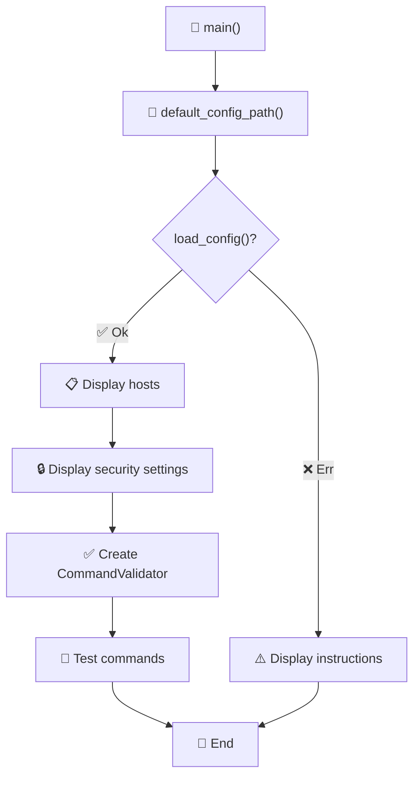
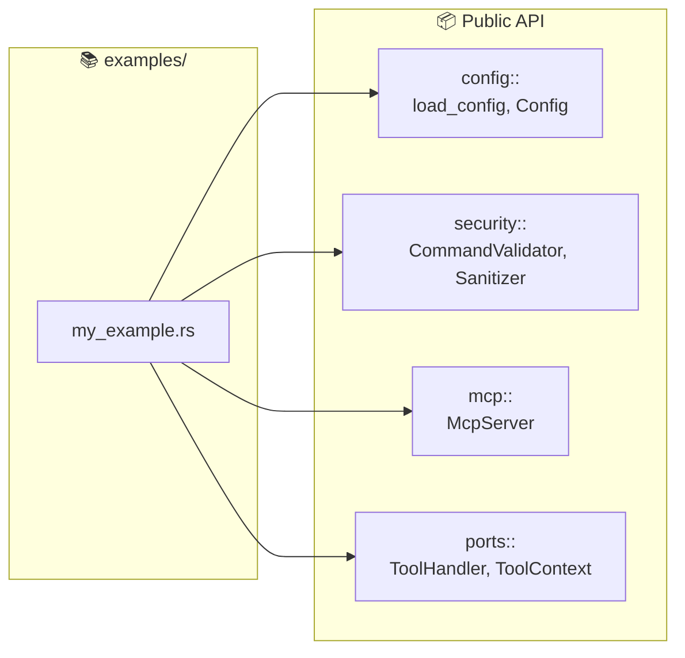

# 📚 Examples

Usage examples for the MCP SSH Bridge library.

## 📁 Contents

| Example | Description |
|---------|-------------|
| 🔧 `basic_usage.rs` | Config loading and command validation |

## 🚀 Execution

```bash
# Run an example
cargo run --example basic_usage

# With all features
cargo run --example basic_usage --all-features
```

## 🔧 basic_usage.rs

This example shows how to:

1. 📂 Load configuration from the default path
2. 📋 List configured hosts
3. ✅ Use `CommandValidator` to validate commands



### Code

```rust
use mcp_ssh_bridge::config::{default_config_path, load_config};
use mcp_ssh_bridge::security::CommandValidator;

fn main() {
    let config_path = default_config_path();
    let config = load_config(&config_path)?;

    // List hosts
    for (alias, host) in &config.hosts {
        println!("{} -> {}@{}", alias, host.user, host.hostname);
    }

    // Validate commands
    let validator = CommandValidator::new(&config.security);
    match validator.validate("ls -la") {
        Ok(()) => println!("✅ Command allowed"),
        Err(e) => println!("❌ Command denied: {}", e),
    }
}
```

### Example Output

```
Config path: /home/user/.config/mcp-ssh-bridge/config.yaml

=== Configured Hosts ===
  prod-server -> admin@192.168.1.100:22
      Production server

=== Security Settings ===
  Mode: Strict
  Whitelist patterns: 5
  Blacklist patterns: 7

=== Command Validation ===
  ls -la -> ALLOWED
  pwd -> ALLOWED
  whoami -> ALLOWED
  rm -rf / -> DENIED
  cat /etc/passwd -> DENIED
```

## ➕ Creating a New Example

### 1️⃣ Create the file

```rust
// examples/my_example.rs
use mcp_ssh_bridge::config::Config;

fn main() {
    println!("My example!");
}
```

### 2️⃣ Run

```bash
cargo run --example my_example
```

### 📦 Available APIs

Examples have access to all public APIs:



## 🎨 Best Practices

| Practice | Description |
|----------|-------------|
| 📝 Doc comments | `//!` at the top of the file |
| 🔧 Simple | One concept per example |
| ✅ Functional | Must compile and run |
| 📋 Clear output | Readable messages |
