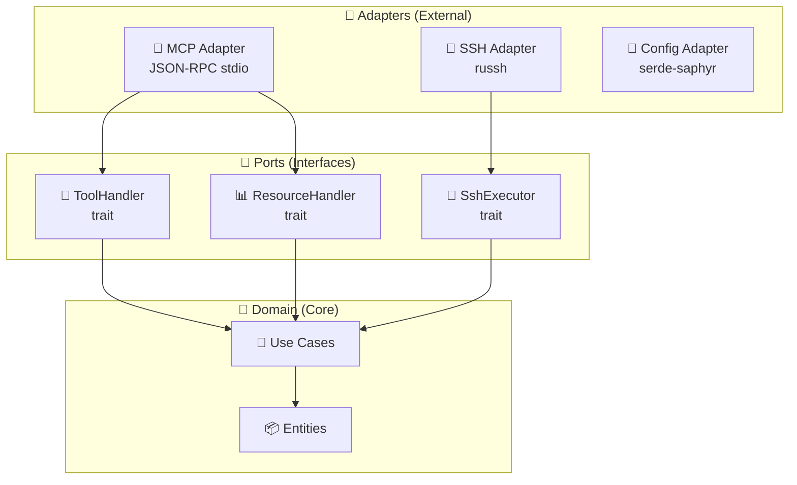
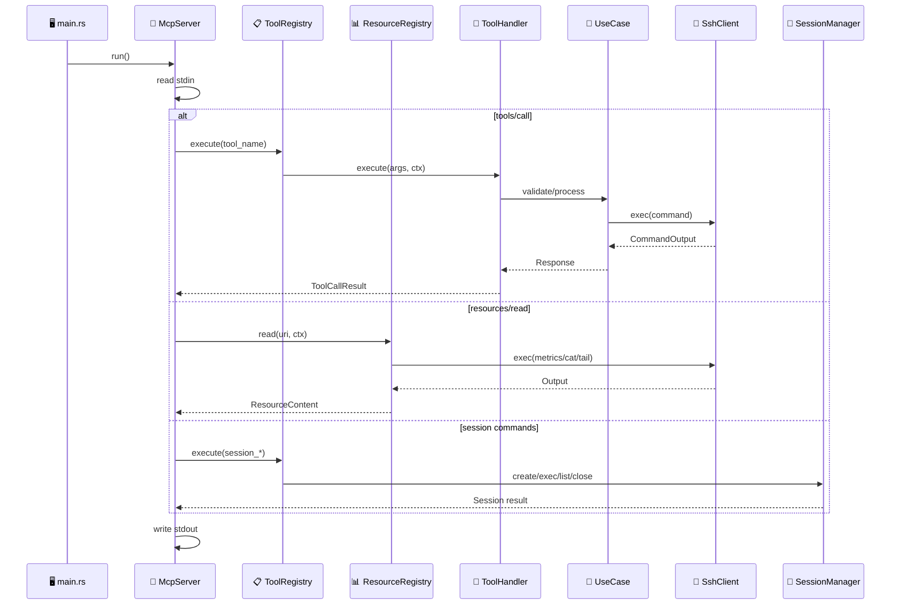

# 📂 Source Code - MCP SSH Bridge

This folder contains the source code for the MCP SSH Bridge server.

## 🏗️ Hexagonal Architecture



## 📁 Module Structure

```
src/
├── 📄 main.rs              # 🚀 CLI entry point
├── 📄 lib.rs               # 📚 Library exports
├── 📄 error.rs             # ❌ Centralized error types
│
├── 📂 config/              # ⚙️ Configuration
│   ├── mod.rs              # Module exports
│   ├── loader.rs           # YAML loading
│   ├── types.rs            # Config structures
│   └── watcher.rs          # Hot-reload configuration
│
├── 📂 domain/              # 💎 Business logic
│   ├── mod.rs              # Module exports
│   ├── history.rs          # CommandHistory (canonical location)
│   ├── output_cache.rs     # 📦 OutputCache for paginated output retrieval
│   ├── output_truncator.rs # ✂️ Head+tail output truncation
│   └── use_cases/          # Use cases
│       ├── mod.rs
│       ├── execute_command.rs
│       ├── parse_metrics.rs # System metrics parsing
│       ├── database.rs      # DatabaseCommandBuilder
│       ├── kubernetes.rs    # KubernetesCommandBuilder + HelmCommandBuilder
│       ├── ansible.rs       # AnsibleCommandBuilder
│       ├── docker.rs        # DockerCommandBuilder
│       ├── tunnel.rs        # TunnelManager
│       ├── systemd.rs       # SystemdCommandBuilder
│       ├── network.rs       # NetworkCommandBuilder
│       ├── process.rs       # ProcessCommandBuilder
│       ├── package.rs       # PackageCommandBuilder
│       ├── firewall.rs      # FirewallCommandBuilder
│       ├── cron.rs          # CronCommandBuilder
│       ├── certificate.rs   # CertificateCommandBuilder
│       ├── nginx.rs         # NginxCommandBuilder
│       ├── redis.rs         # RedisCommandBuilder
│       ├── terraform.rs     # TerraformCommandBuilder
│       ├── vault.rs         # VaultCommandBuilder
│       ├── shell.rs          # 🪟 Shell utilities (OsType, ShellType, escape)
│       ├── active_directory.rs # 🪟 ActiveDirectoryCommandBuilder
│       ├── hyperv.rs          # 🪟 HyperVCommandBuilder
│       ├── iis.rs             # 🪟 IisCommandBuilder
│       ├── scheduled_task.rs  # 🪟 ScheduledTaskCommandBuilder
│       ├── windows_event.rs   # 🪟 WindowsEventCommandBuilder
│       ├── windows_feature.rs # 🪟 WindowsFeatureCommandBuilder
│       ├── windows_firewall.rs # 🪟 WindowsFirewallCommandBuilder
│       ├── windows_network.rs # 🪟 WindowsNetworkCommandBuilder
│       ├── windows_perf.rs    # 🪟 WindowsPerfCommandBuilder
│       ├── windows_process.rs # 🪟 WindowsProcessCommandBuilder
│       ├── windows_registry.rs # 🪟 WindowsRegistryCommandBuilder
│       ├── windows_service.rs # 🪟 WindowsServiceCommandBuilder
│       └── windows_update.rs  # 🪟 WindowsUpdateCommandBuilder
│
├── 📂 ports/               # 🔗 Interfaces (Traits)
│   ├── mod.rs              # Module exports
│   ├── protocol.rs         # Contract types (ToolCallResult, PromptMessage, etc.)
│   ├── connector.rs        # SshConnector trait
│   ├── ssh.rs              # SshExecutor trait
│   ├── tools.rs            # ToolHandler trait + ToolContext
│   ├── prompts.rs          # PromptHandler trait
│   └── resources.rs        # ResourceHandler trait
│
├── 📂 mcp/                 # 📡 MCP Protocol
│   ├── mod.rs              # Module exports
│   ├── server.rs           # Main server
│   ├── protocol.rs         # JSON-RPC types
│   ├── registry.rs         # Tool registry (197 tools, 38 groups)
│   ├── prompt_registry.rs  # Prompt registry
│   ├── resource_registry.rs # Resource registry
│   ├── standard_tool.rs    # StandardTool trait + generic pipeline
│   ├── history.rs          # Command history (re-export from domain)
│   ├── tool_handlers/      # Tool handlers (197)
│   │   ├── ssh_exec.rs     # Command execution
│   │   ├── ssh_exec_multi.rs # Parallel multi-host execution
│   │   ├── ssh_status.rs   # Host status
│   │   ├── ssh_history.rs  # Command history
│   │   ├── ssh_upload.rs   # SFTP upload
│   │   ├── ssh_download.rs # SFTP download
│   │   ├── ssh_sync.rs     # Bidirectional file sync
│   │   ├── ssh_tail.rs     # Tail with grep
│   │   ├── ssh_ls.rs       # Remote directory listing
│   │   ├── ssh_metrics.rs  # System metrics
│   │   ├── ssh_metrics_multi.rs # Multi-host metrics
│   │   ├── ssh_health.rs   # Bridge diagnostics
│   │   ├── ssh_session_*.rs     # Session management (4 tools)
│   │   ├── ssh_tunnel_*.rs      # SSH tunnels (3 tools)
│   │   ├── ssh_db_*.rs          # Database tools (3 tools)
│   │   ├── ssh_backup_*.rs      # Backup tools (3 tools)
│   │   ├── ssh_k8s_*.rs         # Kubernetes tools (9 tools)
│   │   ├── ssh_helm_*.rs        # Helm tools (7 tools)
│   │   ├── ssh_ansible_*.rs     # Ansible tools (3 tools)
│   │   ├── ssh_docker_*.rs      # Docker tools (11 tools)
│   │   ├── ssh_esxi_*.rs        # ESXi tools (7 tools)
│   │   ├── ssh_git_*.rs         # Git tools (7 tools)
│   │   ├── ssh_service_*.rs     # Systemd tools (9 tools)
│   │   ├── ssh_net_*.rs         # Network tools (6 tools)
│   │   ├── ssh_process_*.rs     # Process tools (3 tools)
│   │   ├── ssh_pkg_*.rs         # Package tools (5 tools)
│   │   ├── ssh_firewall_*.rs    # Firewall tools (4 tools)
│   │   ├── ssh_cron_*.rs        # Cron tools (3 tools)
│   │   ├── ssh_cert_*.rs        # Certificate tools (3 tools)
│   │   ├── ssh_nginx_*.rs       # Nginx tools (4 tools)
│   │   ├── ssh_redis_*.rs       # Redis tools (3 tools)
│   │   ├── ssh_terraform_*.rs   # Terraform tools (5 tools)
│   │   ├── ssh_vault_*.rs       # Vault tools (4 tools)
│   │   ├── ssh_output_fetch.rs  # Output pagination
│   │   ├── ssh_config_*.rs      # Config tools (2 tools)
│   │   ├── ssh_disk_usage.rs  # Disk usage analysis
│   │   ├── ssh_find.rs        # File search
│   │   ├── ssh_win_service_*.rs   # 🪟 Windows Services (8 tools)
│   │   ├── ssh_win_event_*.rs     # 🪟 Windows Events (5 tools)
│   │   ├── ssh_ad_*.rs            # 🪟 Active Directory (6 tools)
│   │   ├── ssh_schtask_*.rs       # 🪟 Scheduled Tasks (5 tools)
│   │   ├── ssh_win_firewall_*.rs  # 🪟 Windows Firewall (5 tools)
│   │   ├── ssh_iis_*.rs           # 🪟 IIS (6 tools)
│   │   ├── ssh_win_update_*.rs    # 🪟 Windows Updates (5 tools)
│   │   ├── ssh_win_perf_*.rs      # 🪟 Windows Performance (6 tools)
│   │   ├── ssh_hyperv_*.rs        # 🪟 Hyper-V (8 tools)
│   │   ├── ssh_reg_*.rs           # 🪟 Windows Registry (5 tools)
│   │   ├── ssh_win_feature_*.rs   # 🪟 Windows Features (4 tools)
│   │   ├── ssh_win_net_*.rs       # 🪟 Windows Network (6 tools)
│   │   └── ssh_win_process_*.rs   # 🪟 Windows Process (5 tools)
│   └── resources/          # Resource handlers
│       ├── metrics_resource.rs # metrics://{host}
│       ├── file_resource.rs    # file://{host}/{path}
│       └── log_resource.rs     # log://{host}/{path}
│
├── 📂 ssh/                 # 🔑 SSH Client
│   ├── mod.rs              # Module exports
│   ├── client.rs           # russh client
│   ├── connector.rs        # RealSshConnector
│   ├── pool.rs             # Connection pool
│   ├── retry.rs            # Retry logic
│   ├── session.rs          # Persistent sessions (SessionManager)
│   ├── sftp.rs             # Streaming SFTP transfer
│   └── known_hosts.rs      # Key verification
│
└── 📂 security/            # 🔒 Security
    ├── mod.rs              # Module exports
    ├── validator.rs        # Command validation
    ├── sanitizer.rs        # Output cleaning
    ├── audit.rs            # Audit logging
    └── rate_limiter.rs     # Per-host rate limiting
```

## 🪟 Windows Support

v2.0.1 adds **74 Windows tools** across **13 groups** for managing Windows servers via PowerShell over SSH.


Each Windows tool uses `OsType::Windows` detection and PowerShell command builders from `src/domain/use_cases/`.

## 🔄 Data Flow



## 🎯 Design Principles

| Principle | Application |
|-----------|-------------|
| 🔌 **Ports & Adapters** | Clear separation between domain and infrastructure |
| 🎭 **Strategy Pattern** | `CommandValidator` with pre-compiled regex |
| 🏭 **Factory Pattern** | `create_default_registry()` |
| 🔐 **Open/Closed** | Add tools without modifying existing code |
| 📦 **Arc/Shared State** | Thread-safe component sharing |
| 🪟 **OS Detection** | `OsType` enum routes to Linux/Windows command builders |

## 🧪 Tests

Each module contains its own unit tests in a `#[cfg(test)]` block.

```bash
# Run all tests
cargo test

# Tests for a specific module
cargo test security::validator
```
