# 🖥️ CLI Module

Command-line interface for using MCP SSH Bridge directly, without going through the MCP protocol.

## 📁 Module Structure

```
cli/
├── 📄 mod.rs      → CLI definition with clap (Parser, Subcommand)
└── 📄 runner.rs   → Command execution functions
```

## 🏗️ Architecture

```mermaid
graph TB
    subgraph CLI["🖥️ CLI Module"]
        MOD["📄 mod.rs<br/>Cli, Commands"]
        RUN["📄 runner.rs<br/>run_exec, run_status, etc."]
    end

    subgraph Domain["💎 Domain"]
        UC["🎯 ExecuteCommandUseCase"]
    end

    subgraph SSH["🔑 SSH"]
        POOL["🔄 ConnectionPool"]
    end

    subgraph Security["🔒 Security"]
        VAL["✅ CommandValidator"]
        SAN["🧹 Sanitizer"]
        AUD["📝 AuditLogger"]
    end

    MOD --> RUN
    RUN --> UC
    RUN --> POOL
    RUN --> VAL
    RUN --> SAN
    RUN --> AUD
```



## 🔧 Available Commands

```mermaid
flowchart LR
    CLI["mcp-ssh-bridge"]

    CLI --> Serve["🚀 serve<br/>(default)"]
    CLI --> Exec["⚡ exec"]
    CLI --> Status["📊 status"]
    CLI --> History["📜 history"]
    CLI --> Upload["📤 upload"]
    CLI --> Download["📥 download"]

    Serve --> MCP["MCP Mode<br/>JSON-RPC stdio"]
    Exec --> SSH["SSH Execution"]
    Status --> Info["Display config"]
    History --> Hist["History"]
    Upload --> Up["Upload file"]
    Download --> Down["Download file"]
```



## 📋 Public API

### `mod.rs` - CLI Structures

| Structure | Description |
|-----------|-------------|
| `Cli` | Main parser with global `--config` |
| `Commands` | Subcommands enum |

### `runner.rs` - Execution Functions

| Function | Signature | Description |
|----------|-----------|-------------|
| `run_exec` | `async fn(config, host, command, timeout, working_dir)` | Execute a command |
| `run_status` | `async fn(config)` | Display configured hosts |
| `run_history` | `async fn(config, limit, host_filter)` | Display history |
| `run_upload` | `async fn(config, host, local_path, remote_path)` | Upload file |
| `run_download` | `async fn(config, host, remote_path, local_path)` | Download file |

## 🔄 Execution Flow

```mermaid
sequenceDiagram
    participant User as 👤 User
    participant CLI as 🖥️ CLI
    participant CTX as 📦 ToolContext
    participant UC as 🎯 UseCase
    participant Pool as 🔄 Pool
    participant SSH as 🔑 SSH

    User->>CLI: mcp-ssh-bridge exec host "cmd"
    CLI->>CTX: create_context(config)

    Note over CLI: 1️⃣ Validation
    CLI->>UC: validate(command)
    alt ❌ Command denied
        UC-->>CLI: Err(CommandDenied)
        CLI-->>User: ❌ Error message
    end

    Note over CLI: 2️⃣ Execution
    CLI->>Pool: get_or_create(host)
    Pool->>SSH: connect()
    CLI->>SSH: exec(command)
    SSH-->>CLI: CommandOutput

    Note over CLI: 3️⃣ Post-processing
    CLI->>UC: process_success()
    UC-->>CLI: Response (sanitized)
    CLI-->>User: ✅ Output
```



## 💻 Usage

```bash
# MCP mode (default, for Claude Code)
mcp-ssh-bridge

# With custom config
mcp-ssh-bridge --config /path/to/config.yaml

# Execute a command
mcp-ssh-bridge exec prod-server "docker ps"
mcp-ssh-bridge exec prod-server "ls -la" --timeout 30

# View configured hosts
mcp-ssh-bridge status

# Command history
mcp-ssh-bridge history --limit 20
mcp-ssh-bridge history --host prod-server

# File transfer
mcp-ssh-bridge upload prod-server ./script.sh /tmp/script.sh
mcp-ssh-bridge download prod-server /var/log/app.log ./app.log
```

## 🏷️ Feature Flag

This module is conditional via the `cli` feature:

```toml
[features]
default = ["cli"]
cli = ["dep:clap"]
```



```mermaid
flowchart TD
    BUILD["cargo build"]
    BUILD --> CHECK{"Feature cli?"}

    CHECK -->|"Yes (default)"| BIN["🖥️ Binary + 📚 Lib"]
    CHECK -->|"No"| LIB["📚 Lib only"]

    BIN --> CLAP["clap included"]
    LIB --> NOCLAP["clap excluded"]
```

Without the `cli` feature, only the library is compiled (no binary).

```bash
# Build without CLI (library only)
cargo build --no-default-features

# Build with CLI (default)
cargo build
```

## 🧪 Tests

The CLI module has no direct unit tests as it heavily depends on I/O.
Functions are tested indirectly via integration tests.

```bash
# Integration tests
cargo test --test integration
```

## 🎨 Design Patterns

| Pattern | Application |
|---------|-------------|
| 🏗️ **Builder** | `clap` with derive macros |
| 📦 **Context Object** | `ToolContext` groups dependencies |
| 🔄 **Reuse** | Reuses `ExecuteCommandUseCase` from domain |
| 💉 **DI** | Dependency injection via `create_context()` |

## 🔗 Relations with Other Modules


