# ⚙️ Configuration Module

This module handles loading and validation of YAML configuration for MCP SSH Bridge.

## 📁 Module Structure

```
config/
├── 📄 mod.rs       → Public exports (Config, HostConfig, etc.)
├── 📄 loader.rs    → load_config(), default_config_path()
├── 📄 types.rs     → All configuration structures
└── 📄 watcher.rs   → ConfigWatcher (hot-reload)
```

## 🔧 Public API

### `loader.rs`

| Function | Signature | Description |
|----------|-----------|-------------|
| `load_config` | `fn load_config(path: &Path) -> Result<Config>` | Loads and validates the YAML file |
| `default_config_path` | `fn default_config_path() -> PathBuf` | Returns `~/.config/mcp-ssh-bridge/config.yaml` |

### Validation performed by `load_config`

- ✅ At least one host defined
- ✅ `hostname` and `user` not empty
- ✅ SSH key exists (for `Key` auth)
- ✅ Valid regex patterns (whitelist, blacklist, sanitize)

## 🏗️ Configuration Structures

```mermaid
classDiagram
    class Config {
        +hosts: HashMap~String, HostConfig~
        +security: SecurityConfig
        +limits: LimitsConfig
        +audit: AuditConfig
        +sessions: SessionConfig
        +tool_groups: ToolGroupsConfig
        +ssh_config: SshConfigDiscovery
    }

    class HostConfig {
        +hostname: String
        +port: u16 = 22
        +user: String
        +auth: AuthConfig
        +os_type: OsType = Linux
        +description: Option~String~
        +host_key_verification: HostKeyVerification = Strict
        +proxy_jump: Option~String~
        +socks_proxy: Option~SocksProxyConfig~
        +sudo_password: Option~String~
    }

    class OsType {
        <<enum>>
        Linux ← default
        Windows
    }

    class SocksProxyConfig {
        +hostname: String
        +port: u16 = 1080
        +version: SocksVersion = Socks5
        +username: Option~String~
        +password: Option~String~
    }

    class SocksVersion {
        <<enum>>
        Socks5 ← default
        Socks4
    }

    class AuthConfig {
        <<enum>>
        Key: path, passphrase?
        Agent
        Password: password
    }

    class HostKeyVerification {
        <<enum>>
        Strict ← default
        AcceptNew
        Off
    }

    class SecurityConfig {
        +mode: SecurityMode = Standard
        +whitelist: Vec~String~ = []
        +blacklist: Vec~String~ = defaults
        +sanitize_patterns: Vec~String~ = []
        +sanitize: SanitizeConfig
    }

    class LimitsConfig {
        +command_timeout_seconds: u64 = 60
        +max_output_bytes: usize = 10MB
        +max_concurrent_commands: usize = 5
        +connection_timeout_seconds: u64 = 10
        +keepalive_interval_seconds: u64 = 30
        +retry_attempts: u32 = 3
        +retry_initial_delay_ms: u64 = 100
        +rate_limit_per_second: u32 = 0
        +max_output_chars: usize = 20000
        +client_overrides: Vec~ClientOverride~
        +output_cache_ttl_seconds: u64 = 300
        +output_cache_max_entries: usize = 100
    }

    class AuditConfig {
        +enabled: bool = true
        +path: PathBuf = ~/.local/share/.../audit.log
        +max_size_mb: u64 = 100
        +retain_days: u32 = 30
    }

    class ToolGroupsConfig {
        +groups: HashMap~String, bool~
        +is_group_enabled(name) bool
    }

    class SessionConfig {
        +max_sessions: usize = 10
        +idle_timeout_seconds: u64 = 300
        +max_age_seconds: u64 = 3600
    }

    class ClientOverride {
        +name_contains: String
        +match_mode: MatchMode = Prefix
        +max_output_chars: Option~usize~
    }

    class SshConfigDiscovery {
        +enabled: bool = true
        +config_path: Option~String~
        +exclude_patterns: Vec~String~
    }

    Config --> HostConfig
    Config --> SecurityConfig
    Config --> LimitsConfig
    Config --> AuditConfig
    Config --> SessionConfig
    Config --> ToolGroupsConfig
    Config --> SshConfigDiscovery
    HostConfig --> AuthConfig
    HostConfig --> HostKeyVerification
    HostConfig --> OsType
    HostConfig --> SocksProxyConfig
    SocksProxyConfig --> SocksVersion
    LimitsConfig --> ClientOverride
```



## 🔐 Authentication Methods

```mermaid
flowchart LR
    subgraph AuthConfig["🔑 AuthConfig (enum)"]
        KEY["<b>Key</b><br/>path: String<br/>passphrase: Option"]
        AGENT["<b>Agent</b><br/>(uses SSH_AUTH_SOCK)"]
        PASS["<b>Password</b><br/>password: String"]
    end

    KEY -->|"Recommended"| R1["⭐⭐⭐"]
    AGENT -->|"Recommended"| R2["⭐⭐⭐"]
    PASS -->|"Not recommended"| R3["⭐"]
```



## 🔒 Host Key Verification

```mermaid
flowchart TD
    KEY["🔑 Server key received"] --> MODE{host_key_verification?}

    MODE -->|"Strict<br/>(default)"| STRICT
    MODE -->|"AcceptNew"| ACCEPT
    MODE -->|"Off"| OFF["✅ Accepted<br/>⚠️ Dangerous"]

    subgraph STRICT["Strict Mode"]
        S1{"Key in<br/>known_hosts?"}
        S1 -->|"Match"| S2["✅ OK"]
        S1 -->|"Mismatch"| S3["❌ SshHostKeyMismatch"]
        S1 -->|"Unknown"| S4["❌ SshHostKeyUnknown"]
    end

    subgraph ACCEPT["AcceptNew Mode"]
        A1{"Key in<br/>known_hosts?"}
        A1 -->|"Match"| A2["✅ OK"]
        A1 -->|"Mismatch"| A3["❌ SshHostKeyMismatch"]
        A1 -->|"Unknown"| A4["📝 Auto-add + ✅"]
    end
```



## 📋 Default Values

### `SecurityConfig::default()`

```rust
SecurityConfig {
    mode: SecurityMode::Strict,
    whitelist: vec![],  // Empty = all blocked in strict mode
    blacklist: vec![
        r"rm\s+-rf\s+/",      // rm -rf /
        r"mkfs\.",             // Disk formatting
        r"dd\s+if=",           // Dangerous dd
        r">\s*/dev/",          // Writing to devices
        r"chmod\s+777",        // Dangerous permissions
        r"curl.*\|.*sh",       // Remote execution
        r"wget.*\|.*sh",       // Remote execution
    ],
    sanitize_patterns: vec![
        r"(?i)password\s*=\s*\S+",
        r"(?i)secret\s*=\s*\S+",
        r"(?i)token\s*=\s*\S+",
        r"-----BEGIN.*PRIVATE KEY-----",
    ],
}
```

### `LimitsConfig::default()`

| Parameter | Value | Description |
|-----------|-------|-------------|
| `command_timeout_seconds` | 60 | Max execution timeout |
| `max_output_bytes` | 10 MB | Max output size |
| `max_concurrent_commands` | 5 | Simultaneous commands |
| `connection_timeout_seconds` | 10 | Connection timeout |
| `keepalive_interval_seconds` | 30 | Keepalive interval |
| `retry_attempts` | 3 | Retry attempts |
| `retry_initial_delay_ms` | 100 | Initial backoff delay |
| `rate_limit_per_second` | 0 | Requests/sec per host (0 = disabled) |
| `max_output_chars` | 20000 | Max output chars returned to client |
| `client_overrides` | [] | Per-client output limit overrides |
| `output_cache_ttl_seconds` | 300 | Output cache entry TTL |
| `output_cache_max_entries` | 100 | Max entries in output cache |

## 📝 Complete Example

```yaml
# ~/.config/mcp-ssh-bridge/config.yaml

hosts:
  prod-server:
    hostname: 192.168.1.100
    port: 22
    user: admin
    os_type: linux               # linux (default) or windows
    description: "Production server"
    host_key_verification: strict
    auth:
      type: key
      path: ~/.ssh/id_ed25519
      passphrase: "optional"

  win-server:
    hostname: 10.0.0.50
    user: administrator
    os_type: windows             # Enables Windows tool groups
    auth:
      type: key
      path: ~/.ssh/id_ed25519

  dev-server:
    hostname: dev.example.com
    user: developer
    host_key_verification: acceptnew
    auth:
      type: agent

security:
  mode: strict
  whitelist:
    - "^ls\\b"
    - "^cat\\s"
    - "^docker\\s+(ps|logs|inspect)"
    - "^systemctl\\s+status"
  blacklist:
    - "rm\\s+-rf"
    - "sudo\\s+su"

limits:
  command_timeout_seconds: 120
  max_output_bytes: 5242880      # 5MB
  max_output_chars: 20000        # Max chars returned to client
  retry_attempts: 3
  rate_limit_per_second: 10      # 0 = disabled
  output_cache_ttl_seconds: 300  # Output cache TTL
  output_cache_max_entries: 100  # Max cached outputs
  client_overrides:              # Per-client output limits
    - name_contains: "cursor"
      max_output_chars: 50000

audit:
  enabled: true
  path: /var/log/mcp-ssh-bridge/audit.log
  max_size_mb: 50
  retain_days: 90
```

## 🔧 Useful Methods

### `LimitsConfig::retry_config()`

Converts retry parameters to `RetryConfig` for the SSH module:

```rust
impl LimitsConfig {
    #[must_use]
    pub fn retry_config(&self) -> crate::ssh::RetryConfig {
        crate::ssh::RetryConfig {
            max_attempts: self.retry_attempts,
            initial_delay_ms: self.retry_initial_delay_ms,
            ..Default::default()
        }
    }
}
```

## 🧪 Tests

```bash
# Config module tests
cargo test config::

# Specific test
cargo test config::loader::tests::test_config_not_found
```

### Test Coverage

| Test | Description |
|------|-------------|
| `test_config_not_found` | Error if file doesn't exist |

## 🔄 ConfigWatcher (Hot-Reload)

Watches the configuration file for automatic reloading. Supports atomic saves
(vim, nano, VS Code) and direct writes. Security rules (whitelist, blacklist, mode)
are reloaded in real time without restarting the server.

### Structure


### Operation

```mermaid
flowchart LR
    subgraph FS["📁 Filesystem"]
        DIR["config directory"]
        FILE["config.yaml"]
    end

    subgraph Watcher["👁️ ConfigWatcher"]
        NOTIFY["notify crate<br/>(watches parent dir)"]
        FILTER["Filter: Modify + Create<br/>+ path match"]
        DEBOUNCE["Debounce (500ms)"]
    end

    subgraph Reload["⚙️ Reload"]
        LOAD["load_config()"]
        RWLOCK["Arc~RwLock~Config~~"]
        VALIDATOR["CommandValidator.reload()"]
    end

    DIR -->|"inotify events"| NOTIFY
    NOTIFY --> FILTER
    FILTER --> DEBOUNCE
    DEBOUNCE --> LOAD
    LOAD --> RWLOCK
    LOAD --> VALIDATOR
```



### Key Design Decisions

| Decision | Reason |
|----------|--------|
| Watch **parent directory** instead of file | inotify tracks inodes; atomic saves create new inodes, breaking file-level watches |
| Accept **Modify + Create** events | Atomic saves (write temp + rename) generate Create events, not Modify |
| **Debounce** (500ms) | Editors generate multiple events per save (write + chmod + rename) |
| **Path filtering** | Only react to events targeting the config file, ignore other files in the directory |

### API

```rust
impl ConfigWatcher {
    /// Creates a watcher for config file changes only
    pub fn new(config_path: &Path, config: Arc<RwLock<Config>>) -> notify::Result<Self>

    /// Creates a watcher that also reloads security rules in the validator
    pub fn with_validator(
        config_path: &Path,
        config: Arc<RwLock<Config>>,
        validator: Option<Arc<CommandValidator>>,
    ) -> notify::Result<Self>

    /// Returns the watched path
    #[must_use]
    pub fn path(&self) -> &Path
}
```

### Usage

```rust
// Shared config and validator
let config = Arc::new(RwLock::new(load_config(&path)?));
let validator = Arc::new(CommandValidator::new(&config_snapshot.security));

// Create the watcher with validator integration
let _watcher = ConfigWatcher::with_validator(
    &path,
    Arc::clone(&config),
    Some(Arc::clone(&validator)),
)?;

// Config and security rules are automatically updated on file changes
// Works with atomic saves (vim, nano, VS Code) and direct writes
```

### What Gets Reloaded

| Component | Reloaded | Mechanism |
|-----------|----------|-----------|
| Security mode (strict/permissive) | Yes | `CommandValidator::reload()` |
| Whitelist patterns | Yes | `CommandValidator::reload()` |
| Blacklist patterns | Yes | `CommandValidator::reload()` |
| Host configuration | Yes | `Arc<RwLock<Config>>` swap |
| Limits/timeouts | Yes | `Arc<RwLock<Config>>` swap |
| Invalid YAML | Rejected | Previous config preserved |

## 🔧 ToolGroupsConfig

Controls which tool groups are enabled. Groups not explicitly listed default to enabled.

### Available Groups (38 groups, 197 tools)

#### 🐧 Linux Groups (25 groups, 123 tools)

| Group | Tools | Description |
|-------|-------|-------------|
| `core` | `ssh_exec`, `ssh_exec_multi`, `ssh_status`, `ssh_health`, `ssh_history`, `ssh_output_fetch` | Core execution and info |
| `file_transfer` | `ssh_upload`, `ssh_download`, `ssh_sync` | File operations |
| `sessions` | `ssh_session_create`, `ssh_session_exec`, `ssh_session_list`, `ssh_session_close` | Persistent sessions |
| `monitoring` | `ssh_metrics`, `ssh_metrics_multi`, `ssh_tail`, `ssh_disk_usage` | System metrics and monitoring |
| `tunnels` | `ssh_tunnel_create`, `ssh_tunnel_list`, `ssh_tunnel_close` | SSH tunnels |
| `directory` | `ssh_ls`, `ssh_find` | Directory listing and search |
| `database` | `ssh_db_query`, `ssh_db_dump`, `ssh_db_restore` | Database operations |
| `backup` | `ssh_backup_create`, `ssh_backup_list`, `ssh_backup_restore` | Backup management |
| `docker` | `ssh_docker_ps`, `ssh_docker_logs`, `ssh_docker_inspect`, `ssh_docker_exec`, `ssh_docker_compose`, `ssh_docker_images`, `ssh_docker_stats`, `ssh_docker_network_ls`, `ssh_docker_network_inspect`, `ssh_docker_volume_ls`, `ssh_docker_volume_inspect` | Docker management |
| `esxi` | `ssh_esxi_vm_list`, `ssh_esxi_vm_info`, `ssh_esxi_vm_power`, `ssh_esxi_snapshot`, `ssh_esxi_host_info`, `ssh_esxi_datastore_list`, `ssh_esxi_network_list` | VMware ESXi |
| `git` | `ssh_git_status`, `ssh_git_log`, `ssh_git_diff`, `ssh_git_pull`, `ssh_git_clone`, `ssh_git_branch`, `ssh_git_checkout` | Git operations |
| `kubernetes` | `ssh_k8s_get`, `ssh_k8s_logs`, `ssh_k8s_describe`, `ssh_k8s_apply`, `ssh_k8s_delete`, `ssh_k8s_rollout`, `ssh_k8s_scale`, `ssh_k8s_exec`, `ssh_k8s_top`, `ssh_helm_*` (7) | Kubernetes + Helm |
| `ansible` | `ssh_ansible_playbook`, `ssh_ansible_inventory`, `ssh_ansible_adhoc` | Ansible automation |
| `systemd` | `ssh_service_status`, `ssh_service_start`, `ssh_service_stop`, `ssh_service_restart`, `ssh_service_list`, `ssh_service_logs`, `ssh_service_daemon_reload`, `ssh_service_enable`, `ssh_service_disable` | Systemd services |
| `network` | `ssh_net_connections`, `ssh_net_interfaces`, `ssh_net_routes`, `ssh_net_ping`, `ssh_net_traceroute`, `ssh_net_dns` | Network diagnostics |
| `process` | `ssh_process_list`, `ssh_process_kill`, `ssh_process_top` | Process management |
| `package` | `ssh_pkg_list`, `ssh_pkg_search`, `ssh_pkg_install`, `ssh_pkg_update`, `ssh_pkg_remove` | Package management |
| `firewall` | `ssh_firewall_status`, `ssh_firewall_list`, `ssh_firewall_allow`, `ssh_firewall_deny` | Firewall rules |
| `cron` | `ssh_cron_list`, `ssh_cron_add`, `ssh_cron_remove` | Cron jobs |
| `certificates` | `ssh_cert_check`, `ssh_cert_info`, `ssh_cert_expiry` | TLS certificates |
| `nginx` | `ssh_nginx_status`, `ssh_nginx_test`, `ssh_nginx_reload`, `ssh_nginx_list_sites` | Nginx management |
| `redis` | `ssh_redis_info`, `ssh_redis_cli`, `ssh_redis_keys` | Redis operations |
| `terraform` | `ssh_terraform_init`, `ssh_terraform_plan`, `ssh_terraform_apply`, `ssh_terraform_state`, `ssh_terraform_output` | Terraform IaC |
| `vault` | `ssh_vault_status`, `ssh_vault_read`, `ssh_vault_list`, `ssh_vault_write` | HashiCorp Vault |
| `config` | `ssh_config_get`, `ssh_config_set` | Runtime config management |

<details>
<summary><strong>🪟 Windows Groups (13 groups, 74 tools)</strong></summary>

| Group | Tools | Description |
|-------|-------|-------------|
| `windows_services` | `ssh_win_service_list`, `ssh_win_service_status`, `ssh_win_service_start`, `ssh_win_service_stop`, `ssh_win_service_restart`, `ssh_win_service_enable`, `ssh_win_service_disable`, `ssh_win_service_config` | Windows service management |
| `windows_events` | `ssh_win_event_query`, `ssh_win_event_logs`, `ssh_win_event_sources`, `ssh_win_event_tail`, `ssh_win_event_export` | Windows Event Log |
| `active_directory` | `ssh_ad_user_list`, `ssh_ad_user_info`, `ssh_ad_group_list`, `ssh_ad_group_members`, `ssh_ad_computer_list`, `ssh_ad_domain_info` | Active Directory |
| `scheduled_tasks` | `ssh_schtask_list`, `ssh_schtask_info`, `ssh_schtask_run`, `ssh_schtask_enable`, `ssh_schtask_disable` | Windows Scheduled Tasks |
| `windows_firewall` | `ssh_win_firewall_status`, `ssh_win_firewall_list`, `ssh_win_firewall_allow`, `ssh_win_firewall_deny`, `ssh_win_firewall_remove` | Windows Firewall |
| `iis` | `ssh_iis_list_sites`, `ssh_iis_list_pools`, `ssh_iis_status`, `ssh_iis_start`, `ssh_iis_stop`, `ssh_iis_restart` | IIS web server |
| `windows_updates` | `ssh_win_update_list`, `ssh_win_update_search`, `ssh_win_update_install`, `ssh_win_update_history`, `ssh_win_update_reboot` | Windows Update |
| `windows_perf` | `ssh_win_perf_overview`, `ssh_win_perf_cpu`, `ssh_win_perf_memory`, `ssh_win_perf_disk`, `ssh_win_perf_network`, `ssh_win_disk_usage` | Windows performance counters |
| `hyperv` | `ssh_hyperv_vm_list`, `ssh_hyperv_vm_info`, `ssh_hyperv_vm_start`, `ssh_hyperv_vm_stop`, `ssh_hyperv_host_info`, `ssh_hyperv_switch_list`, `ssh_hyperv_snapshot_list`, `ssh_hyperv_snapshot_create` | Hyper-V management |
| `windows_registry` | `ssh_reg_query`, `ssh_reg_list`, `ssh_reg_set`, `ssh_reg_delete`, `ssh_reg_export` | Windows Registry |
| `windows_features` | `ssh_win_feature_list`, `ssh_win_feature_info`, `ssh_win_feature_install`, `ssh_win_feature_remove` | Windows Features/Roles |
| `windows_network` | `ssh_win_net_ip`, `ssh_win_net_adapters`, `ssh_win_net_connections`, `ssh_win_net_routes`, `ssh_win_net_ping`, `ssh_win_net_dns` | Windows network diagnostics |
| `windows_process` | `ssh_win_process_list`, `ssh_win_process_top`, `ssh_win_process_info`, `ssh_win_process_by_name`, `ssh_win_process_kill` | Windows process management |

</details>

### Example

```yaml
tool_groups:
  groups:
    sessions: false          # Disable persistent sessions
    database: false          # Disable database tools
    backup: true             # Explicitly enable backup tools
    windows_registry: false  # Disable Windows Registry tools
    hyperv: false            # Disable Hyper-V tools
    # Unlisted groups (core, file_transfer, etc.) are enabled by default
```

## 🔍 SshConfigDiscovery

When enabled, the bridge parses `~/.ssh/config` and automatically discovers hosts. YAML-defined hosts take precedence over discovered ones.

### Configuration

```yaml
ssh_config:
  enabled: true                    # Enabled by default
  config_path: ~/.ssh/config       # Custom path (optional)
  exclude_patterns:                # Hosts to exclude (optional)
    - "*.internal"
    - "bastion-*"
```

## 🔑 sudo_password in HostConfig

Optional sudo password for a host, used when commands require sudo privileges. This is stored in the YAML configuration and passed to tools that need elevated permissions.

### Example

```yaml
hosts:
  prod-server:
    hostname: 192.168.1.100
    user: admin
    sudo_password: "my-sudo-password"  # Optional, used for sudo commands
    auth:
      type: key
      path: ~/.ssh/id_ed25519
```

> [!WARNING]
> Storing passwords in configuration files is less secure than SSH key-based authentication. Consider using this only when necessary and ensure the config file has restrictive permissions (600).

## 🧦 SOCKS Proxy in `HostConfig`

Optional SOCKS proxy for routing SSH connections through a SOCKS4/5 proxy server. This is an alternative to `proxy_jump` — the two are mutually exclusive.

### Example

```yaml
hosts:
  remote-via-proxy:
    hostname: 10.0.0.5
    user: deploy
    socks_proxy:
      hostname: proxy.example.com
      port: 1080          # Default: 1080
      version: socks5     # socks5 (default) or socks4
      # username: user    # Optional (SOCKS5 only)
      # password: pass    # Optional (SOCKS5 only)
    auth:
      type: key
      path: ~/.ssh/id_ed25519
```

> [!CAUTION]
> Setting both `proxy_jump` and `socks_proxy` on the same host will result in a `ConfigInvalid` error at load time.

## ⚠️ Possible Errors

| Error | Cause |
|-------|-------|
| `ConfigNotFound` | Config file doesn't exist |
| `ConfigInvalid` | Malformed YAML or validation failed |
| `SshKeyNotFound` | Specified SSH key not found |
