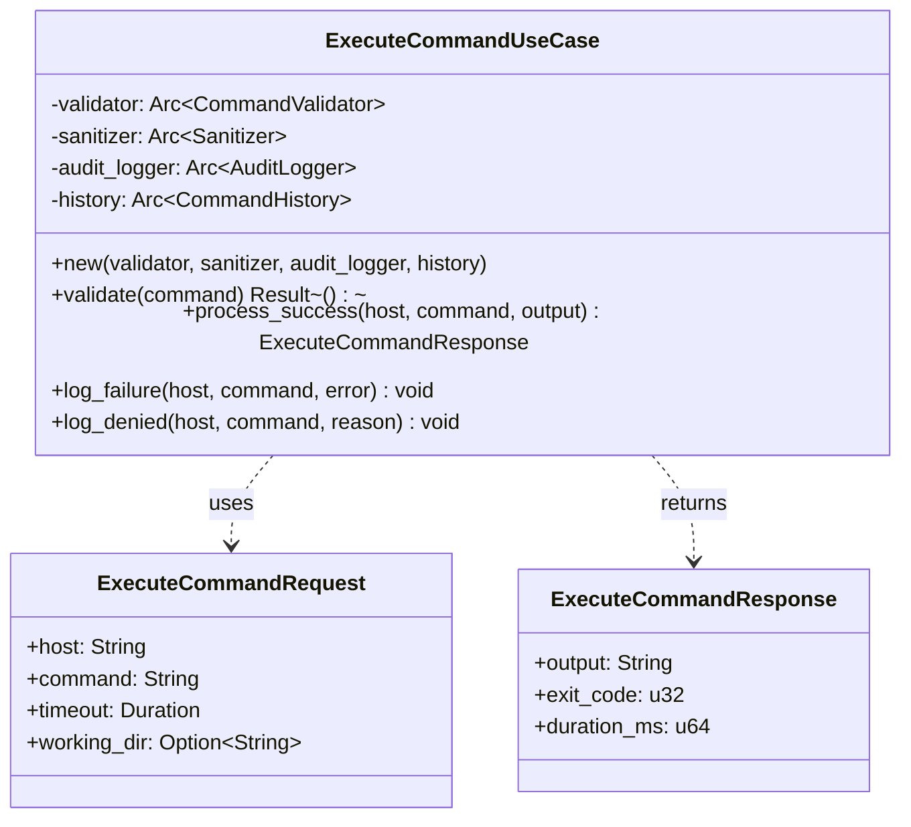
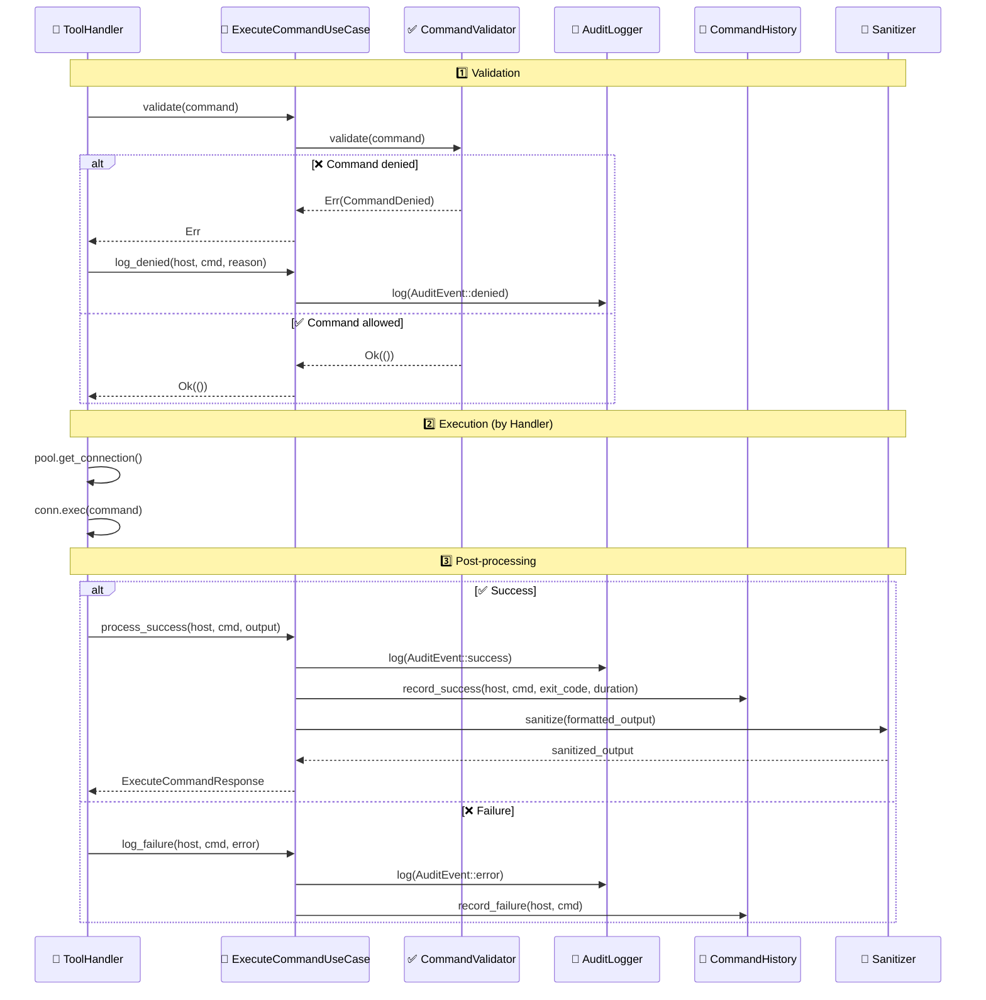
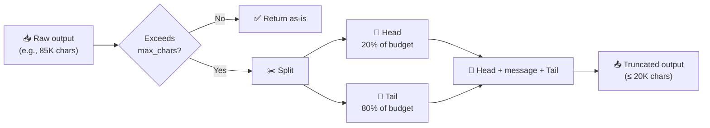
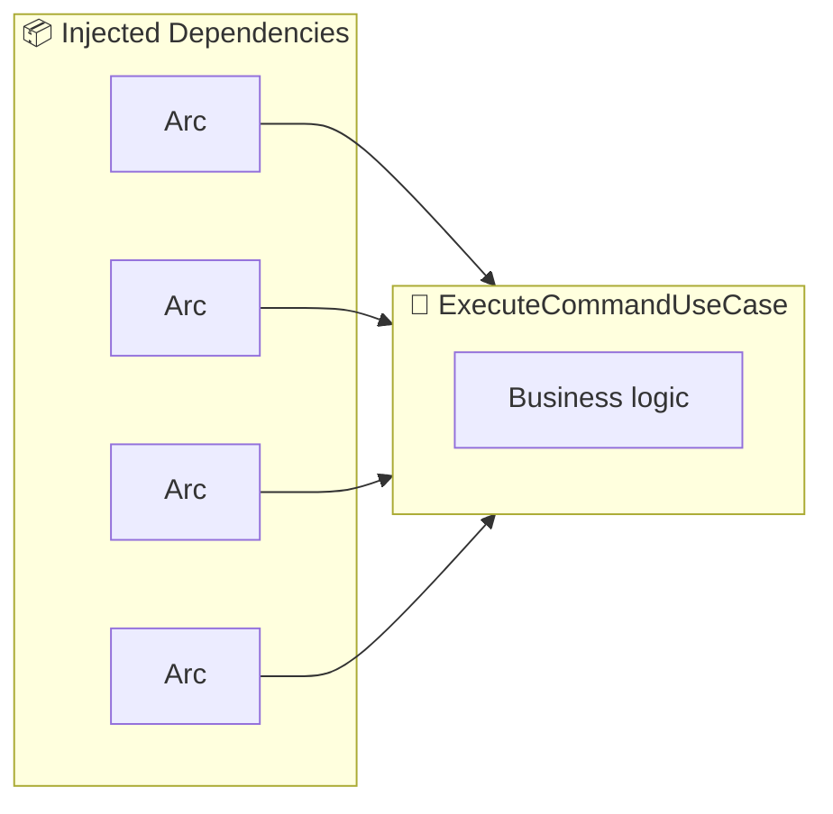
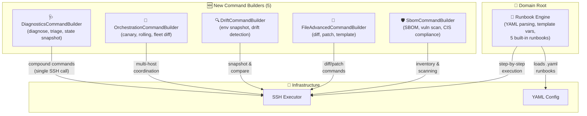
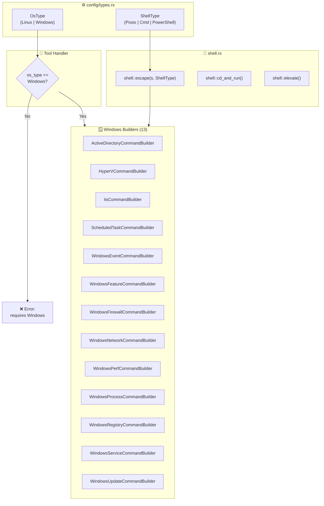
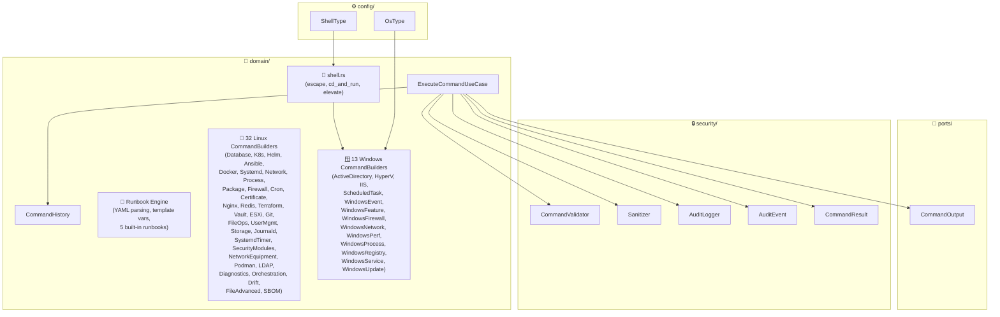

# 💎 Domain Module

This module contains the pure business logic of MCP SSH Bridge, isolated from infrastructure details.

## 📁 Module Structure

```
domain/
├── 📄 mod.rs                    → Re-exports (ExecuteCommandUseCase, CommandHistory, etc.)
├── 📄 history.rs                → CommandHistory, HistoryEntry, HistoryConfig
├── 📄 output_cache.rs           → 📦 OutputCache for paginated output retrieval
├── 📄 output_truncator.rs       → ✂️ Head+tail output truncation
├── 📄 task_store.rs             → 📋 TaskStore for MCP Tasks async lifecycle (v1.1.0)
├── 📄 runbook.rs                → 📓 Runbook engine (YAML parsing, template variables, built-in runbooks)
└── 📂 use_cases/
    ├── 📄 mod.rs                → Use case exports
    ├── 📄 execute_command.rs    → Main UseCase
    ├── 📄 parse_metrics.rs      → System metrics parsing
    ├── 📄 shell.rs              → 🐚 OsType, ShellType, shell::escape() (cross-platform foundation)
    ├── 📄 tunnel.rs             → TunnelManager
    │
    │   ── 🐧 Linux Command Builders (32) ──
    ├── 📄 database.rs           → DatabaseCommandBuilder
    ├── 📄 kubernetes.rs         → KubernetesCommandBuilder + HelmCommandBuilder
    ├── 📄 ansible.rs            → AnsibleCommandBuilder
    ├── 📄 docker.rs             → DockerCommandBuilder (11 commands)
    ├── 📄 systemd.rs            → SystemdCommandBuilder (9 commands)
    ├── 📄 network.rs            → NetworkCommandBuilder
    ├── 📄 process.rs            → ProcessCommandBuilder
    ├── 📄 package.rs            → PackageCommandBuilder (5 commands)
    ├── 📄 firewall.rs           → FirewallCommandBuilder
    ├── 📄 cron.rs               → CronCommandBuilder
    ├── 📄 certificate.rs        → CertificateCommandBuilder
    ├── 📄 nginx.rs              → NginxCommandBuilder
    ├── 📄 redis.rs              → RedisCommandBuilder
    ├── 📄 terraform.rs          → TerraformCommandBuilder
    ├── 📄 vault.rs              → VaultCommandBuilder
    ├── 📄 file_ops.rs           → FileOpsCommandBuilder (5 commands)
    ├── 📄 user_management.rs    → UserManagementCommandBuilder (8 commands)
    ├── 📄 storage.rs            → StorageCommandBuilder (7 commands)
    ├── 📄 journald.rs           → JournaldCommandBuilder (4 commands)
    ├── 📄 systemd_timer.rs      → SystemdTimerCommandBuilder (5 commands)
    ├── 📄 security_modules.rs   → SecurityModulesCommandBuilder (5 commands)
    ├── 📄 network_equipment.rs  → NetworkEquipmentCommandBuilder (8 commands)
    ├── 📄 podman.rs             → PodmanCommandBuilder (6 commands)
    ├── 📄 ldap.rs               → LdapCommandBuilder (5 commands)
    ├── 📄 diagnostics.rs        → 🩺 DiagnosticsCommandBuilder (3 commands)
    ├── 📄 orchestration.rs      → 🚀 OrchestrationCommandBuilder (3 commands)
    ├── 📄 drift.rs              → 🔍 DriftCommandBuilder (2 commands)
    ├── 📄 file_advanced.rs      → 📝 FileAdvancedCommandBuilder (3 commands)
    ├── 📄 sbom.rs               → 🛡️ SbomCommandBuilder (3 commands)
    │
    │   ── 🪟 Windows Command Builders (13) ──
    ├── 📄 active_directory.rs   → ActiveDirectoryCommandBuilder (6 commands)
    ├── 📄 hyperv.rs             → HyperVCommandBuilder (8 commands)
    ├── 📄 iis.rs                → IisCommandBuilder (6 commands)
    ├── 📄 scheduled_task.rs     → ScheduledTaskCommandBuilder (5 commands)
    ├── 📄 windows_event.rs      → WindowsEventCommandBuilder (5 commands)
    ├── 📄 windows_feature.rs    → WindowsFeatureCommandBuilder (4 commands)
    ├── 📄 windows_firewall.rs   → WindowsFirewallCommandBuilder (5 commands)
    ├── 📄 windows_network.rs    → WindowsNetworkCommandBuilder (6 commands)
    ├── 📄 windows_perf.rs       → WindowsPerfCommandBuilder (5 commands)
    ├── 📄 windows_process.rs    → WindowsProcessCommandBuilder (6 commands)
    ├── 📄 windows_registry.rs   → WindowsRegistryCommandBuilder (5 commands)
    ├── 📄 windows_service.rs    → WindowsServiceCommandBuilder (9 commands)
    └── 📄 windows_update.rs     → WindowsUpdateCommandBuilder (5 commands)
```

## 🎯 ExecuteCommandUseCase

This is the **heart of the application** - it orchestrates:

1. ✅ Command validation
2. 📝 Audit logging
3. 📜 Command history
4. 🧹 Output sanitization


```mermaid
classDiagram
    class ExecuteCommandUseCase {
        -validator: Arc~CommandValidator~
        -sanitizer: Arc~Sanitizer~
        -audit_logger: Arc~AuditLogger~
        -history: Arc~CommandHistory~
        +new(validator, sanitizer, audit_logger, history)
        +validate(command) Result~()~
        +process_success(host, command, output) ExecuteCommandResponse
        +log_failure(host, command, error) void
        +log_denied(host, command, reason) void
    }

    class ExecuteCommandRequest {
        +host: String
        +command: String
        +timeout: Duration
        +working_dir: Option~String~
    }

    class ExecuteCommandResponse {
        +output: String
        +exit_code: u32
        +duration_ms: u64
    }

    ExecuteCommandUseCase ..> ExecuteCommandRequest : uses
    ExecuteCommandUseCase ..> ExecuteCommandResponse : returns
```

## 🔧 Public API

### `ExecuteCommandUseCase`

| Method | Signature | Description |
|--------|-----------|-------------|
| `new` | `fn new(validator, sanitizer, audit_logger, history) -> Self` | Constructor |
| `validate` | `fn validate(&self, command: &str) -> Result<()>` | Validates against security rules |
| `process_success` | `fn process_success(&self, host, cmd, output) -> ExecuteCommandResponse` | Processes a success |
| `log_failure` | `fn log_failure(&self, host, cmd, error)` | Logs a failure |
| `log_denied` | `fn log_denied(&self, host, cmd, reason)` | Logs a denied command |

## 🔄 Execution Flow


```mermaid
sequenceDiagram
    participant H as 🔧 ToolHandler
    participant UC as 🎯 ExecuteCommandUseCase
    participant V as ✅ CommandValidator
    participant A as 📝 AuditLogger
    participant HI as 📜 CommandHistory
    participant S as 🧹 Sanitizer

    Note over H,S: 1️⃣ Validation
    H->>UC: validate(command)
    UC->>V: validate(command)
    alt ❌ Command denied
        V-->>UC: Err(CommandDenied)
        UC-->>H: Err
        H->>UC: log_denied(host, cmd, reason)
        UC->>A: log(AuditEvent::denied)
    else ✅ Command allowed
        V-->>UC: Ok(())
        UC-->>H: Ok(())
    end

    Note over H,S: 2️⃣ Execution (by Handler)
    H->>H: pool.get_connection()
    H->>H: conn.exec(command)

    Note over H,S: 3️⃣ Post-processing
    alt ✅ Success
        H->>UC: process_success(host, cmd, output)
        UC->>A: log(AuditEvent::success)
        UC->>HI: record_success(host, cmd, exit_code, duration)
        UC->>S: sanitize(formatted_output)
        S-->>UC: sanitized_output
        UC-->>H: ExecuteCommandResponse
    else ❌ Failure
        H->>UC: log_failure(host, cmd, error)
        UC->>A: log(AuditEvent::error)
        UC->>HI: record_failure(host, cmd)
    end
```

## 📋 Data Structures

### `ExecuteCommandRequest`

```rust
/// Request to execute a command
pub struct ExecuteCommandRequest {
    pub host: String,               // Host alias (e.g., "prod-server")
    pub command: String,            // Command to execute (e.g., "ls -la")
    pub timeout: Duration,          // Execution timeout
    pub working_dir: Option<String>, // Working directory (optional)
}
```

### `ExecuteCommandResponse`

```rust
/// Response after executing a command
pub struct ExecuteCommandResponse {
    pub output: String,     // Formatted and sanitized output
    pub exit_code: u32,     // Exit code (0 = success)
    pub duration_ms: u64,   // Execution duration in ms
}
```

## ✂️ Output Truncator

The `output_truncator` module handles intelligent truncation of large outputs to stay within Claude Code display limits (~30K characters).

### Head+Tail Algorithm


```mermaid
flowchart LR
    INPUT["📥 Raw output<br/>(e.g., 85K chars)"] --> CHECK{"Exceeds<br/>max_chars?"}
    CHECK -->|No| PASS["✅ Return as-is"]
    CHECK -->|Yes| SPLIT["✂️ Split"]
    SPLIT --> HEAD["📄 Head<br/>20% of budget"]
    SPLIT --> TAIL["📄 Tail<br/>80% of budget"]
    HEAD --> JOIN["🔗 Head + message + Tail"]
    TAIL --> JOIN
    JOIN --> OUT["📤 Truncated output<br/>(≤ 20K chars)"]
```

### API

| Function | Signature | Description |
|----------|-----------|-------------|
| `truncate_output` | `fn truncate_output(output: &str, max_chars: usize) -> String` | Truncates with head+tail |
| `DEFAULT_MAX_OUTPUT_CHARS` | `const: 20_000` | Default limit |

### Behavior

- `max_chars = 0` → truncation disabled, returns original
- Output ≤ `max_chars` → returns original
- Output > `max_chars` → cuts in the middle, keeps start and end at line boundaries

### Truncation Message

```
--- [truncated: 1250 lines total, 1200 lines omitted, 85000 → 20000 chars] ---
```

## 🔧 Output Format

The `process_success` method formats output as follows:

```
Host: prod-server
Command: ls -la
Exit code: 0
Duration: 150ms

--- STDOUT ---
total 24
drwxr-xr-x  3 user user 4096 Jan 15 10:00 .
-rw-r--r--  1 user user  100 Jan 15 09:00 file.txt

--- STDERR ---
(shown only if not empty)
```

Then passes through the `Sanitizer` to mask secrets, and finally through `truncate_output()` for intelligent truncation (in the MCP handler).

## 🛡️ Dependency Injection


```mermaid
graph LR
    subgraph Injected["📦 Injected Dependencies"]
        V["Arc<CommandValidator>"]
        S["Arc<Sanitizer>"]
        A["Arc<AuditLogger>"]
        H["Arc<CommandHistory>"]
    end

    subgraph UC["🎯 ExecuteCommandUseCase"]
        CORE["Business logic"]
    end

    V --> UC
    S --> UC
    A --> UC
    H --> UC
```

The UseCase never creates its dependencies - they are injected via constructor:

```rust
let use_case = ExecuteCommandUseCase::new(
    Arc::clone(&validator),
    Arc::clone(&sanitizer),
    Arc::clone(&audit_logger),
    Arc::clone(&history),
);
```

## 🗄️ DatabaseCommandBuilder (`database.rs`)

Builds safe database commands for remote execution. Supports multiple database types and provides query validation.

### Supported Database Types

| Type | Commands |
|------|----------|
| `PostgreSQL` | `psql`, `pg_dump`, `pg_restore` |
| `MySQL` | `mysql`, `mysqldump`, `mysql` (restore) |
| `SQLite` | `sqlite3` |

### API

| Method | Description |
|--------|-------------|
| `build_query_command(db_type, connection, query)` | Builds a query execution command |
| `build_dump_command(db_type, connection, options)` | Builds a database dump command |
| `build_restore_command(db_type, connection, path)` | Builds a database restore command |
| `validate_query(query)` | Validates a query for safety (rejects dangerous operations) |

## 🔗 TunnelManager (`tunnel.rs`)

Manages SSH tunnel lifecycle (creation, tracking, and cleanup).

### Structure

| Field | Description |
|-------|-------------|
| `TunnelDirection` | Enum: `Local` or `Remote` tunnel |
| `TunnelInfo` | Tracks tunnel state (host, ports, direction, status) |
| `TunnelManager` | Manages tunnel creation and cleanup with max tunnel limit |

## ☸️ KubernetesCommandBuilder (`use_cases/kubernetes.rs`)

Builds safe kubectl commands for remote execution. Supports all common kubectl operations.

### API

| Method | Description |
|--------|-------------|
| `build_get_command(resource, namespace, context, output, selector, all_namespaces)` | Builds a kubectl get command |
| `build_logs_command(pod, namespace, context, container, tail, previous, follow)` | Builds a kubectl logs command |
| `build_describe_command(resource, namespace, context)` | Builds a kubectl describe command |
| `build_apply_command(manifest_path, namespace, context, dry_run)` | Builds a kubectl apply command |
| `build_delete_command(resource, namespace, context, force, grace_period)` | Builds a kubectl delete command |
| `build_rollout_command(action, resource, namespace, context, revision)` | Builds a kubectl rollout command |
| `build_scale_command(resource, replicas, namespace, context)` | Builds a kubectl scale command |
| `build_exec_command(pod, command, namespace, context, container, stdin, tty)` | Builds a kubectl exec command |
| `build_top_command(resource_type, name, namespace, context, containers, sort_by)` | Builds a kubectl top command |

## 🤖 AnsibleCommandBuilder & HelmCommandBuilder (`use_cases/ansible.rs`)

### AnsibleCommandBuilder

Builds safe Ansible commands for remote execution.

| Method | Description |
|--------|-------------|
| `build_playbook_command(playbook, inventory, limit, tags, extra_vars, check, verbose, become)` | Builds an ansible-playbook command |
| `build_inventory_command(inventory, host, list, graph, yaml_output)` | Builds an ansible-inventory command |
| `build_adhoc_command(pattern, module, args, inventory, become, extra_vars, forks, verbose)` | Builds an ansible ad-hoc command |

### HelmCommandBuilder

Builds safe Helm commands for remote execution.

| Method | Description |
|--------|-------------|
| `build_list_command(namespace, all_namespaces, filter, output)` | Builds a helm list command |
| `build_status_command(release, namespace, revision, output)` | Builds a helm status command |
| `build_upgrade_command(release, chart, namespace, values, set_values, version, atomic, wait, timeout, dry_run)` | Builds a helm upgrade command |
| `build_install_command(release, chart, namespace, values, set_values, version, wait, timeout, dry_run, create_namespace)` | Builds a helm install command |
| `build_rollback_command(release, revision, namespace, wait, timeout)` | Builds a helm rollback command |
| `build_history_command(release, namespace, max_entries, output)` | Builds a helm history command |
| `build_uninstall_command(release, namespace, keep_history, dry_run)` | Builds a helm uninstall command |

## 🐳 DockerCommandBuilder (`use_cases/docker.rs`)

Builds safe Docker commands for remote execution.

| Method | Description |
|--------|-------------|
| `build_ps_command(all, filter, format)` | List containers |
| `build_logs_command(container, tail, since, timestamps)` | View container logs |
| `build_inspect_command(target, format)` | Inspect container/image |
| `build_exec_command(container, command, user, workdir, env, interactive, tty)` | Execute in container |
| `build_compose_command(action, project_dir, service, file, options)` | Docker Compose operations |
| `build_images_command(filter, format)` | List images |
| `build_stats_command(container, no_stream, format)` | Container resource usage |
| `build_volume_ls_command(filter, format)` | List volumes |
| `build_network_ls_command(filter, format)` | List networks |
| `build_volume_inspect_command(volume, format)` | Inspect volume |
| `build_network_inspect_command(network, format)` | Inspect network |

## 🔧 SystemdCommandBuilder (`use_cases/systemd.rs`)

Builds safe systemd/systemctl commands.

| Method | Description |
|--------|-------------|
| `build_status_command(service)` | Service status |
| `build_start_command(service)` | Start service |
| `build_stop_command(service)` | Stop service |
| `build_restart_command(service, action)` | Restart/reload service |
| `build_enable_command(service)` | Enable service at boot |
| `build_disable_command(service)` | Disable service at boot |
| `build_daemon_reload_command()` | Reload systemd daemon |
| `build_list_command(state, all, unit_type)` | List services |
| `build_logs_command(service, lines, since, priority)` | Service logs (journalctl) |

## 🌐 NetworkCommandBuilder (`use_cases/network.rs`)

Builds safe network diagnostic commands.

| Method | Description |
|--------|-------------|
| `build_connections_command(filter)` | List connections (ss) |
| `build_interfaces_command()` | List network interfaces |
| `build_routes_command()` | Show routing table |
| `build_ping_command(target, count)` | Ping target |
| `build_traceroute_command(target)` | Traceroute target |
| `build_dns_command(domain, record_type, server)` | DNS lookup |

## 📊 ProcessCommandBuilder (`use_cases/process.rs`)

Builds safe process management commands.

| Method | Description |
|--------|-------------|
| `build_list_command(filter, sort_by)` | List processes |
| `build_kill_command(pid, signal)` | Send signal to process |
| `build_top_command(sort_by, count)` | Top processes |

## 📦 PackageCommandBuilder (`use_cases/package.rs`)

Builds safe package management commands (auto-detects apt/yum/dnf/apk).

| Method | Description |
|--------|-------------|
| `build_list_command(pkg_manager, filter)` | List installed packages |
| `build_search_command(pkg_manager, query)` | Search packages |
| `build_install_command(pkg_manager, package)` | Install packages |
| `build_remove_command(pkg_manager, package)` | Remove/uninstall packages |
| `build_update_command(pkg_manager, package)` | Update package lists |

## 🔥 FirewallCommandBuilder (`use_cases/firewall.rs`)

Builds safe firewall management commands (ufw/iptables/firewalld).

| Method | Description |
|--------|-------------|
| `build_status_command()` | Firewall status |
| `build_list_command()` | List rules |
| `build_allow_command(port, protocol, source)` | Allow port/source |
| `build_deny_command(port, protocol, source)` | Deny port/source |

## ⏰ CronCommandBuilder (`use_cases/cron.rs`)

Builds safe cron job management commands.

| Method | Description |
|--------|-------------|
| `build_list_command(user, system)` | List cron jobs |
| `build_add_command(schedule, command, user)` | Add cron job |
| `build_remove_command(pattern, user)` | Remove cron job |

## 🔐 CertificateCommandBuilder (`use_cases/certificate.rs`)

Builds safe TLS certificate inspection commands.

| Method | Description |
|--------|-------------|
| `build_check_command(domain, port)` | Check remote certificate |
| `build_info_command(path)` | Inspect local certificate file |
| `build_expiry_command(domain)` | Check certificate expiry |

## 🌍 NginxCommandBuilder (`use_cases/nginx.rs`)

Builds safe Nginx management commands.

| Method | Description |
|--------|-------------|
| `build_status_command()` | Nginx service status |
| `build_test_command()` | Test configuration |
| `build_reload_command()` | Reload configuration |
| `build_list_sites_command()` | List enabled sites |

## 🗄️ RedisCommandBuilder (`use_cases/redis.rs`)

Builds safe Redis commands.

| Method | Description |
|--------|-------------|
| `build_info_command(section)` | Redis server info |
| `build_cli_command(command, db)` | Execute Redis CLI command |
| `build_keys_command(pattern, db)` | List keys by pattern |

## 🏗️ TerraformCommandBuilder (`use_cases/terraform.rs`)

Builds safe Terraform commands.

| Method | Description |
|--------|-------------|
| `build_init_command(directory, backend, upgrade)` | Initialize Terraform |
| `build_plan_command(directory, var_file, target, destroy)` | Plan changes |
| `build_apply_command(directory, var_file, target, auto_approve)` | Apply changes |
| `build_state_command(action, resource, directory)` | Manage state |
| `build_output_command(name, directory, json)` | Show outputs |

## 🔒 VaultCommandBuilder (`use_cases/vault.rs`)

Builds safe HashiCorp Vault commands.

| Method | Description |
|--------|-------------|
| `build_status_command(address)` | Vault status |
| `build_read_command(path, address, field)` | Read secret |
| `build_list_command(path, address)` | List secrets |
| `build_write_command(path, data, address)` | Write secret |

## 🐚 Shell Utilities (`use_cases/shell.rs`)

Cross-platform foundation for Windows support. Works with `OsType` (Linux/Windows) and `ShellType` (Posix/Cmd/PowerShell) enums defined in `config/types.rs`.

| Function | Description |
|----------|-------------|
| `escape(s, shell)` | Escape a string for safe interpolation (Posix: single-quotes, Cmd: caret-escaping, PowerShell: single-quote doubling) |
| `cd_and_run(dir, cmd, shell)` | Build a "change directory then run" one-liner |
| `command_exists(name, shell)` | Check if an executable exists on the remote host |
| `null_device(shell)` | Return the null device path (`/dev/null`, `NUL`, `$null`) |
| `elevate(cmd, shell)` | Optionally wrap with `sudo` (POSIX only, no-op on Windows) |
| `stderr_to_null(shell)` | Return the stderr-to-null redirect suffix |
| `exit_code_var(shell)` | Return the exit-code variable (`$?`, `%ERRORLEVEL%`, `$LASTEXITCODE`) |

## 🆕 New Command Builders

The following diagram shows the new command builders and how they relate to the domain:


```mermaid
flowchart TB
    subgraph NewBuilders["🆕 New Command Builders (5)"]
        DIAG["🩺 DiagnosticsCommandBuilder<br/>(diagnose, triage, state snapshot)"]
        ORCH["🚀 OrchestrationCommandBuilder<br/>(canary, rolling, fleet diff)"]
        DRIFT["🔍 DriftCommandBuilder<br/>(env snapshot, drift detection)"]
        FADV["📝 FileAdvancedCommandBuilder<br/>(diff, patch, template)"]
        SBOM["🛡️ SbomCommandBuilder<br/>(SBOM, vuln scan, CIS compliance)"]
    end

    subgraph RootDomain["📓 Domain Root"]
        RB["📓 Runbook Engine<br/>(YAML parsing, template vars,<br/>5 built-in runbooks)"]
    end

    subgraph Infra["🔧 Infrastructure"]
        SSH["SSH Executor"]
        YAML["YAML Config"]
    end

    DIAG -->|"compound commands<br/>(single SSH call)"| SSH
    ORCH -->|"multi-host<br/>coordination"| SSH
    DRIFT -->|"snapshot &<br/>compare"| SSH
    FADV -->|"diff/patch<br/>commands"| SSH
    SBOM -->|"inventory &<br/>scanning"| SSH
    RB -->|"step-by-step<br/>execution"| SSH
    RB -->|"loads .yaml<br/>runbooks"| YAML
```

## 🩺 DiagnosticsCommandBuilder (`use_cases/diagnostics.rs`)

Builds comprehensive diagnostic commands that collect multiple system metrics in a single SSH call, avoiding sequential round-trips.

### API

| Method | Description |
|--------|-------------|
| `build_diagnose_command()` | 🏥 Comprehensive host diagnostic (uptime, CPU, memory, disk, top processes, failed services, recent errors, OOM kills, network listeners) |
| `build_triage_command(symptom, since)` | 🚨 Incident triage tailored to a specific symptom (`slow`, `crash`, `oom`, `disk`, `network`, or generic) |
| `build_state_snapshot_command()` | 📸 Capture current system state for comparison (packages, services, listeners, kernel, hostname) |

### Supported Triage Symptoms

| Symptom | Sections Collected |
|---------|-------------------|
| `slow` / `performance` | CPU load, IO wait, disk latency, slow queries |
| `crash` / `restart` | Recent boots, core dumps, failed services, kernel panics |
| `oom` / `memory` | Memory detail, top mem processes, OOM kills, swap |
| `disk` / `storage` | Disk usage, inode usage, large files, disk errors |
| `network` / `connectivity` | Interfaces, routes, DNS, listeners, dropped packets |
| _(other)_ | General triage with failed services and recent errors |

## 🚀 OrchestrationCommandBuilder (`use_cases/orchestration.rs`)

Builds commands for multi-host orchestration patterns: canary deployments, rolling updates, and fleet-wide configuration drift detection. The actual orchestration logic (coordinating multiple SSH calls) lives in the tool handlers; this builder constructs the individual commands.

### API

| Method | Description |
|--------|-------------|
| `build_canary_command(command, health_check)` | 🐤 Build a canary execution command with optional health check (chains with `&& (hc \|\| true)`) |
| `build_rolling_command(command, health_check)` | 🔄 Build a rolling execution command with optional health check and descriptive fallback |
| `build_fleet_diff_command(command)` | 🔎 Build a fleet diff command (comparison performed by caller across multiple hosts) |

## 🔍 DriftCommandBuilder (`use_cases/drift.rs`)

Builds commands to capture environment state snapshots for drift detection between hosts or across time.

### API

| Method | Description |
|--------|-------------|
| `build_snapshot_command()` | 📸 Capture comprehensive environment snapshot (OS, kernel, hostname, packages, services, listeners, users, groups, crontabs, config checksums) |
| `build_diff_instruction()` | 📋 Return instructions for comparing two snapshots using `ssh_env_snapshot` + `save_output` |

## 📝 FileAdvancedCommandBuilder (`use_cases/file_advanced.rs`)

Builds commands for advanced file operations: diff, patch, and template rendering via `envsubst`.

### API

| Method | Description |
|--------|-------------|
| `build_diff_command(file1, file2, context_lines)` | ↔️ Build a unified diff command between two files on the same host |
| `build_patch_command(target_file, patch_content, dry_run)` | 🩹 Build a patch apply command (supports `--dry-run` mode) |
| `build_template_command(template_path, output_path, variables)` | 📄 Build a template rendering command using `envsubst` with exported variables |

## 🛡️ SbomCommandBuilder (`use_cases/sbom.rs`)

Builds commands for software inventory (SBOM), vulnerability scanning, and CIS compliance checks.

### API

| Method | Description |
|--------|-------------|
| `build_sbom_command()` | 📦 Generate a software bill of materials (package manager detection, installed packages, kernel, OS) |
| `build_vuln_scan_command()` | 🔓 Check for known vulnerabilities (security upgrades, kernel version, pending updates, last update time) |
| `build_compliance_command(profile)` | ✅ Run CIS compliance checks (file permissions, SSH config, firewall, password policy, sysctl) |

### Supported Compliance Profiles

| Profile | Checks Performed |
|---------|-----------------|
| `cis-level1` / `cis-level2` | File permissions, SSH configuration, firewall status, password policy, core dump limits, sysctl security settings |
| _(other)_ | Basic compliance: `/etc/passwd` + `/etc/shadow` permissions, `PermitRootLogin` check |

## 📓 Runbook Engine (`domain/runbook.rs`)

A YAML-based runbook engine for automated multi-step operational procedures. Lives in the domain root (not `use_cases/`) as it orchestrates entire workflows rather than building individual commands.

### 📐 Data Model

| Struct | Description |
|--------|-------------|
| `Runbook` | Top-level definition: name, description, version, params, steps |
| `RunbookParam` | Parameter definition with type, default value, and description |
| `RunbookStep` | Single step: command, save_as, condition, on_false, confirm, rollback |
| `StepResult` | Result of executing one step: name, command, output, exit_code, skipped, error |
| `RunbookResult` | Full execution result: runbook_name, steps, completed, error |

### 🔧 API

| Function | Description |
|----------|-------------|
| `validate_runbook(runbook)` | ✅ Validate a runbook definition (non-empty name, at least one step, each step has command or condition) |
| `apply_template(template, vars)` | 🔀 Replace `{{ variable }}` and `{{variable}}` patterns with values from a HashMap |
| `load_runbooks_from_dir(dir)` | 📂 Load all `.yaml`/`.yml` runbooks from a directory |
| `load_runbook(path)` | 📄 Load and validate a single runbook from a YAML file |
| `default_runbooks_dir()` | 📁 Get the default runbooks directory (`~/.config/mcp-ssh-bridge/runbooks/`) |
| `builtin_runbooks()` | 🏗️ Get 5 built-in runbook definitions (embedded in binary) |

### 📦 Built-in Runbooks

| Runbook | Description |
|---------|-------------|
| `disk_full` | 💾 Disk full remediation |
| `service_restart` | 🔄 Service restart procedure |
| `oom_recovery` | 🧠 OOM kill recovery |
| `log_rotation` | 📋 Log rotation cleanup |
| `cert_renewal` | 🔐 Certificate renewal |

### 📝 YAML Format Example

```yaml
name: disk_full
description: Automated disk full remediation
version: "1.0"
params:
  threshold:
    type: string
    default: "90"
    description: Disk usage percentage threshold
steps:
  - name: check_usage
    command: "df -h {{ dir }}"
    save_as: usage
  - name: evaluate
    condition: "{{ usage }} > {{ threshold }}"
    on_false: skip_to_end
  - name: cleanup
    command: "find {{ dir }} -name '*.log' -mtime +30 -delete"
    confirm: true
    rollback: "echo 'Manual review needed'"
```

## 🪟 Windows Command Builders

All Windows builders generate PowerShell commands and use `shell::escape(s, ShellType::PowerShell)` for safe parameter interpolation. Tool handlers guard against incorrect OS routing with `OsType::Windows` checks.

### Windows Architecture


```mermaid
flowchart TB
    subgraph Config["⚙️ config/types.rs"]
        OS["OsType<br/>(Linux | Windows)"]
        SH["ShellType<br/>(Posix | Cmd | PowerShell)"]
    end

    subgraph Shell["🐚 shell.rs"]
        ESC["shell::escape(s, ShellType)"]
        CD["shell::cd_and_run()"]
        ELEV["shell::elevate()"]
    end

    subgraph WinBuilders["🪟 Windows Builders (13)"]
        AD["ActiveDirectoryCommandBuilder"]
        HV["HyperVCommandBuilder"]
        IIS["IisCommandBuilder"]
        ST["ScheduledTaskCommandBuilder"]
        WE["WindowsEventCommandBuilder"]
        WF["WindowsFeatureCommandBuilder"]
        WFW["WindowsFirewallCommandBuilder"]
        WN["WindowsNetworkCommandBuilder"]
        WP["WindowsPerfCommandBuilder"]
        WPR["WindowsProcessCommandBuilder"]
        WR["WindowsRegistryCommandBuilder"]
        WS["WindowsServiceCommandBuilder"]
        WU["WindowsUpdateCommandBuilder"]
    end

    subgraph Handler["🔧 Tool Handler"]
        CHECK{"os_type ==<br/>Windows?"}
    end

    CHECK -->|Yes| WinBuilders
    CHECK -->|No| REJECT["❌ Error:<br/>requires Windows"]
    OS --> CHECK
    SH --> ESC
    ESC --> WinBuilders
```

### 🏢 ActiveDirectoryCommandBuilder (`use_cases/active_directory.rs`)

Builds PowerShell Active Directory commands.

| Method | Description |
|--------|-------------|
| `build_user_list_command(filter, properties)` | List AD users |
| `build_user_info_command(identity, properties)` | Get AD user details |
| `build_group_list_command(filter, properties)` | List AD groups |
| `build_group_members_command(identity, recursive)` | List group members |
| `build_computer_list_command(filter, properties)` | List AD computers |
| `build_domain_info_command()` | Get domain information |

### 💻 HyperVCommandBuilder (`use_cases/hyperv.rs`)

Builds PowerShell Hyper-V management commands.

| Method | Description |
|--------|-------------|
| `build_vm_list_command(filter, status)` | List VMs |
| `build_vm_info_command(name)` | Get VM details |
| `build_vm_start_command(name)` | Start VM |
| `build_vm_stop_command(name, force, turn_off)` | Stop VM |
| `build_host_info_command()` | Get Hyper-V host info |
| `build_switch_list_command()` | List virtual switches |
| `build_snapshot_list_command(vm_name)` | List VM checkpoints |
| `build_snapshot_create_command(vm_name, snapshot_name)` | Create VM checkpoint |

### 🌐 IisCommandBuilder (`use_cases/iis.rs`)

Builds PowerShell IIS management commands.

| Method | Description |
|--------|-------------|
| `build_list_sites_command()` | List IIS websites |
| `build_list_pools_command()` | List application pools |
| `build_status_command(site_name)` | Get site status |
| `build_start_command(site_name)` | Start website |
| `build_stop_command(site_name)` | Stop website |
| `build_restart_command(site_name)` | Restart website |

### ⏰ ScheduledTaskCommandBuilder (`use_cases/scheduled_task.rs`)

Builds PowerShell scheduled task commands.

| Method | Description |
|--------|-------------|
| `build_list_command(path, state)` | List scheduled tasks |
| `build_info_command(task_name, path)` | Get task details |
| `build_run_command(task_name, path)` | Run task immediately |
| `build_enable_command(task_name, path)` | Enable task |
| `build_disable_command(task_name, path)` | Disable task |

### 📊 WindowsEventCommandBuilder (`use_cases/windows_event.rs`)

Builds PowerShell Windows Event Log commands.

| Method | Description |
|--------|-------------|
| `build_query_command(log_name, level, source, max_events)` | Query event log entries |
| `build_logs_command()` | List available event logs |
| `build_sources_command(log_name)` | List event sources |
| `build_tail_command(log_name, count)` | Tail recent events |
| `build_export_command(log_name, path, max_events)` | Export events to file |

### 🧩 WindowsFeatureCommandBuilder (`use_cases/windows_feature.rs`)

Builds PowerShell Windows Feature commands.

| Method | Description |
|--------|-------------|
| `build_list_command(filter, installed_only)` | List Windows features |
| `build_info_command(feature_name)` | Get feature details |
| `build_install_command(feature_name, include_management)` | Install feature |
| `build_remove_command(feature_name)` | Remove feature |

### 🔥 WindowsFirewallCommandBuilder (`use_cases/windows_firewall.rs`)

Builds PowerShell Windows Firewall commands.

| Method | Description |
|--------|-------------|
| `build_status_command()` | Firewall profile status |
| `build_list_command(direction, enabled_only)` | List firewall rules |
| `build_allow_command(name, port, protocol, direction)` | Create allow rule |
| `build_deny_command(name, port, protocol, direction)` | Create deny/block rule |
| `build_remove_command(name)` | Remove firewall rule |

### 🌐 WindowsNetworkCommandBuilder (`use_cases/windows_network.rs`)

Builds PowerShell network diagnostic commands.

| Method | Description |
|--------|-------------|
| `build_ip_command()` | Show IP configuration |
| `build_adapters_command()` | List network adapters |
| `build_connections_command(state, process)` | List TCP connections |
| `build_routes_command()` | Show routing table |
| `build_ping_command(target, count)` | Ping target |
| `build_dns_command(domain, record_type, server)` | DNS lookup |

### 📈 WindowsPerfCommandBuilder (`use_cases/windows_perf.rs`)

Builds PowerShell performance monitoring commands.

| Method | Description |
|--------|-------------|
| `build_overview_command()` | System performance overview |
| `build_cpu_command()` | CPU usage details |
| `build_memory_command()` | Memory usage details |
| `build_disk_command()` | Disk usage and I/O |
| `build_network_command()` | Network adapter statistics |

### 📊 WindowsProcessCommandBuilder (`use_cases/windows_process.rs`)

Builds PowerShell process management commands.

| Method | Description |
|--------|-------------|
| `build_list_command(filter, sort_by)` | List processes |
| `build_top_command(count, sort_by)` | Top processes by resource usage |
| `build_info_command(pid)` | Get process details |
| `build_by_name_command(name)` | Find processes by name |
| `build_kill_command(pid, force)` | Terminate process |
| `build_disk_usage_command(path)` | Disk usage for path |

### 📋 WindowsRegistryCommandBuilder (`use_cases/windows_registry.rs`)

Builds PowerShell Windows Registry commands.

| Method | Description |
|--------|-------------|
| `build_query_command(path, name)` | Query registry value |
| `build_list_command(path)` | List registry subkeys and values |
| `build_set_command(path, name, value, reg_type)` | Set registry value |
| `build_delete_command(path, name)` | Delete registry value |
| `build_export_command(path, output_file)` | Export registry key |

### 🔧 WindowsServiceCommandBuilder (`use_cases/windows_service.rs`)

Builds PowerShell Windows Service commands.

| Method | Description |
|--------|-------------|
| `build_list_command(filter, status)` | List services |
| `build_status_command(service)` | Get service status |
| `build_start_command(service)` | Start service |
| `build_stop_command(service, force)` | Stop service |
| `build_restart_command(service)` | Restart service |
| `build_enable_command(service)` | Set service to automatic start |
| `build_disable_command(service)` | Disable service |
| `build_config_command(service)` | Get service configuration |
| `build_disk_usage_command(path)` | Disk usage for path |

### 🔄 WindowsUpdateCommandBuilder (`use_cases/windows_update.rs`)

Builds PowerShell Windows Update commands.

| Method | Description |
|--------|-------------|
| `build_list_command()` | List available updates |
| `build_search_command(query)` | Search for updates |
| `build_install_command(kb_id)` | Install specific update |
| `build_history_command(count)` | Show update history |
| `build_reboot_command(force)` | Check/trigger reboot for updates |

## 🎨 Design Patterns

| Pattern | Application |
|---------|-------------|
| 🎯 **Use Case** | `ExecuteCommandUseCase` encapsulates a complete use case |
| 💉 **Dependency Injection** | All dependencies via constructor |
| 📦 **Value Objects** | `ExecuteCommandRequest/Response` are immutable |
| 🔒 **Shared State** | `Arc<T>` for thread-safe sharing |

## 🧪 Tests

```bash
# All domain tests
cargo test domain::

# Specific tests
cargo test domain::use_cases::execute_command::tests
```

### Available Tests

| Test | Description |
|------|-------------|
| `test_validate_command` | Command validation (strict mode, empty whitelist = deny all) |
| `test_format_output` | Correct output formatting |
| `test_process_success` | Secret sanitization in output |

### Test Example

```rust
#[test]
fn test_process_success() {
    let use_case = create_test_use_case();

    let output = CommandOutput {
        stdout: "password=secret123".to_string(),
        stderr: String::new(),
        exit_code: 0,
        duration_ms: 50,
    };

    let response = use_case.process_success("host", "echo test", &output);

    // Password should be sanitized
    assert!(!response.output.contains("secret123"));
    assert!(response.output.contains("[REDACTED]"));
}
```

## 🔗 Dependencies to Other Modules


```mermaid
graph TB
    subgraph Domain["💎 domain/"]
        UC["ExecuteCommandUseCase"]
        HIST["CommandHistory"]
        SHELL["🐚 shell.rs<br/>(escape, cd_and_run, elevate)"]
        RUNBOOK["📓 Runbook Engine<br/>(YAML parsing, template vars,<br/>5 built-in runbooks)"]
        LINUX["🐧 32 Linux CommandBuilders<br/>(Database, K8s, Helm, Ansible,<br/>Docker, Systemd, Network, Process,<br/>Package, Firewall, Cron, Certificate,<br/>Nginx, Redis, Terraform, Vault, ESXi, Git,<br/>FileOps, UserMgmt, Storage, Journald,<br/>SystemdTimer, SecurityModules,<br/>NetworkEquipment, Podman, LDAP,<br/>Diagnostics, Orchestration, Drift,<br/>FileAdvanced, SBOM)"]
        WINDOWS["🪟 13 Windows CommandBuilders<br/>(ActiveDirectory, HyperV, IIS,<br/>ScheduledTask, WindowsEvent,<br/>WindowsFeature, WindowsFirewall,<br/>WindowsNetwork, WindowsPerf,<br/>WindowsProcess, WindowsRegistry,<br/>WindowsService, WindowsUpdate)"]
    end

    subgraph Config["⚙️ config/"]
        OS["OsType"]
        ST["ShellType"]
    end

    subgraph Ports["🔗 ports/"]
        CO["CommandOutput"]
    end

    subgraph Security["🔒 security/"]
        VAL["CommandValidator"]
        SAN["Sanitizer"]
        AUD["AuditLogger"]
        AE["AuditEvent"]
        CR["CommandResult"]
    end

    UC --> CO
    UC --> VAL
    UC --> SAN
    UC --> AUD
    UC --> AE
    UC --> CR
    UC --> HIST
    ST --> SHELL
    SHELL --> WINDOWS
    OS --> WINDOWS
```

## ⚠️ Important Notes

> [!IMPORTANT]
> **No SSH here**: The domain does not make SSH calls directly. The `ToolHandler` manages the connection.

> [!IMPORTANT]
> **No I/O**: The domain is a pure layer without side effects (except logging via injected dependencies).

> [!NOTE]
> **Thread-safe**: All dependencies are `Arc<T>` to allow concurrent usage.
