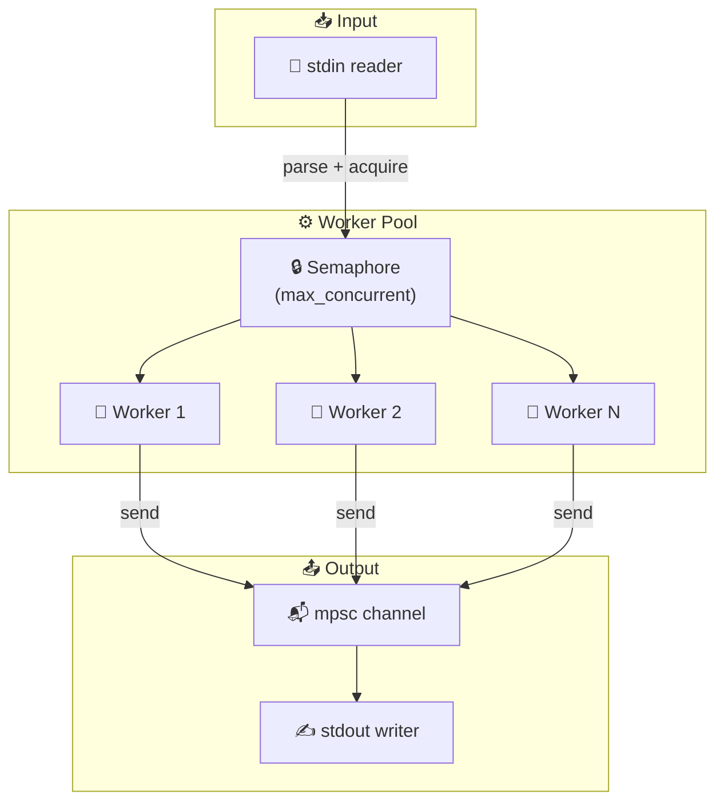
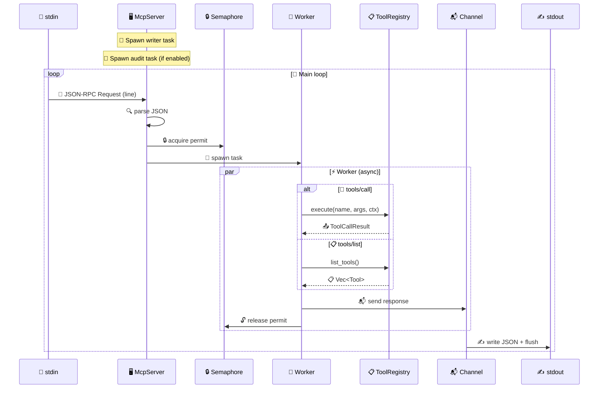
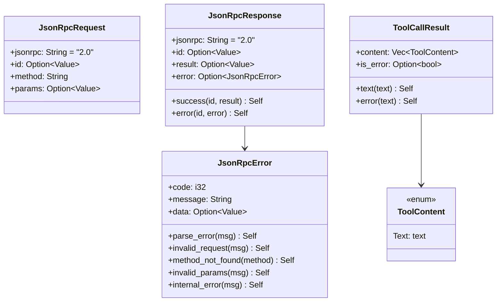
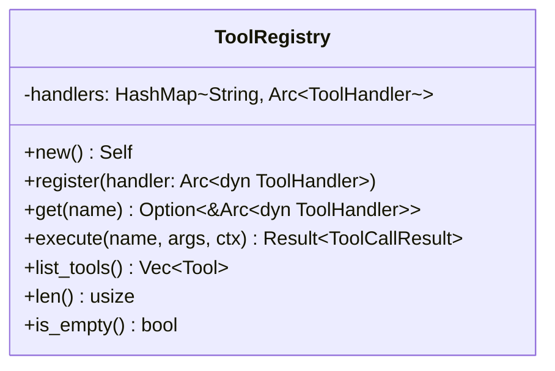
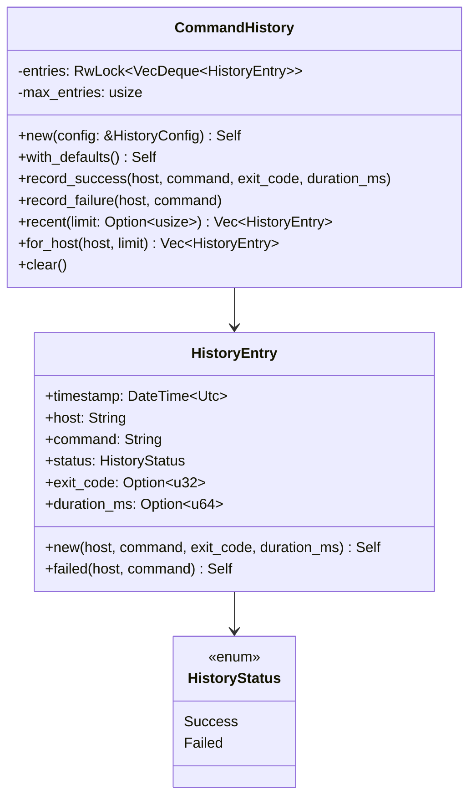
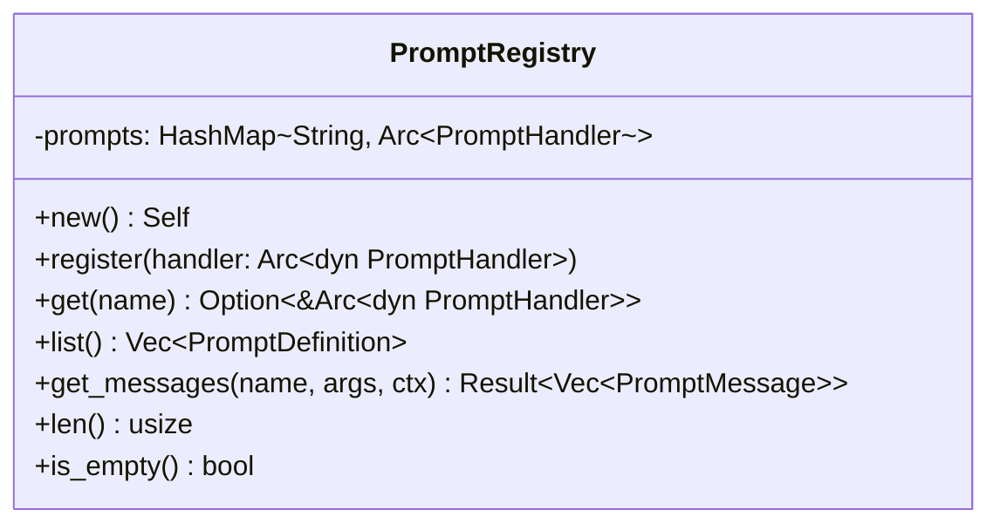
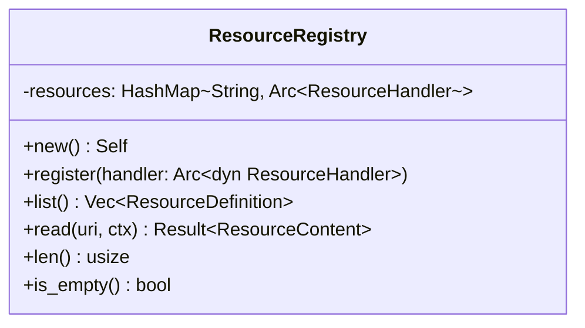
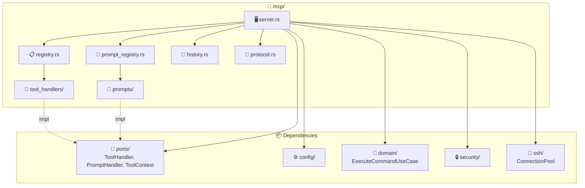

# 📡 MCP Module

This module implements the **MCP (Model Context Protocol)** adapter for JSON-RPC 2.0 communication with Claude Code via stdio.

## 📋 MCP Protocol Version

Supports MCP protocol versions:

| Version | Status |
|---------|--------|
| `2025-11-25` | ✅ Current |
| `2025-06-18` | ✅ Supported |
| `2024-11-05` | ✅ Supported |

## 📁 Module Structure

```
mcp/
├── 📄 mod.rs              -> 📦 Public exports
├── 📄 server.rs           -> 🖥️ McpServer (main loop)
├── 📄 protocol.rs         -> 📡 JSON-RPC 2.0 types + re-exports contract types from ports/protocol.rs
├── 📄 registry.rs         -> 📋 ToolRegistry + create_default_registry()
├── 📄 prompt_registry.rs  -> 💬 PromptRegistry + create_default_prompt_registry()
├── 📄 history.rs          -> 📜 Re-exports from domain/history.rs
├── 📄 resource_registry.rs -> 📊 ResourceRegistry + create_default_resource_registry()
├── 📄 standard_tool.rs    -> 🏭 StandardTool trait + generic execution pipeline
├── 🔧 tool_handlers/      -> 🛠️ Tool implementations (197 tools across 38 groups)
│   ├── 📄 mod.rs
│   ├── 📄 utils.rs
│   │
│   ├── ⚡ Execution
│   │   ├── 📄 ssh_exec.rs
│   │   └── 📄 ssh_exec_multi.rs
│   │
│   ├── 📁 File Transfer
│   │   ├── 📄 ssh_upload.rs
│   │   ├── 📄 ssh_download.rs
│   │   ├── 📄 ssh_sync.rs
│   │   ├── 📄 ssh_tail.rs
│   │   └── 📄 ssh_ls.rs
│   │
│   ├── 📊 Monitoring
│   │   ├── 📄 ssh_metrics.rs
│   │   ├── 📄 ssh_metrics_multi.rs
│   │   └── 📄 ssh_disk_usage.rs
│   │
│   ├── 📂 Directory
│   │   └── 📄 ssh_find.rs
│   │
│   ├── ℹ️ Info
│   │   ├── 📄 ssh_status.rs
│   │   ├── 📄 ssh_history.rs
│   │   └── 📄 ssh_health.rs
│   │
│   ├── 📦 Sessions
│   │   ├── 📄 ssh_session_create.rs
│   │   ├── 📄 ssh_session_exec.rs
│   │   ├── 📄 ssh_session_list.rs
│   │   └── 📄 ssh_session_close.rs
│   │
│   ├── 🔗 Tunnels
│   │   ├── 📄 ssh_tunnel_create.rs
│   │   ├── 📄 ssh_tunnel_list.rs
│   │   └── 📄 ssh_tunnel_close.rs
│   │
│   ├── 🗄️ Database
│   │   ├── 📄 ssh_db_query.rs
│   │   ├── 📄 ssh_db_dump.rs
│   │   └── 📄 ssh_db_restore.rs
│   │
│   ├── 💼 Backup
│   │   ├── 📄 ssh_backup_create.rs
│   │   ├── 📄 ssh_backup_list.rs
│   │   └── 📄 ssh_backup_restore.rs
│   │
│   ├── ☸️ Kubernetes (9 tools)
│   │   ├── 📄 ssh_k8s_get.rs
│   │   ├── 📄 ssh_k8s_logs.rs
│   │   ├── 📄 ssh_k8s_describe.rs
│   │   ├── 📄 ssh_k8s_apply.rs
│   │   ├── 📄 ssh_k8s_delete.rs
│   │   ├── 📄 ssh_k8s_rollout.rs
│   │   ├── 📄 ssh_k8s_scale.rs
│   │   ├── 📄 ssh_k8s_exec.rs
│   │   └── 📄 ssh_k8s_top.rs
│   │
│   ├── ⎈ Helm (7 tools)
│   │   ├── 📄 ssh_helm_list.rs
│   │   ├── 📄 ssh_helm_status.rs
│   │   ├── 📄 ssh_helm_upgrade.rs
│   │   ├── 📄 ssh_helm_install.rs
│   │   ├── 📄 ssh_helm_rollback.rs
│   │   ├── 📄 ssh_helm_history.rs
│   │   └── 📄 ssh_helm_uninstall.rs
│   │
│   ├── 🤖 Ansible (3 tools)
│   │   ├── 📄 ssh_ansible_playbook.rs
│   │   ├── 📄 ssh_ansible_inventory.rs
│   │   └── 📄 ssh_ansible_adhoc.rs
│   │
│   ├── 🐳 Docker (11 tools)
│   │   ├── 📄 ssh_docker_ps.rs
│   │   ├── 📄 ssh_docker_logs.rs
│   │   ├── 📄 ssh_docker_inspect.rs
│   │   ├── 📄 ssh_docker_exec.rs
│   │   ├── 📄 ssh_docker_compose.rs
│   │   ├── 📄 ssh_docker_images.rs
│   │   ├── 📄 ssh_docker_stats.rs
│   │   ├── 📄 ssh_docker_network_ls.rs
│   │   ├── 📄 ssh_docker_network_inspect.rs
│   │   ├── 📄 ssh_docker_volume_ls.rs
│   │   └── 📄 ssh_docker_volume_inspect.rs
│   │
│   ├── 🖥️ ESXi (7 tools)
│   │   ├── 📄 ssh_esxi_vm_list.rs
│   │   ├── 📄 ssh_esxi_vm_info.rs
│   │   ├── 📄 ssh_esxi_vm_power.rs
│   │   ├── 📄 ssh_esxi_snapshot.rs
│   │   ├── 📄 ssh_esxi_datastore_list.rs
│   │   ├── 📄 ssh_esxi_network_list.rs
│   │   └── 📄 ssh_esxi_host_info.rs
│   │
│   ├── 🔀 Git (7 tools)
│   │   ├── 📄 ssh_git_status.rs
│   │   ├── 📄 ssh_git_log.rs
│   │   ├── 📄 ssh_git_diff.rs
│   │   ├── 📄 ssh_git_branch.rs
│   │   ├── 📄 ssh_git_pull.rs
│   │   ├── 📄 ssh_git_clone.rs
│   │   └── 📄 ssh_git_checkout.rs
│   │
│   ├── 🔧 Systemd (9 tools)
│   │   ├── 📄 ssh_service_status.rs
│   │   ├── 📄 ssh_service_start.rs
│   │   ├── 📄 ssh_service_stop.rs
│   │   ├── 📄 ssh_service_restart.rs
│   │   ├── 📄 ssh_service_list.rs
│   │   ├── 📄 ssh_service_logs.rs
│   │   ├── 📄 ssh_service_daemon_reload.rs
│   │   ├── 📄 ssh_service_enable.rs
│   │   └── 📄 ssh_service_disable.rs
│   │
│   ├── 🌐 Network (6 tools)
│   │   ├── 📄 ssh_net_connections.rs
│   │   ├── 📄 ssh_net_interfaces.rs
│   │   ├── 📄 ssh_net_routes.rs
│   │   ├── 📄 ssh_net_ping.rs
│   │   ├── 📄 ssh_net_traceroute.rs
│   │   └── 📄 ssh_net_dns.rs
│   │
│   ├── 📊 Process (3 tools)
│   │   ├── 📄 ssh_process_list.rs
│   │   ├── 📄 ssh_process_kill.rs
│   │   └── 📄 ssh_process_top.rs
│   │
│   ├── 📦 Package (5 tools)
│   │   ├── 📄 ssh_pkg_list.rs
│   │   ├── 📄 ssh_pkg_search.rs
│   │   ├── 📄 ssh_pkg_install.rs
│   │   ├── 📄 ssh_pkg_update.rs
│   │   └── 📄 ssh_pkg_remove.rs
│   │
│   ├── 🔥 Firewall (4 tools)
│   │   ├── 📄 ssh_firewall_status.rs
│   │   ├── 📄 ssh_firewall_list.rs
│   │   ├── 📄 ssh_firewall_allow.rs
│   │   └── 📄 ssh_firewall_deny.rs
│   │
│   ├── ⏰ Cron (3 tools)
│   │   ├── 📄 ssh_cron_list.rs
│   │   ├── 📄 ssh_cron_add.rs
│   │   └── 📄 ssh_cron_remove.rs
│   │
│   ├── 🔐 Certificates (3 tools)
│   │   ├── 📄 ssh_cert_check.rs
│   │   ├── 📄 ssh_cert_info.rs
│   │   └── 📄 ssh_cert_expiry.rs
│   │
│   ├── 🌍 Nginx (4 tools)
│   │   ├── 📄 ssh_nginx_status.rs
│   │   ├── 📄 ssh_nginx_test.rs
│   │   ├── 📄 ssh_nginx_reload.rs
│   │   └── 📄 ssh_nginx_list_sites.rs
│   │
│   ├── 🗄️ Redis (3 tools)
│   │   ├── 📄 ssh_redis_info.rs
│   │   ├── 📄 ssh_redis_cli.rs
│   │   └── 📄 ssh_redis_keys.rs
│   │
│   ├── 🏗️ Terraform (5 tools)
│   │   ├── 📄 ssh_terraform_init.rs
│   │   ├── 📄 ssh_terraform_plan.rs
│   │   ├── 📄 ssh_terraform_apply.rs
│   │   ├── 📄 ssh_terraform_state.rs
│   │   └── 📄 ssh_terraform_output.rs
│   │
│   ├── 🔒 Vault (4 tools)
│   │   ├── 📄 ssh_vault_status.rs
│   │   ├── 📄 ssh_vault_read.rs
│   │   ├── 📄 ssh_vault_list.rs
│   │   └── 📄 ssh_vault_write.rs
│   │
│   ├── 📤 Output (1 tool)
│   │   └── 📄 ssh_output_fetch.rs
│   │
│   ├── ⚙️ Config (2 tools)
│   │   ├── 📄 ssh_config_get.rs
│   │   └── 📄 ssh_config_set.rs
│   │
│   ├── 🪟 Windows Services (8 tools)
│   │   ├── 📄 ssh_win_service_list.rs
│   │   ├── 📄 ssh_win_service_status.rs
│   │   ├── 📄 ssh_win_service_start.rs
│   │   ├── 📄 ssh_win_service_stop.rs
│   │   ├── 📄 ssh_win_service_restart.rs
│   │   ├── 📄 ssh_win_service_enable.rs
│   │   ├── 📄 ssh_win_service_disable.rs
│   │   └── 📄 ssh_win_service_config.rs
│   │
│   ├── 🪟 Windows Events (5 tools)
│   │   ├── 📄 ssh_win_event_query.rs
│   │   ├── 📄 ssh_win_event_logs.rs
│   │   ├── 📄 ssh_win_event_sources.rs
│   │   ├── 📄 ssh_win_event_tail.rs
│   │   └── 📄 ssh_win_event_export.rs
│   │
│   ├── 🪟 Active Directory (6 tools)
│   │   ├── 📄 ssh_ad_user_list.rs
│   │   ├── 📄 ssh_ad_user_info.rs
│   │   ├── 📄 ssh_ad_group_list.rs
│   │   ├── 📄 ssh_ad_group_members.rs
│   │   ├── 📄 ssh_ad_computer_list.rs
│   │   └── 📄 ssh_ad_domain_info.rs
│   │
│   ├── 🪟 Scheduled Tasks (5 tools)
│   │   ├── 📄 ssh_schtask_list.rs
│   │   ├── 📄 ssh_schtask_info.rs
│   │   ├── 📄 ssh_schtask_run.rs
│   │   ├── 📄 ssh_schtask_enable.rs
│   │   └── 📄 ssh_schtask_disable.rs
│   │
│   ├── 🪟 Windows Firewall (5 tools)
│   │   ├── 📄 ssh_win_firewall_status.rs
│   │   ├── 📄 ssh_win_firewall_list.rs
│   │   ├── 📄 ssh_win_firewall_allow.rs
│   │   ├── 📄 ssh_win_firewall_deny.rs
│   │   └── 📄 ssh_win_firewall_remove.rs
│   │
│   ├── 🪟 IIS (6 tools)
│   │   ├── 📄 ssh_iis_list_sites.rs
│   │   ├── 📄 ssh_iis_list_pools.rs
│   │   ├── 📄 ssh_iis_status.rs
│   │   ├── 📄 ssh_iis_start.rs
│   │   ├── 📄 ssh_iis_stop.rs
│   │   └── 📄 ssh_iis_restart.rs
│   │
│   ├── 🪟 Windows Updates (5 tools)
│   │   ├── 📄 ssh_win_update_list.rs
│   │   ├── 📄 ssh_win_update_search.rs
│   │   ├── 📄 ssh_win_update_install.rs
│   │   ├── 📄 ssh_win_update_history.rs
│   │   └── 📄 ssh_win_update_reboot.rs
│   │
│   ├── 🪟 Windows Performance (6 tools)
│   │   ├── 📄 ssh_win_perf_overview.rs
│   │   ├── 📄 ssh_win_perf_cpu.rs
│   │   ├── 📄 ssh_win_perf_memory.rs
│   │   ├── 📄 ssh_win_perf_disk.rs
│   │   ├── 📄 ssh_win_perf_network.rs
│   │   └── 📄 ssh_win_disk_usage.rs
│   │
│   ├── 🪟 Hyper-V (8 tools)
│   │   ├── 📄 ssh_hyperv_vm_list.rs
│   │   ├── 📄 ssh_hyperv_vm_info.rs
│   │   ├── 📄 ssh_hyperv_vm_start.rs
│   │   ├── 📄 ssh_hyperv_vm_stop.rs
│   │   ├── 📄 ssh_hyperv_host_info.rs
│   │   ├── 📄 ssh_hyperv_switch_list.rs
│   │   ├── 📄 ssh_hyperv_snapshot_list.rs
│   │   └── 📄 ssh_hyperv_snapshot_create.rs
│   │
│   ├── 🪟 Windows Registry (5 tools)
│   │   ├── 📄 ssh_reg_query.rs
│   │   ├── 📄 ssh_reg_list.rs
│   │   ├── 📄 ssh_reg_set.rs
│   │   ├── 📄 ssh_reg_delete.rs
│   │   └── 📄 ssh_reg_export.rs
│   │
│   ├── 🪟 Windows Features (4 tools)
│   │   ├── 📄 ssh_win_feature_list.rs
│   │   ├── 📄 ssh_win_feature_info.rs
│   │   ├── 📄 ssh_win_feature_install.rs
│   │   └── 📄 ssh_win_feature_remove.rs
│   │
│   ├── 🪟 Windows Network (6 tools)
│   │   ├── 📄 ssh_win_net_ip.rs
│   │   ├── 📄 ssh_win_net_adapters.rs
│   │   ├── 📄 ssh_win_net_connections.rs
│   │   ├── 📄 ssh_win_net_routes.rs
│   │   ├── 📄 ssh_win_net_ping.rs
│   │   └── 📄 ssh_win_net_dns.rs
│   │
│   └── 🪟 Windows Process (5 tools)
│       ├── 📄 ssh_win_process_list.rs
│       ├── 📄 ssh_win_process_top.rs
│       ├── 📄 ssh_win_process_info.rs
│       ├── 📄 ssh_win_process_by_name.rs
│       └── 📄 ssh_win_process_kill.rs
│
├── 💬 prompts/            -> 🗣️ MCP prompt implementations
│   ├── 📄 mod.rs
│   ├── 📄 system_health.rs    -> 🩺 System health diagnostic
│   ├── 📄 deploy.rs           -> 🚀 Deployment assistance
│   └── 📄 security_audit.rs   -> 🔐 Security audit
└── 📊 resources/          -> 📈 MCP resource implementations
    ├── 📄 mod.rs
    ├── 📄 metrics_resource.rs -> 💻 System metrics (metrics://)
    ├── 📄 file_resource.rs    -> 📄 Remote files (file://)
    └── 📄 log_resource.rs     -> 📜 Remote logs (log://)
```

## 🏗️ Architecture

```mermaid
graph TB
    subgraph External["🌐 External"]
        CLAUDE["🤖 Claude Code"]
    end

    subgraph MCP["📡 MCP Module"]
        SRV["🖥️ McpServer<br/><i>server.rs</i>"]
        PROT["📡 protocol.rs<br/>JSON-RPC types"]
        REG["📋 ToolRegistry<br/><i>registry.rs</i>"]
        PREG["💬 PromptRegistry<br/><i>prompt_registry.rs</i>"]
        RREG["📊 ResourceRegistry<br/><i>resource_registry.rs</i>"]
        HIST["📜 CommandHistory<br/><i>history.rs</i>"]

        subgraph LinuxHandlers["🐧 Linux Tool Handlers (123 tools, 25 groups)"]
            EXEC["⚡ ssh_exec"]
            MULTI["🔄 ssh_exec_multi"]
            STAT["📊 ssh_status"]
            HSTY["📜 ssh_history"]
            HEALTH["🩺 ssh_health"]
            UP["📤 ssh_upload"]
            DL["📥 ssh_download"]
            SYNC["🔄 ssh_sync"]
            TAIL["📄 ssh_tail"]
            LS["📂 ssh_ls"]
            FIND["🔍 ssh_find"]
            METRICS["💻 ssh_metrics"]
            MMULTI["🌐 ssh_metrics_multi"]
            DISKUSAGE["💾 ssh_disk_usage"]
            SC["🆕 ssh_session_create"]
            SE["▶️ ssh_session_exec"]
            SL["📋 ssh_session_list"]
            SCL["🔚 ssh_session_close"]
            TC["🔗 ssh_tunnel_create"]
            TL["📋 ssh_tunnel_list"]
            TCL["🔚 ssh_tunnel_close"]
            DBQ["🔍 ssh_db_query"]
            DBD["💾 ssh_db_dump"]
            DBR["♻️ ssh_db_restore"]
            BC["🆕 ssh_backup_create"]
            BL["📋 ssh_backup_list"]
            BR["♻️ ssh_backup_restore"]
            K8SGET["☸️ ssh_k8s_get"]
            K8SLOGS["☸️ ssh_k8s_logs"]
            K8SDESC["☸️ ssh_k8s_describe"]
            K8SAPPLY["☸️ ssh_k8s_apply"]
            K8SDEL["☸️ ssh_k8s_delete"]
            K8SROLL["☸️ ssh_k8s_rollout"]
            K8SSCALE["☸️ ssh_k8s_scale"]
            K8SEXEC["☸️ ssh_k8s_exec"]
            K8STOP["☸️ ssh_k8s_top"]
            HELMLIST["⎈ ssh_helm_list"]
            HELMSTAT["⎈ ssh_helm_status"]
            HELMUPG["⎈ ssh_helm_upgrade"]
            HELMINST["⎈ ssh_helm_install"]
            HELMRB["⎈ ssh_helm_rollback"]
            HELMHIST["⎈ ssh_helm_history"]
            HELMUNIN["⎈ ssh_helm_uninstall"]
            ANSPLAY["🤖 ssh_ansible_playbook"]
            ANSINV["🤖 ssh_ansible_inventory"]
            ANSADHOC["🤖 ssh_ansible_adhoc"]
            DKRPS["🐳 ssh_docker_ps"]
            DKRLOGS["🐳 ssh_docker_logs"]
            DKRINSP["🐳 ssh_docker_inspect"]
            DKREXEC["🐳 ssh_docker_exec"]
            DKRCOMP["🐳 ssh_docker_compose"]
            DKRIMGS["🐳 ssh_docker_images"]
            DKRSTATS["🐳 ssh_docker_stats"]
            DKRNETLS["🐳 ssh_docker_network_ls"]
            DKRNETINSP["🐳 ssh_docker_network_inspect"]
            DKRVOLS["🐳 ssh_docker_volume_ls"]
            DKRVOLINSP["🐳 ssh_docker_volume_inspect"]
            ESXILIST["🖥️ ssh_esxi_vm_list"]
            ESXIINFO["🖥️ ssh_esxi_vm_info"]
            ESXIPWR["🖥️ ssh_esxi_vm_power"]
            ESXISNAP["🖥️ ssh_esxi_snapshot"]
            ESXIDS["🖥️ ssh_esxi_datastore_list"]
            ESXINET["🖥️ ssh_esxi_network_list"]
            ESXIHOST["🖥️ ssh_esxi_host_info"]
            GITSTAT["🔀 ssh_git_status"]
            GITLOG["🔀 ssh_git_log"]
            GITDIFF["🔀 ssh_git_diff"]
            GITBR["🔀 ssh_git_branch"]
            GITPULL["🔀 ssh_git_pull"]
            GITCLONE["🔀 ssh_git_clone"]
            GITCO["🔀 ssh_git_checkout"]
        end

        subgraph SysAdmin["🔧 Linux System Admin (55 tools)"]
            SVCSTAT["🔧 ssh_service_*<br/>(9 tools)"]
            NETCONN["🌐 ssh_net_*<br/>(6 tools)"]
            PROCLIST["📊 ssh_process_*<br/>(3 tools)"]
            PKGLIST["📦 ssh_pkg_*<br/>(5 tools)"]
            FWSTAT["🔥 ssh_firewall_*<br/>(4 tools)"]
            CRONLIST["⏰ ssh_cron_*<br/>(3 tools)"]
            CERTCHK["🔐 ssh_cert_*<br/>(3 tools)"]
            NGXSTAT["🌍 ssh_nginx_*<br/>(4 tools)"]
            REDISINFO["🗄️ ssh_redis_*<br/>(3 tools)"]
            TFINIT["🏗️ ssh_terraform_*<br/>(5 tools)"]
            VLTSTAT["🔒 ssh_vault_*<br/>(4 tools)"]
            CFGTOOLS["⚙️ ssh_config_*<br/>(2 tools)"]
            OUTTOOLS["📤 ssh_output_fetch<br/>(1 tool)"]
        end

        subgraph WindowsHandlers["🪟 Windows Tool Handlers (74 tools, 13 groups)"]
            WINSVC["🔧 ssh_win_service_*<br/>(8 tools)"]
            WINEVT["📋 ssh_win_event_*<br/>(5 tools)"]
            WINAD["👥 ssh_ad_*<br/>(6 tools)"]
            WINSCHT["⏰ ssh_schtask_*<br/>(5 tools)"]
            WINFW["🔥 ssh_win_firewall_*<br/>(5 tools)"]
            WINIIS["🌐 ssh_iis_*<br/>(6 tools)"]
            WINUPD["🔄 ssh_win_update_*<br/>(5 tools)"]
            WINPERF["📊 ssh_win_perf_*<br/>(6 tools)"]
            WINHV["🖥️ ssh_hyperv_*<br/>(8 tools)"]
            WINREG["📝 ssh_reg_*<br/>(5 tools)"]
            WINFEAT["⚙️ ssh_win_feature_*<br/>(4 tools)"]
            WINNET["🌐 ssh_win_net_*<br/>(6 tools)"]
            WINPROC["📋 ssh_win_process_*<br/>(5 tools)"]
        end

        subgraph Prompts["💬 prompts/"]
            PHEALTH["🩺 system-health"]
            DEPLOY["🚀 deploy"]
            AUDIT["🔐 security-audit"]
        end

        subgraph Resources["📊 resources/"]
            METRICS_R["💻 metrics://"]
            FILE_R["📄 file://"]
            LOG_R["📜 log://"]
        end
    end

    CLAUDE <-->|"stdin/stdout<br/>📡 JSON-RPC"| SRV
    SRV --> PROT
    SRV --> REG
    SRV --> PREG
    SRV --> RREG
    REG --> LinuxHandlers
    REG --> SysAdmin
    REG --> WindowsHandlers
    PREG --> Prompts
    RREG --> Resources
    SRV --> HIST
```



## 🖥️ McpServer (`server.rs`)

The main server that handles the MCP communication loop.

Since v0.2.0, processes requests **concurrently** with a worker pool.

### 📋 Structure

```rust
pub struct McpServer {
    config: Arc<Config>,
    validator: Arc<CommandValidator>,
    sanitizer: Arc<Sanitizer>,
    audit_logger: Arc<AuditLogger>,
    history: Arc<CommandHistory>,
    connection_pool: Arc<ConnectionPool>,
    execute_use_case: Arc<ExecuteCommandUseCase>,
    rate_limiter: Arc<RateLimiter>,       // v0.2.0
    registry: ToolRegistry,
    prompt_registry: PromptRegistry,
    session_manager: Arc<SessionManager>,    // v0.6.0
    resource_registry: ResourceRegistry,     // v0.5.0
    initialized: AtomicBool,               // v0.2.0: thread-safe
    concurrent_limit: Arc<Semaphore>,      // v0.2.0
}
```

### 🔌 API

```rust
impl McpServer {
    /// Creates a new server with the config
    /// # Returns
    /// Tuple (server, Option<audit_task>) - the task must be spawned
    pub fn new(config: Config) -> (Self, Option<AuditWriterTask>)

    /// Starts the main loop (stdin -> workers -> stdout)
    /// # Errors
    /// If stdin read or stdout write fails
    pub async fn run(self: Arc<Self>, audit_task: Option<AuditWriterTask>) -> Result<()>
}
```

### ⚡ Concurrent Architecture (v0.2.0)



### 🔄 Main Loop



### 📋 Supported MCP Methods

| Method | Description | Response |
|--------|-------------|----------|
| 🤝 `initialize` | Initial handshake | `InitializeResult` with capabilities |
| ✅ `initialized` | End of init notification | None (notification) |
| 📋 `tools/list` | List available tools | `ToolsListResult` |
| 🔧 `tools/call` | Execute a tool | `ToolCallResult` |
| 💬 `prompts/list` | List available prompts | `PromptsListResult` |
| 🗣️ `prompts/get` | Get a prompt with its arguments | `PromptsGetResult` |
| 📊 `resources/list` | List available resources | `ResourcesListResult` |
| 📖 `resources/read` | Read a resource content | `ResourcesReadResult` |
| 📡 `ping` | Connectivity check | `{}` |

## 📡 Protocol (`protocol.rs`)

JSON-RPC 2.0 types for serialization/deserialization.

### 📋 Structures



### ❌ Standard JSON-RPC Error Codes

| Code | Constant | Description |
|------|----------|-------------|
| -32700 | `parse_error` | 🚫 Invalid JSON |
| -32600 | `invalid_request` | ⚠️ Malformed request |
| -32601 | `method_not_found` | ❓ Unknown method |
| -32602 | `invalid_params` | ❌ Invalid parameters |
| -32603 | `internal_error` | 💥 Internal error |

### 🔌 API

```rust
impl JsonRpcResponse {
    #[must_use]
    pub fn success(id: Option<Value>, result: Value) -> Self

    #[must_use]
    pub fn error(id: Option<Value>, error: JsonRpcError) -> Self
}

impl JsonRpcError {
    #[must_use]
    pub fn parse_error(msg: impl Into<String>) -> Self      // -32700
    #[must_use]
    pub fn invalid_request(msg: impl Into<String>) -> Self  // -32600
    #[must_use]
    pub fn method_not_found(method: &str) -> Self           // -32601
    #[must_use]
    pub fn invalid_params(msg: impl Into<String>) -> Self   // -32602
    #[must_use]
    pub fn internal_error(msg: impl Into<String>) -> Self   // -32603
}

impl ToolCallResult {
    #[must_use]
    pub fn text(text: impl Into<String>) -> Self    // is_error = None
    #[must_use]
    pub fn error(text: impl Into<String>) -> Self   // is_error = Some(true)
}
```

## 📋 ToolRegistry (`registry.rs`)

Tool handler registry with Open/Closed pattern.

### 📋 Structure



### 🔌 API

```rust
impl ToolRegistry {
    /// Creates an empty registry
    #[must_use]
    pub fn new() -> Self

    /// Registers a handler (replaces if exists)
    pub fn register(&mut self, handler: Arc<dyn ToolHandler>)

    /// Gets a handler by name
    #[must_use]
    pub fn get(&self, name: &str) -> Option<&Arc<dyn ToolHandler>>

    /// Executes a tool
    /// # Errors
    /// If the tool doesn't exist or execution fails
    pub async fn execute(&self, name: &str, args: Option<Value>, ctx: &ToolContext)
        -> Result<ToolCallResult>

    /// Lists all tools for MCP tools/list
    #[must_use]
    pub fn list_tools(&self) -> Vec<Tool>

    /// Number of registered tools
    #[must_use]
    pub fn len(&self) -> usize

    /// Checks if empty
    #[must_use]
    pub fn is_empty(&self) -> bool
}

/// Creates a registry with all default handlers
#[must_use]
pub fn create_default_registry() -> ToolRegistry
```

### 🏷️ ToolAnnotations

All **197 tools** have `ToolAnnotations` centralized in `registry.rs::tool_annotations()`. Annotations inform Claude about the impact level of each tool:

| Level | Function | Description |
|-------|----------|-------------|
| 📖 Read-only | `read_only()` | No side effects, safe to call anytime |
| ✏️ Mutating | `mutating()` | Modifies state (start/stop services, write configs) |
| 💥 Destructive | `destructive()` | Potentially irreversible (delete, uninstall, kill) |

### 🐧 Default Registered Linux Tools (123 tools, 25 groups)

| Group | Tool | Handler | Description |
|-------|------|---------|-------------|
| ⚡ **Execution** | `ssh_exec` | `SshExecHandler` | Execute an SSH command |
| | `ssh_exec_multi` | `SshExecMultiHandler` | Execute in parallel on multiple hosts |
| 📁 **File Transfer** | `ssh_upload` | `SshUploadHandler` | File upload (SFTP) |
| | `ssh_download` | `SshDownloadHandler` | File download (SFTP) |
| | `ssh_sync` | `SshSyncHandler` | Bidirectional file sync |
| | `ssh_tail` | `SshTailHandler` | Read last lines of a file |
| | `ssh_ls` | `SshLsHandler` | Remote directory listing |
| 📊 **Monitoring** | `ssh_metrics` | `SshMetricsHandler` | Collect system metrics |
| | `ssh_metrics_multi` | `SshMetricsMultiHandler` | Collect metrics from multiple hosts |
| | `ssh_disk_usage` | `SshDiskUsageHandler` | Disk usage analysis |
| 📂 **Directory** | `ssh_find` | `SshFindHandler` | File search on remote host |
| ℹ️ **Info** | `ssh_status` | `SshStatusHandler` | List configured hosts |
| | `ssh_history` | `SshHistoryHandler` | Command history |
| | `ssh_health` | `SshHealthHandler` | Bridge diagnostics |
| 📦 **Sessions** | `ssh_session_create` | `SshSessionCreateHandler` | Create a persistent session |
| | `ssh_session_exec` | `SshSessionExecHandler` | Execute in a session |
| | `ssh_session_list` | `SshSessionListHandler` | List active sessions |
| | `ssh_session_close` | `SshSessionCloseHandler` | Close a session |
| 🔗 **Tunnels** | `ssh_tunnel_create` | `SshTunnelCreateHandler` | Create an SSH tunnel |
| | `ssh_tunnel_list` | `SshTunnelListHandler` | List active tunnels |
| | `ssh_tunnel_close` | `SshTunnelCloseHandler` | Close an SSH tunnel |
| 🗄️ **Database** | `ssh_db_query` | `SshDbQueryHandler` | Execute a database query |
| | `ssh_db_dump` | `SshDbDumpHandler` | Dump a database |
| | `ssh_db_restore` | `SshDbRestoreHandler` | Restore a database |
| 💼 **Backup** | `ssh_backup_create` | `SshBackupCreateHandler` | Create a backup |
| | `ssh_backup_list` | `SshBackupListHandler` | List available backups |
| | `ssh_backup_restore` | `SshBackupRestoreHandler` | Restore from a backup |
| ☸️ **Kubernetes** | `ssh_k8s_get` | `SshK8sGetHandler` | Get Kubernetes resources |
| | `ssh_k8s_logs` | `SshK8sLogsHandler` | Get pod logs |
| | `ssh_k8s_describe` | `SshK8sDescribeHandler` | Describe Kubernetes resources |
| | `ssh_k8s_apply` | `SshK8sApplyHandler` | Apply Kubernetes manifests |
| | `ssh_k8s_delete` | `SshK8sDeleteHandler` | Delete Kubernetes resources |
| | `ssh_k8s_rollout` | `SshK8sRolloutHandler` | Manage rollouts |
| | `ssh_k8s_scale` | `SshK8sScaleHandler` | Scale deployments |
| | `ssh_k8s_exec` | `SshK8sExecHandler` | Execute in pods |
| | `ssh_k8s_top` | `SshK8sTopHandler` | Resource usage metrics |
| | `ssh_helm_list` | `SshHelmListHandler` | List Helm releases |
| | `ssh_helm_status` | `SshHelmStatusHandler` | Get Helm release status |
| | `ssh_helm_upgrade` | `SshHelmUpgradeHandler` | Upgrade Helm release |
| | `ssh_helm_install` | `SshHelmInstallHandler` | Install Helm chart |
| | `ssh_helm_rollback` | `SshHelmRollbackHandler` | Rollback Helm release |
| | `ssh_helm_history` | `SshHelmHistoryHandler` | Helm release history |
| | `ssh_helm_uninstall` | `SshHelmUninstallHandler` | Uninstall Helm release |
| 🤖 **Ansible** | `ssh_ansible_playbook` | `SshAnsiblePlaybookHandler` | Run Ansible playbook |
| | `ssh_ansible_inventory` | `SshAnsibleInventoryHandler` | Query Ansible inventory |
| | `ssh_ansible_adhoc` | `SshAnsibleAdhocHandler` | Run Ansible ad-hoc command |
| 🐳 **Docker** | `ssh_docker_ps` | `SshDockerPsHandler` | List Docker containers |
| | `ssh_docker_logs` | `SshDockerLogsHandler` | Get Docker container logs |
| | `ssh_docker_inspect` | `SshDockerInspectHandler` | Inspect Docker container |
| | `ssh_docker_exec` | `SshDockerExecHandler` | Execute in running container |
| | `ssh_docker_compose` | `SshDockerComposeHandler` | Docker Compose operations |
| | `ssh_docker_images` | `SshDockerImagesHandler` | List Docker images |
| | `ssh_docker_stats` | `SshDockerStatsHandler` | Container resource usage |
| | `ssh_docker_network_ls` | `SshDockerNetworkLsHandler` | List Docker networks |
| | `ssh_docker_network_inspect` | `SshDockerNetworkInspectHandler` | Inspect Docker network |
| | `ssh_docker_volume_ls` | `SshDockerVolumeLsHandler` | List Docker volumes |
| | `ssh_docker_volume_inspect` | `SshDockerVolumeInspectHandler` | Inspect Docker volume |
| 🖥️ **ESXi** | `ssh_esxi_vm_list` | `SshEsxiVmListHandler` | List ESXi virtual machines |
| | `ssh_esxi_vm_info` | `SshEsxiVmInfoHandler` | Get ESXi VM info |
| | `ssh_esxi_vm_power` | `SshEsxiVmPowerHandler` | Power on/off ESXi VM |
| | `ssh_esxi_snapshot` | `SshEsxiSnapshotHandler` | Manage ESXi VM snapshots |
| | `ssh_esxi_host_info` | `SshEsxiHostInfoHandler` | Get ESXi host info |
| | `ssh_esxi_datastore_list` | `SshEsxiDatastoreListHandler` | List ESXi datastores |
| | `ssh_esxi_network_list` | `SshEsxiNetworkListHandler` | List ESXi networks |
| 🔀 **Git** | `ssh_git_status` | `SshGitStatusHandler` | Get Git repository status |
| | `ssh_git_log` | `SshGitLogHandler` | Get Git commit log |
| | `ssh_git_diff` | `SshGitDiffHandler` | Get Git diff |
| | `ssh_git_pull` | `SshGitPullHandler` | Pull Git changes |
| | `ssh_git_clone` | `SshGitCloneHandler` | Clone Git repository |
| | `ssh_git_branch` | `SshGitBranchHandler` | Manage Git branches |
| | `ssh_git_checkout` | `SshGitCheckoutHandler` | Checkout Git branch |
| 🔧 **Systemd** | `ssh_service_status` | `SshServiceStatusHandler` | Service status |
| | `ssh_service_start` | `SshServiceStartHandler` | Start service |
| | `ssh_service_stop` | `SshServiceStopHandler` | Stop service |
| | `ssh_service_restart` | `SshServiceRestartHandler` | Restart service |
| | `ssh_service_list` | `SshServiceListHandler` | List services |
| | `ssh_service_logs` | `SshServiceLogsHandler` | Service logs (journalctl) |
| | `ssh_service_daemon_reload` | `SshServiceDaemonReloadHandler` | Reload systemd daemon |
| | `ssh_service_enable` | `SshServiceEnableHandler` | Enable service at boot |
| | `ssh_service_disable` | `SshServiceDisableHandler` | Disable service at boot |
| 🌐 **Network** | `ssh_net_connections` | `SshNetConnectionsHandler` | List connections (ss) |
| | `ssh_net_interfaces` | `SshNetInterfacesHandler` | List network interfaces |
| | `ssh_net_routes` | `SshNetRoutesHandler` | Show routing table |
| | `ssh_net_ping` | `SshNetPingHandler` | Ping target |
| | `ssh_net_traceroute` | `SshNetTracerouteHandler` | Traceroute target |
| | `ssh_net_dns` | `SshNetDnsHandler` | DNS lookup |
| 📊 **Process** | `ssh_process_list` | `SshProcessListHandler` | List processes |
| | `ssh_process_kill` | `SshProcessKillHandler` | Send signal to process |
| | `ssh_process_top` | `SshProcessTopHandler` | Top processes |
| 📦 **Package** | `ssh_pkg_list` | `SshPkgListHandler` | List installed packages |
| | `ssh_pkg_search` | `SshPkgSearchHandler` | Search packages |
| | `ssh_pkg_install` | `SshPkgInstallHandler` | Install packages |
| | `ssh_pkg_update` | `SshPkgUpdateHandler` | Update package lists |
| | `ssh_pkg_remove` | `SshPkgRemoveHandler` | Remove packages |
| 🔥 **Firewall** | `ssh_firewall_status` | `SshFirewallStatusHandler` | Firewall status |
| | `ssh_firewall_list` | `SshFirewallListHandler` | List firewall rules |
| | `ssh_firewall_allow` | `SshFirewallAllowHandler` | Allow port/source |
| | `ssh_firewall_deny` | `SshFirewallDenyHandler` | Deny port/source |
| ⏰ **Cron** | `ssh_cron_list` | `SshCronListHandler` | List cron jobs |
| | `ssh_cron_add` | `SshCronAddHandler` | Add cron job |
| | `ssh_cron_remove` | `SshCronRemoveHandler` | Remove cron job |
| 🔐 **Certificates** | `ssh_cert_check` | `SshCertCheckHandler` | Check remote certificate |
| | `ssh_cert_info` | `SshCertInfoHandler` | Inspect certificate file |
| | `ssh_cert_expiry` | `SshCertExpiryHandler` | Check certificate expiry |
| 🌍 **Nginx** | `ssh_nginx_status` | `SshNginxStatusHandler` | Nginx service status |
| | `ssh_nginx_test` | `SshNginxTestHandler` | Test Nginx config |
| | `ssh_nginx_reload` | `SshNginxReloadHandler` | Reload Nginx |
| | `ssh_nginx_list_sites` | `SshNginxListSitesHandler` | List enabled sites |
| 🗄️ **Redis** | `ssh_redis_info` | `SshRedisInfoHandler` | Redis server info |
| | `ssh_redis_cli` | `SshRedisCliHandler` | Execute Redis CLI command |
| | `ssh_redis_keys` | `SshRedisKeysHandler` | List keys by pattern |
| 🏗️ **Terraform** | `ssh_terraform_init` | `SshTerraformInitHandler` | Initialize Terraform |
| | `ssh_terraform_plan` | `SshTerraformPlanHandler` | Plan changes |
| | `ssh_terraform_apply` | `SshTerraformApplyHandler` | Apply changes |
| | `ssh_terraform_state` | `SshTerraformStateHandler` | Manage state |
| | `ssh_terraform_output` | `SshTerraformOutputHandler` | Show outputs |
| 🔒 **Vault** | `ssh_vault_status` | `SshVaultStatusHandler` | Vault status |
| | `ssh_vault_read` | `SshVaultReadHandler` | Read secret |
| | `ssh_vault_list` | `SshVaultListHandler` | List secrets |
| | `ssh_vault_write` | `SshVaultWriteHandler` | Write secret |
| ⚙️ **Config** | `ssh_config_get` | `SshConfigGetHandler` | Read current config limits |
| | `ssh_config_set` | `SshConfigSetHandler` | Set runtime config limit |
| 📤 **Output** | `ssh_output_fetch` | `SshOutputFetchHandler` | Fetch paginated output |

<details>
<summary><strong>🪟 Windows Tools (74 tools, 13 groups)</strong></summary>

| Group | Tool | Handler | Description |
|-------|------|---------|-------------|
| 🔧 **Windows Services** (8) | `ssh_win_service_list` | `SshWinServiceListHandler` | List Windows services |
| | `ssh_win_service_status` | `SshWinServiceStatusHandler` | Service status |
| | `ssh_win_service_start` | `SshWinServiceStartHandler` | Start service |
| | `ssh_win_service_stop` | `SshWinServiceStopHandler` | Stop service |
| | `ssh_win_service_restart` | `SshWinServiceRestartHandler` | Restart service |
| | `ssh_win_service_enable` | `SshWinServiceEnableHandler` | Enable service |
| | `ssh_win_service_disable` | `SshWinServiceDisableHandler` | Disable service |
| | `ssh_win_service_config` | `SshWinServiceConfigHandler` | Service configuration |
| 📋 **Windows Events** (5) | `ssh_win_event_query` | `SshWinEventQueryHandler` | Query event logs |
| | `ssh_win_event_logs` | `SshWinEventLogsHandler` | List event log names |
| | `ssh_win_event_sources` | `SshWinEventSourcesHandler` | List event sources |
| | `ssh_win_event_tail` | `SshWinEventTailHandler` | Tail recent events |
| | `ssh_win_event_export` | `SshWinEventExportHandler` | Export event logs |
| 👥 **Active Directory** (6) | `ssh_ad_user_list` | `SshAdUserListHandler` | List AD users |
| | `ssh_ad_user_info` | `SshAdUserInfoHandler` | Get AD user details |
| | `ssh_ad_group_list` | `SshAdGroupListHandler` | List AD groups |
| | `ssh_ad_group_members` | `SshAdGroupMembersHandler` | List group members |
| | `ssh_ad_computer_list` | `SshAdComputerListHandler` | List AD computers |
| | `ssh_ad_domain_info` | `SshAdDomainInfoHandler` | Get domain information |
| ⏰ **Scheduled Tasks** (5) | `ssh_schtask_list` | `SshSchtaskListHandler` | List scheduled tasks |
| | `ssh_schtask_info` | `SshSchtaskInfoHandler` | Task details |
| | `ssh_schtask_run` | `SshSchtaskRunHandler` | Run task immediately |
| | `ssh_schtask_enable` | `SshSchtaskEnableHandler` | Enable scheduled task |
| | `ssh_schtask_disable` | `SshSchtaskDisableHandler` | Disable scheduled task |
| 🔥 **Windows Firewall** (5) | `ssh_win_firewall_status` | `SshWinFirewallStatusHandler` | Firewall status |
| | `ssh_win_firewall_list` | `SshWinFirewallListHandler` | List firewall rules |
| | `ssh_win_firewall_allow` | `SshWinFirewallAllowHandler` | Allow port/app |
| | `ssh_win_firewall_deny` | `SshWinFirewallDenyHandler` | Deny port/app |
| | `ssh_win_firewall_remove` | `SshWinFirewallRemoveHandler` | Remove firewall rule |
| 🌐 **IIS** (6) | `ssh_iis_list_sites` | `SshIisListSitesHandler` | List IIS sites |
| | `ssh_iis_list_pools` | `SshIisListPoolsHandler` | List application pools |
| | `ssh_iis_status` | `SshIisStatusHandler` | IIS site status |
| | `ssh_iis_start` | `SshIisStartHandler` | Start IIS site |
| | `ssh_iis_stop` | `SshIisStopHandler` | Stop IIS site |
| | `ssh_iis_restart` | `SshIisRestartHandler` | Restart IIS site |
| 🔄 **Windows Updates** (5) | `ssh_win_update_list` | `SshWinUpdateListHandler` | List available updates |
| | `ssh_win_update_search` | `SshWinUpdateSearchHandler` | Search for updates |
| | `ssh_win_update_install` | `SshWinUpdateInstallHandler` | Install updates |
| | `ssh_win_update_history` | `SshWinUpdateHistoryHandler` | Update history |
| | `ssh_win_update_reboot` | `SshWinUpdateRebootHandler` | Reboot after updates |
| 📊 **Windows Performance** (6) | `ssh_win_perf_overview` | `SshWinPerfOverviewHandler` | Performance overview |
| | `ssh_win_perf_cpu` | `SshWinPerfCpuHandler` | CPU performance |
| | `ssh_win_perf_memory` | `SshWinPerfMemoryHandler` | Memory performance |
| | `ssh_win_perf_disk` | `SshWinPerfDiskHandler` | Disk performance |
| | `ssh_win_perf_network` | `SshWinPerfNetworkHandler` | Network performance |
| | `ssh_win_disk_usage` | `SshWinDiskUsageHandler` | Windows disk usage |
| 🖥️ **Hyper-V** (8) | `ssh_hyperv_vm_list` | `SshHypervVmListHandler` | List Hyper-V VMs |
| | `ssh_hyperv_vm_info` | `SshHypervVmInfoHandler` | VM details |
| | `ssh_hyperv_vm_start` | `SshHypervVmStartHandler` | Start VM |
| | `ssh_hyperv_vm_stop` | `SshHypervVmStopHandler` | Stop VM |
| | `ssh_hyperv_host_info` | `SshHypervHostInfoHandler` | Hyper-V host info |
| | `ssh_hyperv_switch_list` | `SshHypervSwitchListHandler` | List virtual switches |
| | `ssh_hyperv_snapshot_list` | `SshHypervSnapshotListHandler` | List VM snapshots |
| | `ssh_hyperv_snapshot_create` | `SshHypervSnapshotCreateHandler` | Create VM snapshot |
| 📝 **Windows Registry** (5) | `ssh_reg_query` | `SshRegQueryHandler` | Query registry value |
| | `ssh_reg_list` | `SshRegListHandler` | List registry keys |
| | `ssh_reg_set` | `SshRegSetHandler` | Set registry value |
| | `ssh_reg_delete` | `SshRegDeleteHandler` | Delete registry key/value |
| | `ssh_reg_export` | `SshRegExportHandler` | Export registry branch |
| ⚙️ **Windows Features** (4) | `ssh_win_feature_list` | `SshWinFeatureListHandler` | List Windows features |
| | `ssh_win_feature_info` | `SshWinFeatureInfoHandler` | Feature details |
| | `ssh_win_feature_install` | `SshWinFeatureInstallHandler` | Install Windows feature |
| | `ssh_win_feature_remove` | `SshWinFeatureRemoveHandler` | Remove Windows feature |
| 🌐 **Windows Network** (6) | `ssh_win_net_ip` | `SshWinNetIpHandler` | IP configuration |
| | `ssh_win_net_adapters` | `SshWinNetAdaptersHandler` | List network adapters |
| | `ssh_win_net_connections` | `SshWinNetConnectionsHandler` | Active connections |
| | `ssh_win_net_routes` | `SshWinNetRoutesHandler` | Routing table |
| | `ssh_win_net_ping` | `SshWinNetPingHandler` | Ping target |
| | `ssh_win_net_dns` | `SshWinNetDnsHandler` | DNS lookup |
| 📋 **Windows Process** (5) | `ssh_win_process_list` | `SshWinProcessListHandler` | List processes |
| | `ssh_win_process_top` | `SshWinProcessTopHandler` | Top processes by resource |
| | `ssh_win_process_info` | `SshWinProcessInfoHandler` | Process details |
| | `ssh_win_process_by_name` | `SshWinProcessByNameHandler` | Find processes by name |
| | `ssh_win_process_kill` | `SshWinProcessKillHandler` | Kill process |

</details>

The registry supports tool group filtering via `ToolGroupsConfig`. Individual groups can be enabled or disabled in the YAML configuration.

## 📜 CommandHistory (`history.rs`)

In-memory history of executed commands.

### 📋 Structures



### 🔌 API

```rust
impl CommandHistory {
    #[must_use]
    pub fn new(config: &HistoryConfig) -> Self

    #[must_use]
    pub fn with_defaults() -> Self  // max_entries = 1000

    /// Records a successful command
    pub fn record_success(&self, host: &str, command: &str, exit_code: u32, duration_ms: u64)

    /// Records a failure
    pub fn record_failure(&self, host: &str, command: &str)

    /// Returns the last N entries
    pub fn recent(&self, limit: Option<usize>) -> Vec<HistoryEntry>

    /// Filters by host
    pub fn for_host(&self, host: &str, limit: Option<usize>) -> Vec<HistoryEntry>

    /// Clears the history
    pub fn clear(&self)
}

impl HistoryEntry {
    #[must_use]
    pub fn new(host: &str, command: &str, exit_code: u32, duration_ms: u64) -> Self

    #[must_use]
    pub fn failed(host: &str, command: &str) -> Self
}
```

### 🔄 Behavior

- **🔁 Circular buffer**: Old entries are removed when `max_entries` is reached
- **🔒 Thread-safe**: Uses `RwLock` for concurrent access
- **💨 Non-persistent**: History is lost on restart

## 💬 PromptRegistry (`prompt_registry.rs`)

MCP prompt handler registry with Open/Closed pattern.

### 📋 Structure



### 🔌 API

```rust
impl PromptRegistry {
    /// Creates an empty registry
    #[must_use]
    pub fn new() -> Self

    /// Registers a handler (replaces if exists)
    pub fn register(&mut self, handler: Arc<dyn PromptHandler>)

    /// Gets a handler by name
    #[must_use]
    pub fn get(&self, name: &str) -> Option<&Arc<dyn PromptHandler>>

    /// Lists all prompts for MCP prompts/list
    #[must_use]
    pub fn list(&self) -> Vec<PromptDefinition>

    /// Executes a prompt and returns messages
    pub async fn get_messages(&self, name: &str, args: HashMap<String, String>, ctx: &ToolContext)
        -> Result<Vec<PromptMessage>>
}

/// Creates a registry with all default prompts
#[must_use]
pub fn create_default_prompt_registry() -> PromptRegistry
```

### 💬 Default Registered Prompts

| Prompt | Handler | Description |
|--------|---------|-------------|
| 🩺 `system-health` | `SystemHealthPrompt` | Remote system health diagnostic |
| 🚀 `deploy` | `DeployPrompt` | Application deployment guide |
| 🔐 `security-audit` | `SecurityAuditPrompt` | Security audit (quick/standard/thorough) |

## 📊 ResourceRegistry (`resource_registry.rs`)

MCP resource handler registry with Open/Closed pattern.

### 📋 Structure



### 🔌 API

```rust
impl ResourceRegistry {
    /// Creates an empty registry
    #[must_use]
    pub fn new() -> Self

    /// Registers a handler (replaces if exists)
    pub fn register(&mut self, handler: Arc<dyn ResourceHandler>)

    /// Lists all resources for MCP resources/list
    #[must_use]
    pub fn list(&self) -> Vec<ResourceDefinition>

    /// Reads a resource content
    pub async fn read(&self, uri: &str, ctx: &ToolContext)
        -> Result<ResourceContent>
}

/// Creates a registry with all default resources
#[must_use]
pub fn create_default_resource_registry() -> ResourceRegistry
```

### 📊 Default Registered Resources

| Resource | Handler | Description |
|----------|---------|-------------|
| 💻 `metrics://` | `MetricsResource` | System metrics (CPU, memory, disk, network, load) |
| 📄 `file://` | `FileResource` | Remote files via SFTP |
| 📜 `log://` | `LogResource` | Remote logs (tail with optional filter) |

## 💬 Prompts (`prompts/`)

MCP prompts provide pre-defined conversation templates for Claude.

### 🩺 SystemHealthPrompt

Generates a prompt to diagnose system health.

```rust
// Arguments
- host: String (required) - SSH alias of the host to check
```

### 🚀 DeployPrompt

Generates a prompt to guide application deployment.

```rust
// Arguments
- host: String (required) - SSH alias of the target host
- app: String (required) - Name of the application to deploy
- version: String (optional) - Version to deploy (default: "latest")
```

### 🔐 SecurityAuditPrompt

Generates a prompt to perform a security audit.

```rust
// Arguments
- host: String (required) - SSH alias of the host to audit
- scope: String (optional) - Scope: "quick", "standard" (default), "thorough"
```

## 🧪 Tests

```bash
# 🧪 All MCP tests
cargo test mcp::

# 📋 By module
cargo test mcp::registry::tests
cargo test mcp::prompt_registry::tests
cargo test mcp::history::tests
cargo test mcp::tool_handlers::
```

### 📋 ToolRegistry Tests

| Test | Description |
|------|-------------|
| ✅ `test_register_and_get` | Registration and retrieval |
| 📋 `test_list_tools` | List generation for MCP |
| ❌ `test_execute_unknown_tool` | Error if tool unknown |
| ✅ `test_execute_registered_tool` | Successful execution |
| 🔢 `test_default_registry_has_all_tools` | Verifies all 197 default tools |
| 📊 `test_len_and_is_empty` | Counters |

### 💬 PromptRegistry Tests

| Test | Description |
|------|-------------|
| 🆕 `test_prompt_registry_new` | Empty registry creation |
| 📋 `test_prompt_registry_default` | Empty default registry |
| 🔢 `test_default_prompt_registry_has_all_prompts` | Verifies all 3 default prompts |
| 📋 `test_prompt_registry_list` | Prompt list |
| ❌ `test_prompt_registry_get_nonexistent` | Error if prompt unknown |
| 📝 `test_prompts_have_descriptions` | Verifies descriptions |
| 🩺 `test_system_health_prompt_has_host_argument` | system-health prompt arguments |
| 🚀 `test_deploy_prompt_has_correct_arguments` | deploy prompt arguments |
| 🔐 `test_security_audit_prompt_has_correct_arguments` | security-audit prompt arguments |

### 📜 History Tests

| Test | Description |
|------|-------------|
| ➕ `test_history_add_and_recent` | Add and retrieve |
| 🔁 `test_history_max_entries` | Rotation when full |
| 🖧 `test_history_for_host` | Filter by host |
| ✅❌ `test_history_entry_success/failure` | Entry creation |
| 🗑️ `test_history_clear` | Clear |

### 🖥️ Server Tests (prompts)

| Test | Description |
|------|-------------|
| 📋 `test_handle_prompts_list_returns_all_prompts` | Lists all prompts |
| ✅ `test_handle_prompts_list_prompts_have_required_fields` | Required fields present |
| 🩺 `test_handle_prompts_get_system_health` | Get system-health prompt |
| ❌ `test_handle_prompts_get_unknown_prompt` | Error if prompt unknown |
| ⚠️ `test_handle_prompts_get_missing_params` | Error if params missing |
| 🤝 `test_initialize_includes_prompts_capability` | prompts capability in initialize |

## 🎨 Design Patterns

| Pattern | Application |
|---------|-------------|
| 🔌 **Adapter** | Transforms JSON-RPC into internal calls |
| 📋 **Registry** | Storage and lookup of handlers (tools and prompts) |
| 🔐 **Open/Closed** | Add tools/prompts without modifying code |
| 🏭 **Factory** | `create_default_registry()`, `create_default_prompt_registry()` |
| 🔁 **Circular Buffer** | `CommandHistory` with max size |

## ➕ Adding a New Tool

See `src/mcp/tool_handlers/README.md` for the complete guide.

1. 📄 Create `src/mcp/tool_handlers/my_tool.rs`
2. 🔧 Implement `ToolHandler` trait
3. 📋 Register in `create_default_registry()`
4. 📦 Export in `tool_handlers/mod.rs`
5. 🏷️ Add annotations in `tool_annotations()` - use `read_only()`, `mutating()`, or `destructive()`
6. 🗂️ Assign tool group in `tool_group()`

## ➕ Adding a New Prompt

1. 📄 Create `src/mcp/prompts/my_prompt.rs`
2. 💬 Implement `PromptHandler` trait
3. 📋 Register in `create_default_prompt_registry()`
4. 📦 Export in `prompts/mod.rs`

```rust
// src/mcp/prompts/my_prompt.rs
pub struct MyPrompt;

#[async_trait]
impl PromptHandler for MyPrompt {
    fn name(&self) -> &'static str { "my-prompt" }
    fn description(&self) -> &'static str { "Prompt description" }
    fn arguments(&self) -> Vec<PromptArgument> {
        vec![PromptArgument {
            name: "host".to_string(),
            description: "SSH host alias".to_string(),
            required: true,
        }]
    }
    async fn get(&self, args: HashMap<String, String>, _ctx: &ToolContext)
        -> Result<Vec<PromptMessage>> {
        Ok(vec![PromptMessage::user("Your prompt here")])
    }
}
```

## 🔗 Relations with Other Modules


