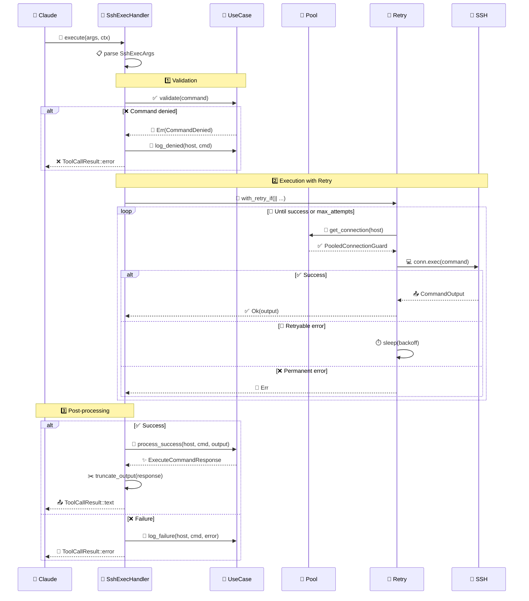
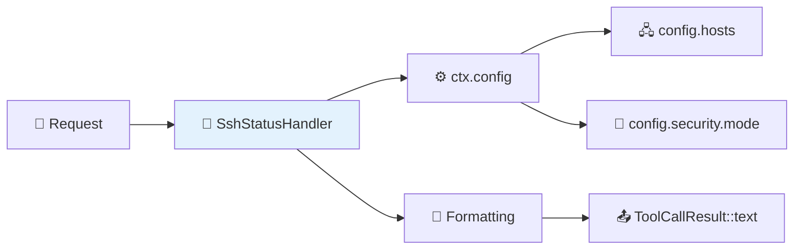
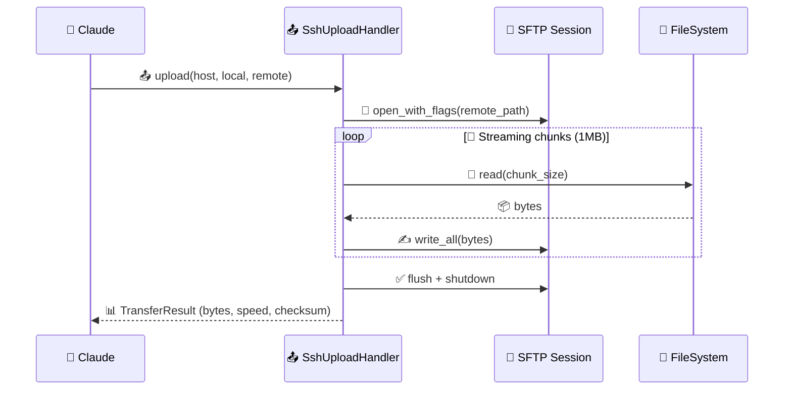
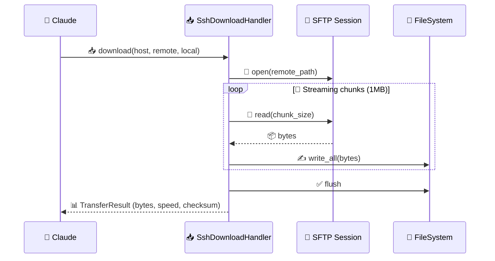
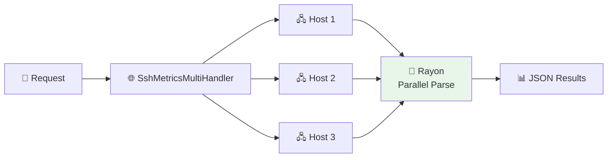
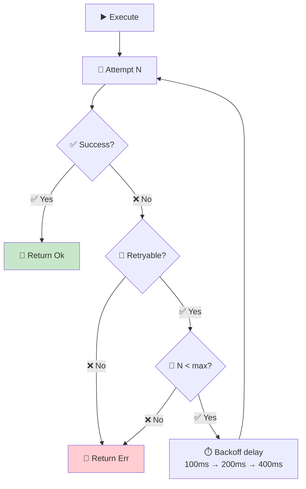

# 🔧 Tool Handlers Module

<div align="center">

**Concrete implementations of MCP tools that implement the `ToolHandler` trait.**

</div>

---

## 📁 Module Structure

```
tool_handlers/
├── 📄 mod.rs               → 📦 Public exports
├── 📄 utils.rs             → 🛠️ Shared utility functions
│
├── ⚡ Execution
│   ├── 📄 ssh_exec.rs          → 🖥️ SshExecHandler
│   └── 📄 ssh_exec_multi.rs    → 🔄 SshExecMultiHandler
│
├── 📁 File Transfer
│   ├── 📄 ssh_upload.rs        → 📤 SshUploadHandler
│   ├── 📄 ssh_download.rs      → 📥 SshDownloadHandler
│   ├── 📄 ssh_sync.rs          → 🔄 SshSyncHandler
│   └── 📄 ssh_tail.rs          → 📄 SshTailHandler
│
├── 📊 Monitoring (4 tools)
│   ├── 📄 ssh_metrics.rs       → 💻 SshMetricsHandler
│   ├── 📄 ssh_metrics_multi.rs → 🌐 SshMetricsMultiHandler
│   └── 📄 ssh_disk_usage.rs    → 💾 SshDiskUsageHandler
│
├── 📂 Directory (2 tools)
│   ├── 📄 ssh_ls.rs            → 📂 SshLsHandler
│   └── 📄 ssh_find.rs          → 🔍 SshFindHandler
│
├── ℹ️ Info
│   ├── 📄 ssh_status.rs        → 📊 SshStatusHandler
│   ├── 📄 ssh_history.rs       → 📜 SshHistoryHandler
│   └── 📄 ssh_health.rs        → 🩺 SshHealthHandler
│
├── 📦 Sessions
│   ├── 📄 ssh_session_create.rs → 🆕 SshSessionCreateHandler
│   ├── 📄 ssh_session_exec.rs   → ▶️ SshSessionExecHandler
│   ├── 📄 ssh_session_list.rs   → 📋 SshSessionListHandler
│   └── 📄 ssh_session_close.rs  → 🔚 SshSessionCloseHandler
│
├── 🔗 Tunnels
│   ├── 📄 ssh_tunnel_create.rs  → 🆕 SshTunnelCreateHandler
│   ├── 📄 ssh_tunnel_list.rs    → 📋 SshTunnelListHandler
│   └── 📄 ssh_tunnel_close.rs   → 🔚 SshTunnelCloseHandler
│
├── 🗄️ Database
│   ├── 📄 ssh_db_query.rs       → 🔍 SshDbQueryHandler
│   ├── 📄 ssh_db_dump.rs        → 💾 SshDbDumpHandler
│   └── 📄 ssh_db_restore.rs     → ♻️ SshDbRestoreHandler
│
├── 💼 Backup
│   ├── 📄 ssh_backup_create.rs  → 🆕 SshBackupCreateHandler
│   ├── 📄 ssh_backup_list.rs    → 📋 SshBackupListHandler
│   └── 📄 ssh_backup_restore.rs → ♻️ SshBackupRestoreHandler
│
├── ☸️ Kubernetes (9 tools)
│   ├── 📄 ssh_k8s_get.rs        → 📋 SshK8sGetHandler
│   ├── 📄 ssh_k8s_logs.rs       → 📜 SshK8sLogsHandler
│   ├── 📄 ssh_k8s_describe.rs   → 🔍 SshK8sDescribeHandler
│   ├── 📄 ssh_k8s_apply.rs      → ✅ SshK8sApplyHandler
│   ├── 📄 ssh_k8s_delete.rs     → 🗑️ SshK8sDeleteHandler
│   ├── 📄 ssh_k8s_rollout.rs    → 🔄 SshK8sRolloutHandler
│   ├── 📄 ssh_k8s_scale.rs      → ⚖️ SshK8sScaleHandler
│   ├── 📄 ssh_k8s_exec.rs       → 💻 SshK8sExecHandler
│   └── 📄 ssh_k8s_top.rs        → 📊 SshK8sTopHandler
│
├── ⎈ Helm (7 tools)
│   ├── 📄 ssh_helm_list.rs      → 📋 SshHelmListHandler
│   ├── 📄 ssh_helm_status.rs    → 📊 SshHelmStatusHandler
│   ├── 📄 ssh_helm_upgrade.rs   → ⬆️ SshHelmUpgradeHandler
│   ├── 📄 ssh_helm_install.rs   → 📦 SshHelmInstallHandler
│   ├── 📄 ssh_helm_rollback.rs  → ⏪ SshHelmRollbackHandler
│   ├── 📄 ssh_helm_history.rs   → 📜 SshHelmHistoryHandler
│   └── 📄 ssh_helm_uninstall.rs → 🗑️ SshHelmUninstallHandler
│
├── 🤖 Ansible (3 tools)
│   ├── 📄 ssh_ansible_playbook.rs  → 📓 SshAnsiblePlaybookHandler
│   ├── 📄 ssh_ansible_inventory.rs → 📋 SshAnsibleInventoryHandler
│   └── 📄 ssh_ansible_adhoc.rs     → ⚡ SshAnsibleAdhocHandler
│
├── 🐳 Docker (11 tools)
│   ├── 📄 ssh_docker_ps.rs          → 📋 SshDockerPsHandler
│   ├── 📄 ssh_docker_logs.rs        → 📜 SshDockerLogsHandler
│   ├── 📄 ssh_docker_inspect.rs     → 🔍 SshDockerInspectHandler
│   ├── 📄 ssh_docker_exec.rs        → 💻 SshDockerExecHandler
│   ├── 📄 ssh_docker_compose.rs     → 🔄 SshDockerComposeHandler
│   ├── 📄 ssh_docker_images.rs      → 🖼️ SshDockerImagesHandler
│   ├── 📄 ssh_docker_stats.rs       → 📊 SshDockerStatsHandler
│   ├── 📄 ssh_docker_network_ls.rs  → 🌐 SshDockerNetworkLsHandler
│   ├── 📄 ssh_docker_network_inspect.rs → 🔍 SshDockerNetworkInspectHandler
│   ├── 📄 ssh_docker_volume_ls.rs   → 💾 SshDockerVolumeLsHandler
│   └── 📄 ssh_docker_volume_inspect.rs → 🔍 SshDockerVolumeInspectHandler
│
├── 🖥️ ESXi (7 tools)
│   ├── 📄 ssh_esxi_vm_list.rs       → 📋 SshEsxiVmListHandler
│   ├── 📄 ssh_esxi_vm_info.rs       → ℹ️ SshEsxiVmInfoHandler
│   ├── 📄 ssh_esxi_vm_power.rs      → ⚡ SshEsxiVmPowerHandler
│   ├── 📄 ssh_esxi_snapshot.rs      → 📸 SshEsxiSnapshotHandler
│   ├── 📄 ssh_esxi_host_info.rs     → 🖥️ SshEsxiHostInfoHandler
│   ├── 📄 ssh_esxi_datastore_list.rs → 💾 SshEsxiDatastoreListHandler
│   └── 📄 ssh_esxi_network_list.rs  → 🌐 SshEsxiNetworkListHandler
│
├── 🔀 Git (7 tools)
│   ├── 📄 ssh_git_status.rs         → 📊 SshGitStatusHandler
│   ├── 📄 ssh_git_log.rs            → 📜 SshGitLogHandler
│   ├── 📄 ssh_git_diff.rs           → 📝 SshGitDiffHandler
│   ├── 📄 ssh_git_branch.rs         → 🌿 SshGitBranchHandler
│   ├── 📄 ssh_git_pull.rs           → ⬇️ SshGitPullHandler
│   ├── 📄 ssh_git_clone.rs          → 📦 SshGitCloneHandler
│   └── 📄 ssh_git_checkout.rs       → 🔀 SshGitCheckoutHandler
│
├── 🔧 Systemd (9 tools)
│   ├── 📄 ssh_service_status.rs     → 📊 SshServiceStatusHandler
│   ├── 📄 ssh_service_start.rs      → ▶️ SshServiceStartHandler
│   ├── 📄 ssh_service_stop.rs       → ⏹️ SshServiceStopHandler
│   ├── 📄 ssh_service_restart.rs    → 🔄 SshServiceRestartHandler
│   ├── 📄 ssh_service_list.rs       → 📋 SshServiceListHandler
│   ├── 📄 ssh_service_logs.rs       → 📜 SshServiceLogsHandler
│   ├── 📄 ssh_service_daemon_reload.rs → 🔁 SshServiceDaemonReloadHandler
│   ├── 📄 ssh_service_enable.rs     → ✅ SshServiceEnableHandler
│   └── 📄 ssh_service_disable.rs    → ❌ SshServiceDisableHandler
│
├── 🌐 Network (6 tools)
│   ├── 📄 ssh_net_connections.rs    → 🔌 SshNetConnectionsHandler
│   ├── 📄 ssh_net_interfaces.rs     → 🌐 SshNetInterfacesHandler
│   ├── 📄 ssh_net_routes.rs         → 🛤️ SshNetRoutesHandler
│   ├── 📄 ssh_net_ping.rs           → 📡 SshNetPingHandler
│   ├── 📄 ssh_net_traceroute.rs     → 🗺️ SshNetTracerouteHandler
│   └── 📄 ssh_net_dns.rs            → 🔍 SshNetDnsHandler
│
├── 📊 Process (3 tools)
│   ├── 📄 ssh_process_list.rs       → 📋 SshProcessListHandler
│   ├── 📄 ssh_process_kill.rs       → 💀 SshProcessKillHandler
│   └── 📄 ssh_process_top.rs        → 📊 SshProcessTopHandler
│
├── 📦 Package (5 tools)
│   ├── 📄 ssh_pkg_list.rs           → 📋 SshPkgListHandler
│   ├── 📄 ssh_pkg_search.rs         → 🔍 SshPkgSearchHandler
│   ├── 📄 ssh_pkg_install.rs        → 📥 SshPkgInstallHandler
│   ├── 📄 ssh_pkg_update.rs         → 🔄 SshPkgUpdateHandler
│   └── 📄 ssh_pkg_remove.rs         → 🗑️ SshPkgRemoveHandler
│
├── 🔥 Firewall (4 tools)
│   ├── 📄 ssh_firewall_status.rs    → 📊 SshFirewallStatusHandler
│   ├── 📄 ssh_firewall_list.rs      → 📋 SshFirewallListHandler
│   ├── 📄 ssh_firewall_allow.rs     → ✅ SshFirewallAllowHandler
│   └── 📄 ssh_firewall_deny.rs      → ❌ SshFirewallDenyHandler
│
├── ⏰ Cron (3 tools)
│   ├── 📄 ssh_cron_list.rs          → 📋 SshCronListHandler
│   ├── 📄 ssh_cron_add.rs           → ➕ SshCronAddHandler
│   └── 📄 ssh_cron_remove.rs        → ➖ SshCronRemoveHandler
│
├── 🔐 Certificates (3 tools)
│   ├── 📄 ssh_cert_check.rs         → ✅ SshCertCheckHandler
│   ├── 📄 ssh_cert_info.rs          → ℹ️ SshCertInfoHandler
│   └── 📄 ssh_cert_expiry.rs        → ⏰ SshCertExpiryHandler
│
├── 🌍 Nginx (4 tools)
│   ├── 📄 ssh_nginx_status.rs       → 📊 SshNginxStatusHandler
│   ├── 📄 ssh_nginx_test.rs         → ✅ SshNginxTestHandler
│   ├── 📄 ssh_nginx_reload.rs       → 🔄 SshNginxReloadHandler
│   └── 📄 ssh_nginx_list_sites.rs   → 📋 SshNginxListSitesHandler
│
├── 🗄️ Redis (3 tools)
│   ├── 📄 ssh_redis_info.rs         → ℹ️ SshRedisInfoHandler
│   ├── 📄 ssh_redis_cli.rs          → 💻 SshRedisCliHandler
│   └── 📄 ssh_redis_keys.rs         → 🔑 SshRedisKeysHandler
│
├── 🏗️ Terraform (5 tools)
│   ├── 📄 ssh_terraform_init.rs     → 🚀 SshTerraformInitHandler
│   ├── 📄 ssh_terraform_plan.rs     → 📋 SshTerraformPlanHandler
│   ├── 📄 ssh_terraform_apply.rs    → ✅ SshTerraformApplyHandler
│   ├── 📄 ssh_terraform_state.rs    → 📊 SshTerraformStateHandler
│   └── 📄 ssh_terraform_output.rs   → 📤 SshTerraformOutputHandler
│
├── 🔒 Vault (4 tools)
│   ├── 📄 ssh_vault_status.rs       → 📊 SshVaultStatusHandler
│   ├── 📄 ssh_vault_read.rs         → 📖 SshVaultReadHandler
│   ├── 📄 ssh_vault_list.rs         → 📋 SshVaultListHandler
│   └── 📄 ssh_vault_write.rs        → ✍️ SshVaultWriteHandler
│
├── 📤 Output (1 tool)
│   └── 📄 ssh_output_fetch.rs       → 📄 SshOutputFetchHandler
│
├── ⚙️ Config (2 tools)
│   ├── 📄 ssh_config_get.rs          → 📖 SshConfigGetHandler
│   └── 📄 ssh_config_set.rs          → ✍️ SshConfigSetHandler
│
├── 🪟 Windows Services (8 tools)
│   ├── 📄 ssh_win_service_list.rs     → 📋 SshWinServiceListHandler
│   ├── 📄 ssh_win_service_status.rs   → 📊 SshWinServiceStatusHandler
│   ├── 📄 ssh_win_service_start.rs    → ▶️ SshWinServiceStartHandler
│   ├── 📄 ssh_win_service_stop.rs     → ⏹️ SshWinServiceStopHandler
│   ├── 📄 ssh_win_service_restart.rs  → 🔄 SshWinServiceRestartHandler
│   ├── 📄 ssh_win_service_enable.rs   → ✅ SshWinServiceEnableHandler
│   ├── 📄 ssh_win_service_disable.rs  → ❌ SshWinServiceDisableHandler
│   └── 📄 ssh_win_service_config.rs   → ⚙️ SshWinServiceConfigHandler
│
├── 🪟 Windows Events (5 tools)
│   ├── 📄 ssh_win_event_query.rs      → 🔍 SshWinEventQueryHandler
│   ├── 📄 ssh_win_event_logs.rs       → 📋 SshWinEventLogsHandler
│   ├── 📄 ssh_win_event_sources.rs    → 📜 SshWinEventSourcesHandler
│   ├── 📄 ssh_win_event_tail.rs       → 📄 SshWinEventTailHandler
│   └── 📄 ssh_win_event_export.rs     → 📤 SshWinEventExportHandler
│
├── 🪟 Active Directory (6 tools)
│   ├── 📄 ssh_ad_user_list.rs         → 👥 SshAdUserListHandler
│   ├── 📄 ssh_ad_user_info.rs         → 👤 SshAdUserInfoHandler
│   ├── 📄 ssh_ad_group_list.rs        → 📋 SshAdGroupListHandler
│   ├── 📄 ssh_ad_group_members.rs     → 👥 SshAdGroupMembersHandler
│   ├── 📄 ssh_ad_computer_list.rs     → 🖥️ SshAdComputerListHandler
│   └── 📄 ssh_ad_domain_info.rs       → ℹ️ SshAdDomainInfoHandler
│
├── 🪟 Scheduled Tasks (5 tools)
│   ├── 📄 ssh_schtask_list.rs         → 📋 SshSchtaskListHandler
│   ├── 📄 ssh_schtask_info.rs         → ℹ️ SshSchtaskInfoHandler
│   ├── 📄 ssh_schtask_run.rs          → ▶️ SshSchtaskRunHandler
│   ├── 📄 ssh_schtask_enable.rs       → ✅ SshSchtaskEnableHandler
│   └── 📄 ssh_schtask_disable.rs      → ❌ SshSchtaskDisableHandler
│
├── 🪟 Windows Firewall (5 tools)
│   ├── 📄 ssh_win_firewall_status.rs  → 📊 SshWinFirewallStatusHandler
│   ├── 📄 ssh_win_firewall_list.rs    → 📋 SshWinFirewallListHandler
│   ├── 📄 ssh_win_firewall_allow.rs   → ✅ SshWinFirewallAllowHandler
│   ├── 📄 ssh_win_firewall_deny.rs    → ❌ SshWinFirewallDenyHandler
│   └── 📄 ssh_win_firewall_remove.rs  → 🗑️ SshWinFirewallRemoveHandler
│
├── 🪟 IIS (6 tools)
│   ├── 📄 ssh_iis_list_sites.rs       → 📋 SshIisListSitesHandler
│   ├── 📄 ssh_iis_list_pools.rs       → 📋 SshIisListPoolsHandler
│   ├── 📄 ssh_iis_status.rs           → 📊 SshIisStatusHandler
│   ├── 📄 ssh_iis_start.rs            → ▶️ SshIisStartHandler
│   ├── 📄 ssh_iis_stop.rs             → ⏹️ SshIisStopHandler
│   └── 📄 ssh_iis_restart.rs          → 🔄 SshIisRestartHandler
│
├── 🪟 Windows Updates (5 tools)
│   ├── 📄 ssh_win_update_list.rs      → 📋 SshWinUpdateListHandler
│   ├── 📄 ssh_win_update_search.rs    → 🔍 SshWinUpdateSearchHandler
│   ├── 📄 ssh_win_update_install.rs   → 📥 SshWinUpdateInstallHandler
│   ├── 📄 ssh_win_update_history.rs   → 📜 SshWinUpdateHistoryHandler
│   └── 📄 ssh_win_update_reboot.rs    → 🔄 SshWinUpdateRebootHandler
│
├── 🪟 Windows Performance (6 tools)
│   ├── 📄 ssh_win_perf_overview.rs    → 📊 SshWinPerfOverviewHandler
│   ├── 📄 ssh_win_perf_cpu.rs         → 💻 SshWinPerfCpuHandler
│   ├── 📄 ssh_win_perf_memory.rs      → 🧠 SshWinPerfMemoryHandler
│   ├── 📄 ssh_win_perf_disk.rs        → 💾 SshWinPerfDiskHandler
│   ├── 📄 ssh_win_perf_network.rs     → 🌐 SshWinPerfNetworkHandler
│   └── 📄 ssh_win_disk_usage.rs       → 💾 SshWinDiskUsageHandler
│
├── 🪟 Hyper-V (8 tools)
│   ├── 📄 ssh_hyperv_vm_list.rs       → 📋 SshHypervVmListHandler
│   ├── 📄 ssh_hyperv_vm_info.rs       → ℹ️ SshHypervVmInfoHandler
│   ├── 📄 ssh_hyperv_vm_start.rs      → ▶️ SshHypervVmStartHandler
│   ├── 📄 ssh_hyperv_vm_stop.rs       → ⏹️ SshHypervVmStopHandler
│   ├── 📄 ssh_hyperv_host_info.rs     → 🖥️ SshHypervHostInfoHandler
│   ├── 📄 ssh_hyperv_switch_list.rs   → 🔀 SshHypervSwitchListHandler
│   ├── 📄 ssh_hyperv_snapshot_list.rs → 📸 SshHypervSnapshotListHandler
│   └── 📄 ssh_hyperv_snapshot_create.rs → 📸 SshHypervSnapshotCreateHandler
│
├── 🪟 Windows Registry (5 tools)
│   ├── 📄 ssh_reg_query.rs            → 🔍 SshRegQueryHandler
│   ├── 📄 ssh_reg_list.rs             → 📋 SshRegListHandler
│   ├── 📄 ssh_reg_set.rs              → ✍️ SshRegSetHandler
│   ├── 📄 ssh_reg_delete.rs           → 🗑️ SshRegDeleteHandler
│   └── 📄 ssh_reg_export.rs           → 📤 SshRegExportHandler
│
├── 🪟 Windows Features (4 tools)
│   ├── 📄 ssh_win_feature_list.rs     → 📋 SshWinFeatureListHandler
│   ├── 📄 ssh_win_feature_info.rs     → ℹ️ SshWinFeatureInfoHandler
│   ├── 📄 ssh_win_feature_install.rs  → 📥 SshWinFeatureInstallHandler
│   └── 📄 ssh_win_feature_remove.rs   → 🗑️ SshWinFeatureRemoveHandler
│
├── 🪟 Windows Network (6 tools)
│   ├── 📄 ssh_win_net_ip.rs           → 🌐 SshWinNetIpHandler
│   ├── 📄 ssh_win_net_adapters.rs     → 🔌 SshWinNetAdaptersHandler
│   ├── 📄 ssh_win_net_connections.rs  → 🔗 SshWinNetConnectionsHandler
│   ├── 📄 ssh_win_net_routes.rs       → 🛤️ SshWinNetRoutesHandler
│   ├── 📄 ssh_win_net_ping.rs         → 📡 SshWinNetPingHandler
│   └── 📄 ssh_win_net_dns.rs          → 🔍 SshWinNetDnsHandler
│
└── 🪟 Windows Process (5 tools)
    ├── 📄 ssh_win_process_list.rs     → 📋 SshWinProcessListHandler
    ├── 📄 ssh_win_process_top.rs      → 📊 SshWinProcessTopHandler
    ├── 📄 ssh_win_process_info.rs     → ℹ️ SshWinProcessInfoHandler
    ├── 📄 ssh_win_process_by_name.rs  → 🔍 SshWinProcessByNameHandler
    └── 📄 ssh_win_process_kill.rs     → 💀 SshWinProcessKillHandler
```

---

## 🏗️ Architecture

```mermaid
graph TB
    subgraph Handlers["🔧 Tool Handlers (197 tools, 38 groups)"]
        subgraph Exec["⚡ Execution"]
            E1["🖥️ SshExecHandler"]
            E2["🔄 SshExecMultiHandler"]
        end
        subgraph Files["📁 File Transfer"]
            F1["📤 SshUploadHandler"]
            F2["📥 SshDownloadHandler"]
            F3["🔄 SshSyncHandler"]
            F4["📄 SshTailHandler"]
            F5["📂 SshLsHandler"]
        end
        subgraph Metrics["📊 Metrics"]
            M1["💻 SshMetricsHandler"]
            M2["🌐 SshMetricsMultiHandler"]
        end
        subgraph Info["ℹ️ Info"]
            I1["📊 SshStatusHandler"]
            I2["📜 SshHistoryHandler"]
            I3["🩺 SshHealthHandler"]
        end
        subgraph Sessions["📦 Sessions"]
            S1["🆕 SessionCreate"]
            S2["▶️ SessionExec"]
            S3["📋 SessionList"]
            S4["🔚 SessionClose"]
        end
        subgraph Tunnels["🔗 Tunnels"]
            T1["🆕 TunnelCreate"]
            T2["📋 TunnelList"]
            T3["🔚 TunnelClose"]
        end
        subgraph Database["🗄️ Database"]
            D1["🔍 DbQuery"]
            D2["💾 DbDump"]
            D3["♻️ DbRestore"]
        end
        subgraph Backup["💼 Backup"]
            B1["🆕 BackupCreate"]
            B2["📋 BackupList"]
            B3["♻️ BackupRestore"]
        end
        subgraph K8s["☸️ Kubernetes"]
            K1["📋 K8sGet"]
            K2["📜 K8sLogs"]
            K3["🔍 K8sDescribe"]
            K4["✅ K8sApply"]
            K5["🗑️ K8sDelete"]
            K6["🔄 K8sRollout"]
            K7["⚖️ K8sScale"]
            K8["💻 K8sExec"]
            K9["📊 K8sTop"]
        end
        subgraph Helm["⎈ Helm"]
            H1["📋 HelmList"]
            H2["📊 HelmStatus"]
            H3["⬆️ HelmUpgrade"]
            H4["📦 HelmInstall"]
            H5["⏪ HelmRollback"]
            H6["📜 HelmHistory"]
            H7["🗑️ HelmUninstall"]
        end
        subgraph Ansible["🤖 Ansible"]
            A1["📓 AnsiblePlaybook"]
            A2["📋 AnsibleInventory"]
            A3["⚡ AnsibleAdhoc"]
        end
        subgraph Docker["🐳 Docker (11)"]
            DK1["📋 DockerPs"]
            DK2["📜 DockerLogs"]
            DK3["🔍 DockerInspect"]
            DK4["💻 DockerExec"]
            DK5["🔄 DockerCompose"]
            DK6["🖼️ DockerImages"]
            DK7["📊 DockerStats"]
            DK8["🌐 DockerNetworkLs"]
            DK9["🔍 DockerNetworkInspect"]
            DK10["💾 DockerVolumeLs"]
            DK11["🔍 DockerVolumeInspect"]
        end
        subgraph ESXi["🖥️ ESXi"]
            EX1["📋 VmList"]
            EX2["ℹ️ VmInfo"]
            EX3["⚡ VmPower"]
            EX4["📸 Snapshot"]
            EX5["🖥️ HostInfo"]
            EX6["💾 DatastoreList"]
            EX7["🌐 NetworkList"]
        end
        subgraph Git["🔀 Git"]
            G1["📊 GitStatus"]
            G2["📜 GitLog"]
            G3["📝 GitDiff"]
            G4["🌿 GitBranch"]
            G5["⬇️ GitPull"]
            G6["📦 GitClone"]
            G7["🔀 GitCheckout"]
        end
        subgraph SysAdmin["🔧 Linux System Admin (55 tools)"]
            SYSD["🔧 Systemd (9)"]
            NET["🌐 Network (6)"]
            PROC["📊 Process (3)"]
            PKG["📦 Package (5)"]
            FW["🔥 Firewall (4)"]
            CRON["⏰ Cron (3)"]
            CERT["🔐 Certificates (3)"]
            NGX["🌍 Nginx (4)"]
            REDIS["🗄️ Redis (3)"]
            TF["🏗️ Terraform (5)"]
            VLT["🔒 Vault (4)"]
            MONITOR["📊 Monitoring (4)"]
            DIR["📂 Directory (2)"]
        end
        subgraph WinHandlers["🪟 Windows Handlers (74 tools, 13 groups)"]
            WINSVC["🔧 Win Services (9)"]
            WINEVT["📋 Win Events (6)"]
            WINAD["👥 Active Directory (6)"]
            WINSCHT["⏰ Sched Tasks (5)"]
            WINFW["🔥 Win Firewall (5)"]
            WINIIS["🌐 IIS (6)"]
            WINUPD["🔄 Win Updates (5)"]
            WINPERF["📊 Win Perf (5)"]
            WINHV["🖥️ Hyper-V (8)"]
            WINREG["📝 Registry (5)"]
            WINFEAT["⚙️ Features (4)"]
            WINNET["🌐 Win Network (6)"]
            WINPROC["📋 Win Process (6)"]
        end
        UTILS["🛠️ utils.rs"]
    end

    subgraph Ports["🔗 ports/"]
        TH["🎯 ToolHandler trait"]
        TC["📦 ToolContext"]
    end

    subgraph Domain["💎 domain/"]
        UC["🎯 ExecuteCommandUseCase"]
        DB["🗄️ DatabaseCommandBuilder"]
        KB["☸️ KubernetesCommandBuilder"]
        HB["⎈ HelmCommandBuilder"]
        AB["🤖 AnsibleCommandBuilder"]
        DKB["🐳 DockerCommandBuilder"]
        TM["🔗 TunnelManager"]
        BUILDERS["🔧 11 more Linux builders<br/>(Systemd, Network, Process,<br/>Package, Firewall, Cron,<br/>Certificate, Nginx, Redis,<br/>Terraform, Vault)"]
        WINBUILDERS["🪟 13 Windows builders<br/>(WinService, WinEvent, AD,<br/>ScheduledTask, WinFirewall,<br/>IIS, WinUpdate, WinPerf,<br/>HyperV, WinRegistry,<br/>WinFeature, WinNetwork,<br/>WinProcess)"]
    end

    subgraph SSH["🔑 ssh/"]
        POOL["🔄 ConnectionPool"]
        RETRY["🔁 with_retry_if()"]
        SM["📦 SessionManager"]
    end

    TH -.->|"impl"| Handlers
    Handlers --> TC
    TC --> UC
    TC --> POOL
    TC --> SM
    E1 --> RETRY
    E2 --> RETRY
    F1 --> RETRY
    F2 --> RETRY
    D1 --> DB
    D2 --> DB
    D3 --> DB
    T1 --> TM
    K8s --> KB
    Helm --> HB
    Ansible --> AB
    Docker --> DKB
    WinHandlers --> WINBUILDERS

    style Exec fill:#e3f2fd
    style Files fill:#fff3e0
    style Metrics fill:#e8f5e9
    style Info fill:#fce4ec
    style Sessions fill:#f3e5f5
    style Tunnels fill:#e0f7fa
    style Database fill:#fff9c4
    style Backup fill:#f3e5f5
    style K8s fill:#e8eaf6
    style Helm fill:#e0f2f1
    style Ansible fill:#fbe9e7
    style WinHandlers fill:#e8f0fe
```



---

## ⚡ SshExecHandler (`ssh_exec.rs`)

> 🖥️ Executes commands on remote hosts via SSH.

### 📋 JSON Schema

```json
{
  "type": "object",
  "required": ["host", "command"],
  "properties": {
    "host": { "type": "string", "description": "🖧 SSH host alias" },
    "command": { "type": "string", "description": "💻 Command to execute" },
    "timeout_seconds": { "type": "integer", "description": "⏱️ Custom timeout (1-3600)" },
    "working_dir": { "type": "string", "description": "📂 Working directory" },
    "max_output": { "type": "integer", "description": "📏 Max chars (default: 20000)" }
  }
}
```

### 🔄 Execution Flow



### 📨 MCP Call Example

```json
{
  "jsonrpc": "2.0",
  "id": 1,
  "method": "tools/call",
  "params": {
    "name": "ssh_exec",
    "arguments": {
      "host": "prod-server",
      "command": "docker ps",
      "timeout_seconds": 30
    }
  }
}
```

### 📤 Formatted Output

```
🖧 Host: prod-server
💻 Command: docker ps
✅ Exit code: 0
⏱️ Duration: 150ms

--- STDOUT ---
CONTAINER ID   IMAGE     STATUS
abc123         nginx     Up 2 days

--- STDERR ---
(if not empty)
```

### ✂️ Smart Truncation

If output exceeds `max_output` characters (default: 20,000), it is intelligently truncated:

```
🖧 Host: prod-server
💻 Command: molecule test
✅ Exit code: 0
⏱️ Duration: 45000ms

--- STDOUT ---
PLAY [all] ***
TASK [Gathering Facts] ***
ok: [localhost]

--- [truncated: 1250 lines total, 1200 lines omitted, 85000 → 20000 chars] ---

PLAY RECAP ***
localhost: ok=42  changed=3  failed=0
```

> [!TIP]
> Keeps **20% beginning** (context) + **80% end** (result), cutting at line boundaries.

---

## 📊 SshStatusHandler (`ssh_status.rs`)

> 📋 Displays configured hosts and security mode.

### 📋 JSON Schema

```json
{
  "type": "object",
  "properties": {}
}
```

> ℹ️ No parameters required.

### 📤 Output

```
🌉 SSH Bridge Status
====================
🔐 Security mode: strict

📋 Available hosts:
  • 🖧 prod-server - Production server (🔑 key auth)
  • 🖧 dev-server - Development server (🤖 agent auth)
  • 🖧 test-server (🔒 password auth)
```

### 🔄 Flow



---

## 📜 SshHistoryHandler (`ssh_history.rs`)

> 📜 Returns the history of executed commands.

### 📋 JSON Schema

```json
{
  "type": "object",
  "properties": {
    "limit": { "type": "integer", "description": "🔢 Entries to return (1-100)", "default": 10 },
    "host": { "type": "string", "description": "🖧 Filter by host" }
  }
}
```

### 📤 Output

```
📜 Command History (last 3 entries)
===================================

[⏰ 2024-01-15 10:30:45] 🖧 prod-server
  💻 Command: docker ps
  ✅ Status: Success (exit code: 0)
  ⏱️ Duration: 150ms

[⏰ 2024-01-15 10:30:30] 🖧 prod-server
  💻 Command: ls -la
  ✅ Status: Success (exit code: 0)
  ⏱️ Duration: 50ms

[⏰ 2024-01-15 10:30:00] 🖧 dev-server
  💻 Command: bad-command
  ❌ Status: Failed
```

---

## 📤 SshUploadHandler (`ssh_upload.rs`)

> 📤 File upload via SFTP (streaming, no size limit).

### 📋 JSON Schema

```json
{
  "type": "object",
  "required": ["host", "local_path", "remote_path"],
  "properties": {
    "host": { "type": "string", "description": "🖧 SSH host alias" },
    "local_path": { "type": "string", "description": "📂 Local file path" },
    "remote_path": { "type": "string", "description": "📁 Destination on remote" },
    "mode": { "type": "string", "enum": ["overwrite", "append", "resume", "fail_if_exists"] },
    "chunk_size": { "type": "integer", "default": 1048576 },
    "verify_checksum": { "type": "boolean", "default": false },
    "preserve_permissions": { "type": "boolean", "default": true }
  }
}
```

### 🔄 Flow



### ⚡ Capabilities

| Feature | Value |
|---------|-------|
| 📏 Max size | ♾️ Unlimited |
| 🔄 Streaming | Yes (1MB chunks) |
| ▶️ Resume | Yes |
| 🔐 SHA256 Checksum | Optional |
| 🔒 Permissions | Preserved |

---

## 📥 SshDownloadHandler (`ssh_download.rs`)

> 📥 File download via SFTP (streaming, no size limit).

### 📋 JSON Schema

```json
{
  "type": "object",
  "required": ["host", "remote_path", "local_path"],
  "properties": {
    "host": { "type": "string", "description": "🖧 SSH host alias" },
    "remote_path": { "type": "string", "description": "📁 Path on remote host" },
    "local_path": { "type": "string", "description": "📂 Destination path" },
    "mode": { "type": "string", "enum": ["overwrite", "append", "resume", "fail_if_exists"] },
    "chunk_size": { "type": "integer", "default": 1048576 },
    "verify_checksum": { "type": "boolean", "default": false },
    "preserve_permissions": { "type": "boolean", "default": true }
  }
}
```

### 🔄 Flow



---

## 📄 SshTailHandler (`ssh_tail.rs`)

> 📄 Reads the last lines of a remote file with optional grep filtering.

### 📋 JSON Schema

```json
{
  "type": "object",
  "required": ["host", "file"],
  "properties": {
    "host": { "type": "string", "description": "🖧 SSH host alias" },
    "file": { "type": "string", "description": "📁 Absolute path to file" },
    "lines": { "type": "integer", "description": "🔢 Number of lines (1-100000)", "default": 100 },
    "grep": { "type": "string", "description": "🔍 Regex pattern to filter" },
    "max_output": { "type": "integer", "description": "📏 Max output chars", "default": 20000 }
  }
}
```

### 🔄 Flow


### 🔒 Security

- 🛡️ File path is escaped via `shell_escape()` to prevent injection
- 🔍 Grep pattern is validated and escaped

---

## 💻 SshMetricsHandler (`ssh_metrics.rs`)

> 📊 Collects system metrics from a remote host as structured JSON.

### 📋 JSON Schema

```json
{
  "type": "object",
  "required": ["host", "metrics"],
  "properties": {
    "host": { "type": "string", "description": "🖧 SSH host alias" },
    "metrics": {
      "type": "array",
      "description": "📊 Metrics to collect",
      "items": { "enum": ["cpu", "memory", "disk", "network", "load"] }
    },
    "timeout_seconds": { "type": "integer", "description": "⏱️ Custom timeout" }
  }
}
```

### 📊 Available Metrics

| Metric | Command | Data |
|--------|---------|------|
| 💻 `cpu` | `/proc/stat` | cores, user%, system%, idle% |
| 🧠 `memory` | `/proc/meminfo` | total, used, available, swap, usage% |
| 💾 `disk` | `df -B1` | filesystem, mount, total, used, available, usage% |
| 🌐 `network` | `/proc/net/dev` | interface, rx_bytes, tx_bytes |
| ⚡ `load` | `/proc/uptime` + `/proc/loadavg` | load 1/5/15min, uptime_seconds |

---

## 🌐 SshMetricsMultiHandler (`ssh_metrics_multi.rs`)

> 🌐 Collects system metrics from multiple hosts in parallel.

### 📋 JSON Schema

```json
{
  "type": "object",
  "required": ["hosts", "metrics"],
  "properties": {
    "hosts": { "type": "array", "description": "🖧 Host aliases (max 50)", "maxItems": 50 },
    "metrics": { "type": "array", "description": "📊 Metrics to collect" },
    "fail_fast": { "type": "boolean", "description": "⚡ Stop on first failure", "default": false },
    "timeout_seconds": { "type": "integer", "description": "⏱️ Per-host timeout" }
  }
}
```

### 🚀 Parallel Processing



> 🚀 Uses **rayon** to parse results in parallel, optimizing collection across many hosts.

---

## 🩺 SshHealthHandler (`ssh_health.rs`)

> 🩺 Provides diagnostic information about the MCP server's internal state.

### 📋 JSON Schema

```json
{
  "type": "object",
  "properties": {},
  "required": []
}
```

> ℹ️ No parameters required.

### 📊 Returned Sections

| Section | Description |
|---------|-------------|
| 🔄 **Connection Pool** | Number of pooled connections per host |
| 📦 **Active Sessions** | Active persistent shell sessions with age |
| 📜 **Command History** | Execution statistics (success/failures) |
| ⚙️ **Configuration** | Configuration summary |

### 📤 Example Output

```
=== 🔄 Connection Pool ===
Total pooled connections: 2
  🖧 prod-server: 1 connection(s)
  🖧 dev-server: 1 connection(s)

=== 📦 Active Sessions ===
Total active sessions: 1
  🔑 abc123 (prod-server): cwd=/home/user, age=120s, idle=30s

=== 📜 Command History ===
Commands in history: 15
  ✅ Successful: 13
  ❌ Failed: 2
  📊 By host:
    🖧 prod-server: 10
    🖧 dev-server: 5

=== ⚙️ Configuration ===
🖧 Configured hosts: 2
🔐 Security mode: Strict
⏱️ Command timeout: 60s
🔗 Connection timeout: 10s
🔄 Max concurrent commands: 5
⚡ Rate limit: 10 req/s
```

---

## 🔄 SshExecMultiHandler (`ssh_exec_multi.rs`)

> 🔄 Executes a command in parallel across multiple hosts.

### 📋 JSON Schema

```json
{
  "type": "object",
  "required": ["hosts", "command"],
  "properties": {
    "hosts": { "type": "array", "description": "🖧 Host aliases (max 50)", "maxItems": 50 },
    "command": { "type": "string", "description": "💻 Command to execute" },
    "fail_fast": { "type": "boolean", "description": "⚡ Stop on first failure", "default": false },
    "timeout_seconds": { "type": "integer", "description": "⏱️ Per-host timeout" },
    "max_output": { "type": "integer", "description": "📏 Max chars per host", "default": 20000 },
    "working_dir": { "type": "string", "description": "📂 Working directory" }
  }
}
```

### 📤 JSON Output

```json
{
  "total_hosts": 3,
  "succeeded": 2,
  "failed": 1,
  "results": [
    {
      "host": "server1",
      "success": true,
      "exit_code": 0,
      "output": "...",
      "duration_ms": 150
    },
    {
      "host": "server2",
      "success": false,
      "error": "Connection refused",
      "duration_ms": 5000
    }
  ]
}
```

---

## 📦 Persistent Sessions

The following 4 handlers manage persistent shell sessions that maintain state (working directory, environment variables) between commands.

### 🔄 Lifecycle

```mermaid
sequenceDiagram
    participant C as 🤖 Claude
    participant CREATE as 🆕 session_create
    participant EXEC as ▶️ session_exec
    participant LIST as 📋 session_list
    participant CLOSE as 🔚 session_close

    C->>CREATE: 🆕 create(host)
    CREATE-->>C: 📤 {session_id, host, cwd}

    loop 🔄 Commands
        C->>EXEC: ▶️ exec(session_id, command)
        EXEC-->>C: 📤 {output, exit_code, cwd}
    end

    C->>LIST: 📋 list()
    LIST-->>C: 📤 [{id, host, cwd, timestamps}]

    C->>CLOSE: 🔚 close(session_id)
    CLOSE-->>C: ✅ "closed successfully"
```

### 🆕 SshSessionCreateHandler

```json
{
  "required": ["host"],
  "properties": {
    "host": { "description": "🖧 SSH host alias" },
    "timeout_seconds": { "description": "⏱️ Connection timeout" }
  }
}
```

### ▶️ SshSessionExecHandler

```json
{
  "required": ["session_id", "command"],
  "properties": {
    "session_id": { "description": "🔑 Session ID from create" },
    "command": { "description": "💻 Command to execute" },
    "timeout_seconds": { "description": "⏱️ Command timeout" },
    "max_output": { "description": "📏 Max output chars" }
  }
}
```

> [!NOTE]
> **Persistence**: Working directory (`cd`) and environment variables (`export`) are preserved between commands.

### 📋 SshSessionListHandler

> ℹ️ No parameters required. Returns active sessions.

### 🔚 SshSessionCloseHandler

```json
{
  "required": ["session_id"],
  "properties": {
    "session_id": { "description": "🔑 Session ID to close" }
  }
}
```

---

## 🛠️ Utilities (`utils.rs`)

Shared functions between handlers.

### 📋 API

```rust
/// 🔍 Gets a host config or returns an error
pub fn get_host_config<'a>(ctx: &'a ToolContext, host_name: &str)
    -> Result<&'a HostConfig>

/// ⏱️ Creates a LimitsConfig with custom timeout
pub fn create_limits_with_timeout(ctx: &ToolContext, timeout: Option<u64>)
    -> LimitsConfig

/// 🛡️ Escapes a string for safe shell usage
pub fn shell_escape(s: &str) -> String
```

### 🛡️ `shell_escape`

Protects special characters for safe shell execution:

| Input | Output |
|-------|--------|
| `hello` | `hello` |
| `hello world` | `'hello world'` |
| `it's` | `'it'"'"'s'` |
| `$(rm -rf)` | `'$(rm -rf)'` |

---

## 🔁 Retry Logic

The handlers `ssh_exec`, `ssh_exec_multi`, `ssh_upload`, and `ssh_download` use `with_retry_if`.



### ✅ Retryable Errors

| Error | Description |
|-------|-------------|
| 🔌 `SshConnection` | Connection lost |
| ⏱️ `SshTimeout` | Timeout exceeded |
| 📡 `SshExec` | Channel/connection errors |

### ❌ Non-Retryable Errors

| Error | Description |
|-------|-------------|
| 🚫 `CommandDenied` | Security violation |
| 🔐 `SshAuth` | Authentication failure |
| ❓ `HostNotFound` | Invalid host |
| 🔑 `SshHostKeyMismatch` | Host key error |

---

## 🧪 Tests

```bash
# 🧪 All handler tests
cargo test mcp::tool_handlers::

# 🔧 By handler
cargo test mcp::tool_handlers::ssh_exec::tests
cargo test mcp::tool_handlers::ssh_status::tests
cargo test mcp::tool_handlers::ssh_health::tests
# ... etc
```

### 📊 Test Coverage

| Handler | Tests |
|---------|-------|
| ⚡ **ssh_exec** | `test_schema`, `test_command_denied`, `test_unknown_host` |
| 🔄 **ssh_exec_multi** | `test_schema`, `test_empty_hosts`, `test_command_denied` |
| 📊 **ssh_status** | `test_schema`, `test_ssh_status_*` |
| 📜 **ssh_history** | `test_schema`, `test_ssh_history_*` |
| 📤 **ssh_upload** | `test_schema`, `test_file_not_found`, `test_unknown_host` |
| 📥 **ssh_download** | `test_schema`, `test_unknown_host` |
| 🔄 **ssh_sync** | `test_schema`, `test_unknown_host` |
| 📄 **ssh_tail** | `test_schema`, `test_build_command_*`, `test_command_denied` |
| 📂 **ssh_ls** | `test_schema`, `test_unknown_host` |
| 💻 **ssh_metrics** | `test_schema`, `test_build_command_*`, `test_unknown_host` |
| 🌐 **ssh_metrics_multi** | `test_schema`, `test_empty_hosts` |
| 🩺 **ssh_health** | `test_schema`, `test_returns_all_sections` |
| 🆕 **session_create** | `test_schema`, `test_unknown_host` |
| ▶️ **session_exec** | `test_schema`, `test_session_not_found` |
| 📋 **session_list** | `test_schema`, `test_list_empty` |
| 🔚 **session_close** | `test_schema`, `test_session_not_found` |
| 🆕 **tunnel_create** | `test_schema`, `test_unknown_host` |
| 📋 **tunnel_list** | `test_schema`, `test_list_empty` |
| 🔚 **tunnel_close** | `test_schema`, `test_tunnel_not_found` |
| 🔍 **db_query** | `test_schema`, `test_unknown_host` |
| 💾 **db_dump** | `test_schema`, `test_unknown_host` |
| ♻️ **db_restore** | `test_schema`, `test_unknown_host` |
| 🆕 **backup_create** | `test_schema`, `test_unknown_host` |
| 📋 **backup_list** | `test_schema`, `test_unknown_host` |
| ♻️ **backup_restore** | `test_schema`, `test_unknown_host` |
| ☸️ **k8s_get** | `test_schema`, `test_unknown_host`, `test_build_command_*` |
| ☸️ **k8s_logs** | `test_schema`, `test_unknown_host`, `test_build_command_*` |
| ☸️ **k8s_describe** | `test_schema`, `test_unknown_host`, `test_build_command_*` |
| ☸️ **k8s_apply** | `test_schema`, `test_unknown_host`, `test_build_command_*` |
| ☸️ **k8s_delete** | `test_schema`, `test_unknown_host`, `test_validate_*` |
| ☸️ **k8s_rollout** | `test_schema`, `test_unknown_host`, `test_validate_*` |
| ☸️ **k8s_scale** | `test_schema`, `test_unknown_host`, `test_build_command_*` |
| ☸️ **k8s_exec** | `test_schema`, `test_unknown_host`, `test_build_command_*` |
| ☸️ **k8s_top** | `test_schema`, `test_unknown_host`, `test_validate_*` |
| ⎈ **helm_list** | `test_schema`, `test_build_command_*` |
| ⎈ **helm_status** | `test_schema`, `test_unknown_host`, `test_build_command_*` |
| ⎈ **helm_upgrade** | `test_schema`, `test_unknown_host`, `test_build_command_*` |
| ⎈ **helm_install** | `test_schema`, `test_unknown_host`, `test_build_command_*` |
| ⎈ **helm_rollback** | `test_schema`, `test_unknown_host`, `test_build_command_*` |
| ⎈ **helm_history** | `test_schema`, `test_unknown_host`, `test_build_command_*` |
| ⎈ **helm_uninstall** | `test_schema`, `test_unknown_host`, `test_build_command_*` |
| 🤖 **ansible_playbook** | `test_schema`, `test_unknown_host`, `test_validate_*` |
| 🤖 **ansible_inventory** | `test_schema`, `test_build_command_*` |
| 🤖 **ansible_adhoc** | `test_schema`, `test_unknown_host`, `test_validate_*` |
| 🛠️ **utils** | `test_shell_escape_*` |

---

## ➕ Adding a New Handler

### 1️⃣ Create the file

```rust
// src/mcp/tool_handlers/my_tool.rs
use async_trait::async_trait;
use serde::Deserialize;
use serde_json::Value;

use crate::error::Result;
use crate::mcp::protocol::ToolCallResult;
use crate::ports::tools::{ToolContext, ToolHandler, ToolSchema};

#[derive(Debug, Deserialize)]
struct MyToolArgs {
    param1: String,
    param2: Option<i32>,
}

pub struct MyToolHandler;

#[async_trait]
impl ToolHandler for MyToolHandler {
    fn name(&self) -> &'static str { "my_tool" }
    fn description(&self) -> &'static str { "Does something useful" }
    fn schema(&self) -> ToolSchema { /* ... */ }

    async fn execute(&self, args: Option<Value>, ctx: &ToolContext)
        -> Result<ToolCallResult>
    {
        // 📋 Parse args
        // ✅ Validate
        // 🔧 Execute
        // 📤 Return result
        Ok(ToolCallResult::text("Success!"))
    }
}
```

### 2️⃣ Export in `mod.rs`

```rust
mod my_tool;
pub use my_tool::MyToolHandler;
```

### 3️⃣ Register in the Registry

```rust
// src/mcp/registry.rs
registry.register(Arc::new(MyToolHandler));
```

---

## 🎨 Design Patterns

| Pattern | Application |
|---------|-------------|
| 🎭 **Strategy** | Each handler implements `ToolHandler` differently |
| 🔁 **Retry** | `with_retry_if()` with exponential backoff |
| 🏭 **Factory** | `create_default_registry()` |
| 💉 **DI** | `ToolContext` injects all dependencies |
| ✅ **Validation** | Argument validation before execution |
