# 🔗 Ports Module

This module defines the **interfaces (traits)** that separate the domain from infrastructure - the heart of hexagonal architecture.

## 📁 Module Structure

```
ports/
├── 📄 mod.rs        → Public exports
├── 📄 protocol.rs   → Contract types (ToolCallResult, PromptMessage, ResourceDefinition, etc.)
├── 📄 ssh.rs        → SshExecutor trait (not currently used)
├── 📄 connector.rs  → SshConnector + SshClientTrait traits (implementations moved to ssh/)
├── 📄 tools.rs      → ToolHandler trait + ToolContext + ToolSchema + test mock module
├── 📄 prompts.rs    → PromptHandler trait for MCP prompts
└── 📄 resources.rs  → ResourceHandler trait for MCP resources
```

## 🏗️ Role in Hexagonal Architecture

```mermaid
graph TB
    subgraph Adapters["🔌 Adapters (Implementations)"]
        MCP["📡 mcp/tool_handlers/<br/>SshExecHandler, etc. (197 tools)"]
        PROMPTS["💬 mcp/prompts/<br/>SystemHealthPrompt, etc."]
        RESOURCES["📊 mcp/resources/<br/>MetricsResource, etc."]
        SSH["🔑 ssh/client.rs<br/>SshClient"]
    end

    subgraph Ports["🔗 Ports (this module)"]
        TH["🔧 ToolHandler<br/><i>tools.rs</i>"]
        PH["💬 PromptHandler<br/><i>prompts.rs</i>"]
        RH["📊 ResourceHandler<br/><i>resources.rs</i>"]
        TC["📦 ToolContext<br/><i>tools.rs</i>"]
        TS["📋 ToolSchema<br/><i>tools.rs</i>"]
    end

    subgraph Domain["💎 Domain"]
        UC["🎯 ExecuteCommandUseCase"]
    end

    MCP -.->|"impl"| TH
    PROMPTS -.->|"impl"| PH
    RESOURCES -.->|"impl"| RH
    MCP -->|"uses"| TC
    PROMPTS -->|"uses"| TC
    RESOURCES -->|"uses"| TC
    TC --> UC
```



## 🔧 ToolHandler Trait (`tools.rs`)

Main interface for all MCP tool handlers.

### Definition

```rust
#[async_trait]
pub trait ToolHandler: Send + Sync {
    /// Unique tool name (e.g., "ssh_exec")
    fn name(&self) -> &'static str;

    /// Description for Claude (e.g., "Execute a command via SSH")
    fn description(&self) -> &'static str;

    /// JSON schema for parameters
    fn schema(&self) -> ToolSchema;

    /// Executes the tool with JSON arguments
    async fn execute(
        &self,
        args: Option<Value>,
        ctx: &ToolContext,
    ) -> Result<ToolCallResult>;
}
```

### Existing Implementations


#### 🐧 Linux Groups (25 groups, 123 tools)

| Group | Count | Examples |
|-------|-------|---------|
| **core** | 6 | `ssh_exec`, `ssh_exec_multi`, `ssh_status`, `ssh_health`, `ssh_history`, `ssh_output_fetch` |
| **config** | 2 | `ssh_config_get`, `ssh_config_set` |
| **file_transfer** | 3 | `ssh_upload`, `ssh_download`, `ssh_sync` |
| **sessions** | 4 | `ssh_session_create`, `ssh_session_exec`, `ssh_session_list`, `ssh_session_close` |
| **monitoring** | 4 | `ssh_metrics`, `ssh_metrics_multi`, `ssh_tail`, `ssh_disk_usage` |
| **tunnels** | 3 | `ssh_tunnel_create`, `ssh_tunnel_list`, `ssh_tunnel_close` |
| **directory** | 2 | `ssh_ls`, `ssh_find` |
| **database** | 3 | `ssh_db_query`, `ssh_db_dump`, `ssh_db_restore` |
| **backup** | 3 | `ssh_backup_create`, `ssh_backup_list`, `ssh_backup_restore` |
| **docker** | 11 | `ssh_docker_ps`, `ssh_docker_logs`, `ssh_docker_compose`, ... |
| **esxi** | 7 | `ssh_esxi_vm_list`, `ssh_esxi_vm_info`, `ssh_esxi_snapshot`, ... |
| **git** | 7 | `ssh_git_status`, `ssh_git_log`, `ssh_git_diff`, ... |
| **kubernetes** | 16 | `ssh_k8s_get`, `ssh_k8s_logs`, `ssh_helm_list`, ... |
| **ansible** | 3 | `ssh_ansible_playbook`, `ssh_ansible_inventory`, `ssh_ansible_adhoc` |
| **systemd** | 9 | `ssh_service_status`, `ssh_service_start`, `ssh_service_enable`, ... |
| **network** | 6 | `ssh_net_connections`, `ssh_net_ping`, `ssh_net_dns`, ... |
| **process** | 3 | `ssh_process_list`, `ssh_process_kill`, `ssh_process_top` |
| **package** | 5 | `ssh_pkg_list`, `ssh_pkg_search`, `ssh_pkg_install`, `ssh_pkg_update`, `ssh_pkg_remove` |
| **firewall** | 4 | `ssh_firewall_status`, `ssh_firewall_list`, `ssh_firewall_allow`, `ssh_firewall_deny` |
| **cron** | 3 | `ssh_cron_list`, `ssh_cron_add`, `ssh_cron_remove` |
| **certificates** | 3 | `ssh_cert_check`, `ssh_cert_info`, `ssh_cert_expiry` |
| **nginx** | 4 | `ssh_nginx_status`, `ssh_nginx_test`, `ssh_nginx_reload`, `ssh_nginx_list_sites` |
| **redis** | 3 | `ssh_redis_info`, `ssh_redis_cli`, `ssh_redis_keys` |
| **terraform** | 5 | `ssh_terraform_init`, `ssh_terraform_plan`, `ssh_terraform_apply`, ... |
| **vault** | 4 | `ssh_vault_status`, `ssh_vault_read`, `ssh_vault_list`, `ssh_vault_write` |

#### 🪟 Windows Groups (13 groups, 74 tools)

| Group | Count | Examples |
|-------|-------|---------|
| **windows_services** | 8 | `ssh_win_service_list`, `ssh_win_service_start`, `ssh_win_service_stop`, ... |
| **windows_events** | 5 | `ssh_win_event_query`, `ssh_win_event_logs`, `ssh_win_event_tail`, ... |
| **active_directory** | 6 | `ssh_ad_user_list`, `ssh_ad_group_list`, `ssh_ad_domain_info`, ... |
| **scheduled_tasks** | 5 | `ssh_schtask_list`, `ssh_schtask_info`, `ssh_schtask_run`, ... |
| **windows_firewall** | 5 | `ssh_win_firewall_status`, `ssh_win_firewall_list`, `ssh_win_firewall_allow`, ... |
| **iis** | 6 | `ssh_iis_list_sites`, `ssh_iis_status`, `ssh_iis_start`, ... |
| **windows_updates** | 5 | `ssh_win_update_list`, `ssh_win_update_search`, `ssh_win_update_install`, ... |
| **windows_perf** | 6 | `ssh_win_perf_overview`, `ssh_win_perf_cpu`, `ssh_win_perf_memory`, ... |
| **hyperv** | 8 | `ssh_hyperv_vm_list`, `ssh_hyperv_vm_info`, `ssh_hyperv_vm_start`, ... |
| **windows_registry** | 5 | `ssh_reg_query`, `ssh_reg_list`, `ssh_reg_set`, `ssh_reg_delete`, `ssh_reg_export` |
| **windows_features** | 4 | `ssh_win_feature_list`, `ssh_win_feature_info`, `ssh_win_feature_install`, `ssh_win_feature_remove` |
| **windows_network** | 6 | `ssh_win_net_adapters`, `ssh_win_net_ip`, `ssh_win_net_connections`, ... |
| **windows_process** | 5 | `ssh_win_process_list`, `ssh_win_process_top`, `ssh_win_process_kill`, ... |

## 💬 PromptHandler Trait (`prompts.rs`)

Interface for all MCP prompt handlers.

### Definition

```rust
#[async_trait]
pub trait PromptHandler: Send + Sync {
    /// Unique prompt name (e.g., "system-health")
    fn name(&self) -> &'static str;

    /// Description for Claude
    fn description(&self) -> &'static str;

    /// List of accepted arguments
    fn arguments(&self) -> Vec<PromptArgument>;

    /// Generates the prompt messages
    async fn get(
        &self,
        args: HashMap<String, String>,
        ctx: &ToolContext,
    ) -> Result<Vec<PromptMessage>>;
}
```

### Existing Implementations


## 📊 ResourceHandler Trait (`resources.rs`)

Interface for all MCP resource handlers.

### Definition

```rust
#[async_trait]
pub trait ResourceHandler: Send + Sync {
    /// URI scheme (e.g., "metrics", "file", "log")
    fn scheme(&self) -> &'static str;

    /// Lists available resources for a set of hosts
    fn list(&self, hosts: &HashMap<String, HostConfig>) -> Vec<ResourceDefinition>;

    /// Reads the content of a resource
    async fn read(&self, uri: &str, ctx: &ToolContext) -> Result<ResourceContent>;
}
```

### Existing Implementations

| Handler | URI Scheme | Description |
|---------|------------|-------------|
| `MetricsResource` | `metrics://{host}` | System metrics (CPU, mem, disk, net, load) |
| `FileResource` | `file://{host}/{path}` | Remote file content |
| `LogResource` | `log://{host}/{path}` | Last lines of a log file |

## 📦 ToolContext (`tools.rs`)

Shared context provided to all handlers with all dependencies.

### Structure

```rust
pub struct ToolContext {
    pub config: Arc<Config>,
    pub validator: Arc<CommandValidator>,
    pub sanitizer: Arc<Sanitizer>,
    pub audit_logger: Arc<AuditLogger>,
    pub history: Arc<CommandHistory>,
    pub connection_pool: Arc<ConnectionPool>,
    pub execute_use_case: Arc<ExecuteCommandUseCase>,
    pub rate_limiter: Arc<RateLimiter>,
    pub session_manager: Arc<SessionManager>,
    pub tunnel_manager: Arc<TunnelManager>,
    pub output_cache: Arc<OutputCache>,
    pub runtime_max_output_chars: Arc<std::sync::atomic::AtomicUsize>,
}
```

### Diagram

```mermaid
classDiagram
    class ToolContext {
        +config: Arc~Config~
        +validator: Arc~CommandValidator~
        +sanitizer: Arc~Sanitizer~
        +audit_logger: Arc~AuditLogger~
        +history: Arc~CommandHistory~
        +connection_pool: Arc~ConnectionPool~
        +execute_use_case: Arc~ExecuteCommandUseCase~
        +rate_limiter: Arc~RateLimiter~
        +session_manager: Arc~SessionManager~
        +tunnel_manager: Arc~TunnelManager~
        +output_cache: Arc~OutputCache~
        +runtime_max_output_chars: Arc~AtomicUsize~
    }

    ToolContext --> Config : "⚙️ Configuration"
    ToolContext --> CommandValidator : "✅ Validation"
    ToolContext --> Sanitizer : "🧹 Sanitization"
    ToolContext --> AuditLogger : "📝 Audit"
    ToolContext --> CommandHistory : "📜 History"
    ToolContext --> ConnectionPool : "🔄 SSH Pool"
    ToolContext --> ExecuteCommandUseCase : "🎯 Use Case"
    ToolContext --> RateLimiter : "⏱️ Rate Limiting"
    ToolContext --> SessionManager : "🔗 Sessions"
    ToolContext --> TunnelManager : "🚇 Tunnels"
    ToolContext --> OutputCache : "📦 Output Pagination"
    ToolContext --> AtomicUsize : "📏 Per-Client Limit"
```



### Usage in a Handler

```rust
impl ToolHandler for SshExecHandler {
    async fn execute(&self, args: Option<Value>, ctx: &ToolContext) -> Result<ToolCallResult> {
        // 1. Parse arguments
        let args: SshExecArgs = serde_json::from_value(args.unwrap())?;

        // 2. Validate command via use case
        ctx.execute_use_case.validate(&args.command)?;

        // 3. Get host config
        let host_config = ctx.config.hosts.get(&args.host)?;

        // 4. Execute via pool
        let mut conn = ctx.connection_pool.get_connection(&args.host, host_config, &ctx.config.limits).await?;
        let output = conn.exec(&args.command, &ctx.config.limits).await?;

        // 5. Process result via use case
        let response = ctx.execute_use_case.process_success(&args.host, &args.command, &output);

        Ok(ToolCallResult::text(response.output))
    }
}
```

## 📋 ToolSchema (`tools.rs`)

JSON schema for tool parameters (used by MCP `tools/list`).

### Structure

```rust
#[derive(Debug, Clone, Serialize)]
pub struct ToolSchema {
    #[serde(rename = "type")]
    pub schema_type: String,  // Always "object"
    pub properties: HashMap<String, PropertySchema>,
    pub required: Vec<String>,
}

#[derive(Debug, Clone, Serialize)]
pub struct PropertySchema {
    #[serde(rename = "type")]
    pub prop_type: String,  // "string", "integer", "boolean"
    pub description: String,
    #[serde(skip_serializing_if = "Option::is_none")]
    pub minimum: Option<i64>,
    #[serde(skip_serializing_if = "Option::is_none")]
    pub maximum: Option<i64>,
}
```

### Example

```rust
fn schema(&self) -> ToolSchema {
    let mut properties = HashMap::new();

    properties.insert("host".to_string(), PropertySchema {
        prop_type: "string".to_string(),
        description: "SSH host alias from configuration".to_string(),
        minimum: None,
        maximum: None,
    });

    properties.insert("command".to_string(), PropertySchema {
        prop_type: "string".to_string(),
        description: "Command to execute".to_string(),
        minimum: None,
        maximum: None,
    });

    properties.insert("timeout_seconds".to_string(), PropertySchema {
        prop_type: "integer".to_string(),
        description: "Custom timeout (optional)".to_string(),
        minimum: Some(1),
        maximum: Some(3600),
    });

    ToolSchema {
        schema_type: "object".to_string(),
        properties,
        required: vec!["host".to_string(), "command".to_string()],
    }
}
```

## 🏷️ ToolAnnotations (`registry.rs`)

All 197 tools have `ToolAnnotations` metadata centralized in the `tool_annotations()` function in `registry.rs`. Annotations help MCP clients understand the safety level and expected behavior of each tool before execution.

### Annotation Levels

| Level | Function | Description |
|-------|----------|-------------|
| 🟢 **Read-only** | `read_only()` | Tool only reads data, no side effects (e.g., `ssh_status`, `ssh_pkg_list`) |
| 🟡 **Mutating** | `mutating()` | Tool modifies state but is reversible (e.g., `ssh_service_restart`, `ssh_cron_add`) |
| 🔴 **Destructive** | `destructive()` | Tool performs potentially irreversible changes (e.g., `ssh_k8s_delete`, `ssh_db_restore`) |

These annotations are returned as part of the MCP `tools/list` response, allowing Claude and other MCP clients to make informed decisions about tool usage and to request appropriate user confirmation before executing mutating or destructive operations.

## 🧪 Test Helper (`tools.rs`)

A centralized mock module with factory functions to create `ToolContext` for tests.

```rust
#[cfg(test)]
pub mod mock {
    /// Creates a minimal test context with no hosts
    pub fn create_test_context() -> ToolContext { ... }

    /// Creates a test context with a single host "server1"
    pub fn create_test_context_with_host() -> ToolContext { ... }

    /// Creates a test context with custom hosts
    pub fn create_test_context_with_hosts(hosts: HashMap<String, HostConfig>) -> ToolContext { ... }

    /// Creates a test context with pre-populated history
    pub fn create_test_context_with_history(history: Arc<CommandHistory>) -> ToolContext { ... }

    /// Creates a test context with a custom config
    pub fn create_test_context_with_config(config: Config) -> ToolContext { ... }
}
```

## 📡 SshExecutor Trait (`ssh.rs`)

Interface for SSH execution (prepared for mocking but not currently used).

```rust
#[async_trait]
pub trait SshExecutor: Send + Sync {
    async fn execute(
        &self,
        host: &str,
        command: &str,
        timeout: Duration,
    ) -> Result<CommandOutput>;

    async fn upload(
        &self,
        host: &str,
        local: &Path,
        remote: &Path,
    ) -> Result<()>;

    async fn download(
        &self,
        host: &str,
        remote: &Path,
        local: &Path,
    ) -> Result<()>;

    async fn is_reachable(&self, host: &str) -> bool;
}
```

> **Note**: Currently, the code directly uses `ConnectionPool` + `SshClient`. This trait is planned for future abstraction enabling full SSH mocking.

## 🎨 Design Patterns

| Pattern | Application |
|---------|-------------|
| 🔌 **Port** | `ToolHandler` and `SshExecutor` are abstract interfaces |
| 💉 **Dependency Injection** | `ToolContext` injects all dependencies |
| 📦 **Context Object** | `ToolContext` groups shared dependencies |
| 🧪 **Test Helper** | `create_test_context()` facilitates unit tests |

## 🧪 Tests

```bash
cargo test ports::
```

## ➕ Adding a New Handler

1. **Create the file** in `src/mcp/tool_handlers/`:

```rust
// src/mcp/tool_handlers/my_tool.rs
pub struct MyToolHandler;

#[async_trait]
impl ToolHandler for MyToolHandler {
    fn name(&self) -> &'static str { "my_tool" }
    fn description(&self) -> &'static str { "Does something useful" }
    fn schema(&self) -> ToolSchema { /* ... */ }
    async fn execute(&self, args: Option<Value>, ctx: &ToolContext)
        -> Result<ToolCallResult> { /* ... */ }
}
```

2. **Register** in `src/mcp/registry.rs`:

```rust
pub fn create_default_registry() -> ToolRegistry {
    let mut registry = ToolRegistry::new();
    // ... existing handlers ...
    registry.register(Arc::new(MyToolHandler));
    registry
}
```

3. **Export** in `src/mcp/tool_handlers/mod.rs`:

```rust
mod my_tool;
pub use my_tool::MyToolHandler;
```

## 🔗 Relations with Other Modules

```mermaid
graph LR
    subgraph Uses["📦 Uses ports/"]
        MCP["mcp/registry.rs"]
        PREG["mcp/prompt_registry.rs"]
        HANDLERS["mcp/tool_handlers/*"]
        PROMPTS["mcp/prompts/*"]
    end

    subgraph Ports["🔗 ports/"]
        TH["ToolHandler"]
        PH["PromptHandler"]
        TC["ToolContext"]
    end

    subgraph Dependencies["📦 ToolContext Dependencies"]
        CONFIG["config/"]
        SECURITY["security/"]
        DOMAIN["domain/"]
        SSH_MOD["ssh/"]
        HISTORY["domain/history.rs"]
    end

    MCP --> TH
    PREG --> PH
    HANDLERS -.->|"impl"| TH
    PROMPTS -.->|"impl"| PH
    HANDLERS --> TC
    PROMPTS --> TC

    TC --> CONFIG
    TC --> SECURITY
    TC --> DOMAIN
    TC --> SSH_MOD
    TC --> HISTORY
```


