# 🔑 SSH Module

This module implements the SSH client based on `russh`, with connection pooling, automatic retry, and host key verification.

## 📁 Module Structure

```
ssh/
├── 📄 mod.rs          -> Public exports (SshClient, ConnectionPool, RealSshConnector, etc.)
├── 📄 client.rs       -> SshClient wrapper around russh
├── 📄 connector.rs    -> RealSshConnector (SshConnector + SshClientTrait implementations)
├── 📄 pool.rs         -> ConnectionPool + PooledConnectionGuard
├── 📄 retry.rs        -> RetryConfig + with_retry() + with_retry_if()
├── 📄 known_hosts.rs  -> Host key verification
├── 📄 session.rs      -> SessionManager + persistent sessions
├── 📄 sftp.rs         -> Streaming SFTP transfer
```

## 🏗️ Architecture

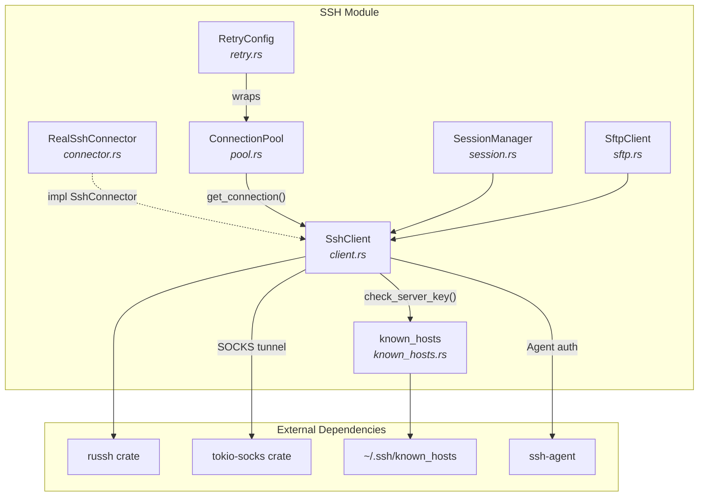

## 🔑 SshClient (`client.rs`)

SSH client wrapper that handles connection, authentication, and execution.

### 📋 Structure

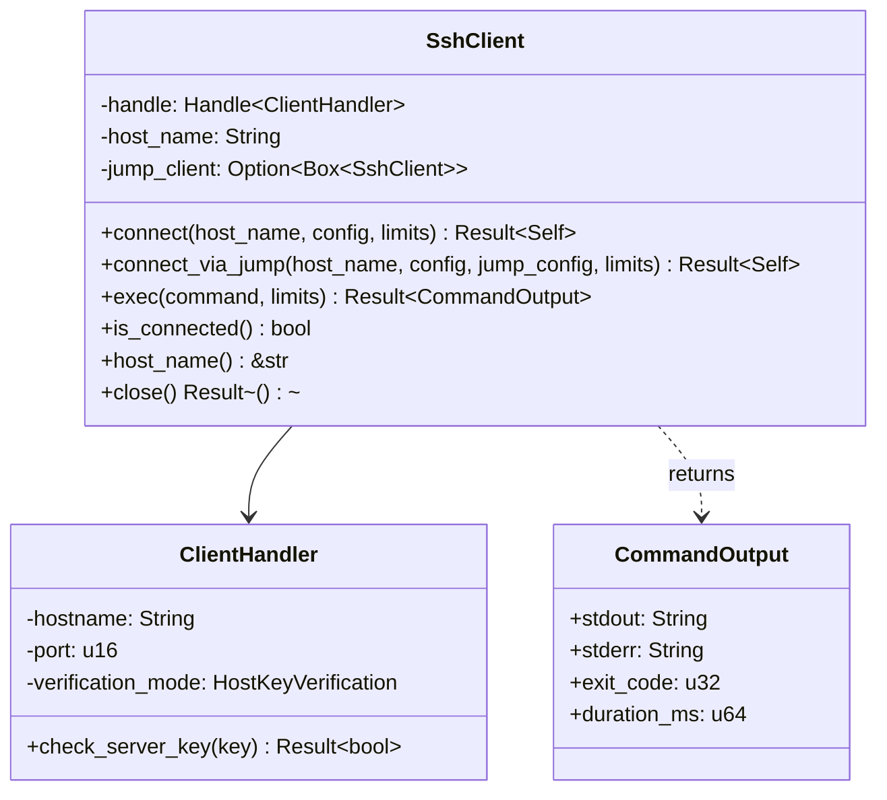

### 🔧 API

```rust
impl SshClient {
    /// Connects to a host with authentication
    /// # Errors
    /// - `SshConnection`: TCP/SSH connection failure
    /// - `SshHostKeyMismatch`: host key doesn't match
    /// - `SshHostKeyUnknown`: unknown host (strict mode)
    /// - `SshAuth`: authentication failure
    pub async fn connect(host_name: &str, config: &HostConfig, limits: &LimitsConfig)
        -> Result<Self>

    /// Connects to a host via a jump host (bastion)
    /// Uses channel_open_direct_tcpip for the tunnel
    /// # Errors
    /// Same errors as connect(), plus jump host errors
    pub async fn connect_via_jump(
        host_name: &str,
        config: &HostConfig,
        jump_config: &HostConfig,
        limits: &LimitsConfig,
    ) -> Result<Self>

    /// Executes a command
    /// # Errors
    /// - `SshExec`: execution failure
    /// - `SshTimeout`: timeout exceeded
    /// - `SshOutputTooLarge`: output too large
    pub async fn exec(&self, command: &str, limits: &LimitsConfig)
        -> Result<CommandOutput>

    /// Checks if the connection is active
    pub async fn is_connected(&self) -> bool

    /// Returns the host name
    #[must_use]
    pub fn host_name(&self) -> &str

    /// Closes the connection properly
    /// # Errors
    /// If the disconnect message cannot be sent
    pub async fn close(self) -> Result<()>
}
```

### 🔄 Lifecycle

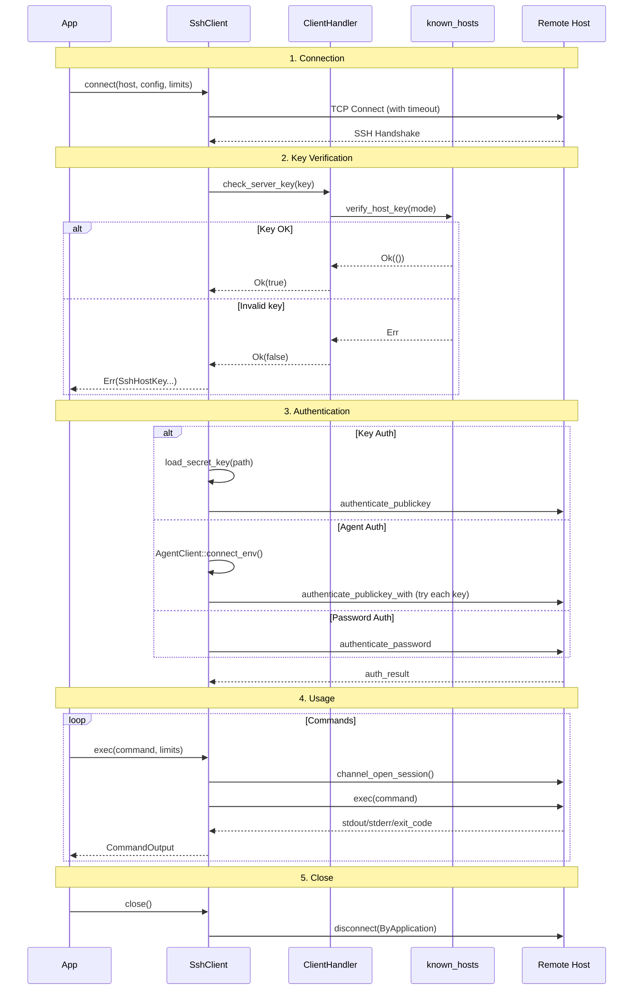

### 🔐 Authentication

| Mode | YAML Config | Description |
|------|-------------|-------------|
| **Key** | `type: key` | SSH key with optional passphrase |
| **Agent** | `type: agent` | Via `ssh-agent` (Unix only) |
| **Password** | `type: password` | Password (not recommended) |

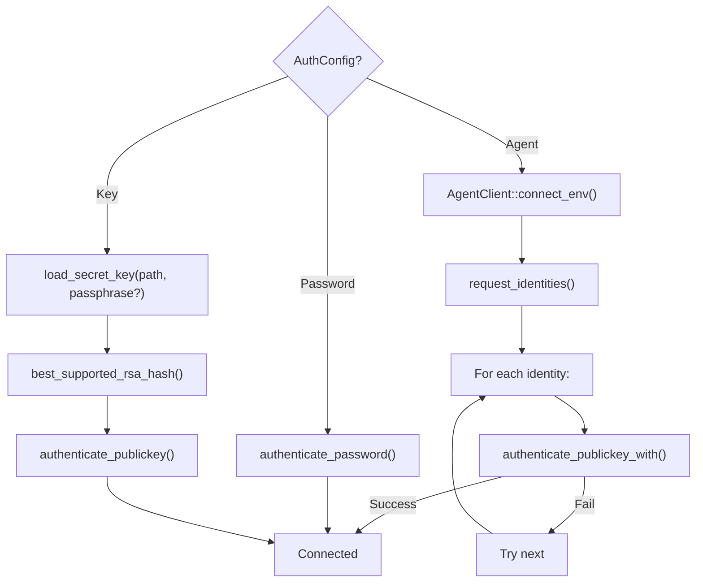

## 🔌 RealSshConnector (`connector.rs`)

Concrete implementation of the `SshConnector` and `SshClientTrait` ports using `SshClient`.

This adapter was moved from `src/ports/connector.rs` to keep the ports layer pure (traits only).

### 📋 Structure

- `RealSshConnector`: Zero-sized type implementing `SshConnector` trait
- `impl SshClientTrait for SshClient`: Delegates to `SshClient` methods

### 🔧 API

```rust
impl SshConnector for RealSshConnector {
    type Client = SshClient;
    async fn connect(&self, host_name: &str, host: &HostConfig, limits: &LimitsConfig) -> Result<SshClient>
    async fn connect_via_jump(&self, host_name: &str, host: &HostConfig, jump_host_name: &str, jump_host: &HostConfig, limits: &LimitsConfig) -> Result<SshClient>
}
```

## 🔄 ConnectionPool (`pool.rs`)

Connection pool for reusing established SSH connections.

### 📋 Structure

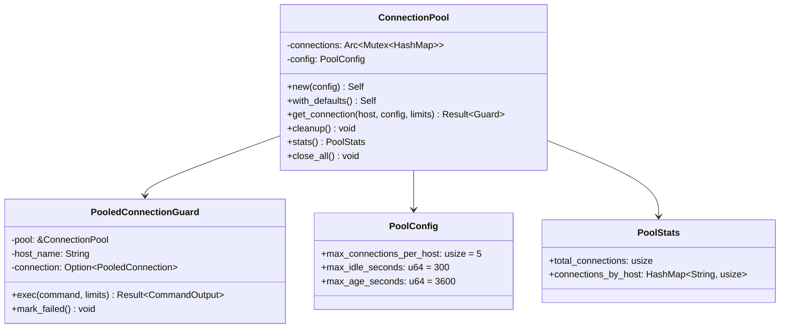

### 🛡️ Guard Behavior (RAII)

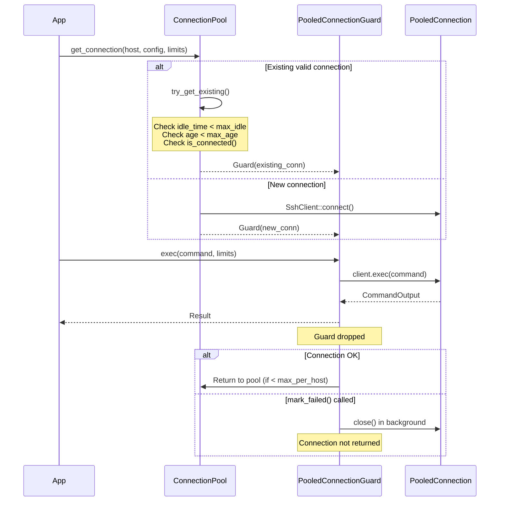

### ⚙️ Configuration

| Parameter | Default | Description |
|-----------|---------|-------------|
| `max_connections_per_host` | 5 | Max connections per host |
| `max_idle_seconds` | 300 (5 min) | Max inactivity |
| `max_age_seconds` | 3600 (1 hour) | Max connection age |

## 🔄 Retry Logic (`retry.rs`)

Retry with exponential backoff for transient errors.

### 📋 Structure

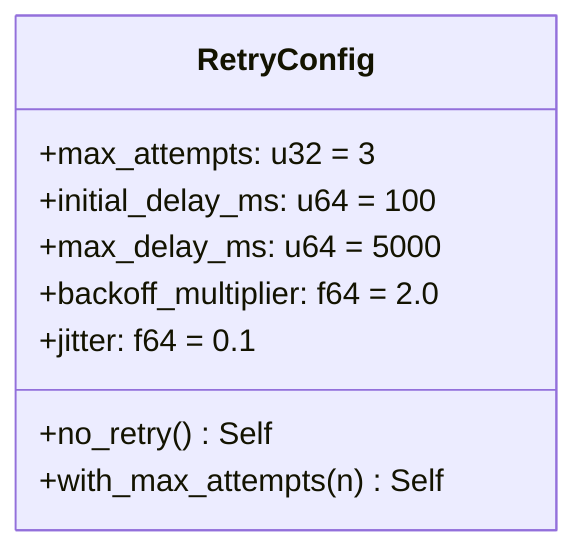

### ⏱️ Delay Calculation

```
delay = min(initial_delay * multiplier^(attempt-1), max_delay) +/- jitter
```

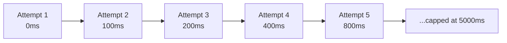

### ❌ Retryable Errors

```rust
pub fn is_retryable_error(error: &BridgeError) -> bool {
    match error {
        SshConnection { .. } => true,  // Connection lost
        SshTimeout { .. } => true,      // Timeout
        SshExec { reason } if reason.contains("channel") => true,
        SshExec { reason } if reason.contains("connection") => true,
        _ => false,  // Permanent errors (auth, config, etc.)
    }
}
```

### 🔧 API

```rust
/// Automatic retry of all errors
/// # Panics
/// If max_attempts == 0
pub async fn with_retry<T, E, F, Fut>(
    config: &RetryConfig,
    operation_name: &str,
    operation: F,
) -> Result<T, E>

/// Retry with custom predicate
/// # Panics
/// If max_attempts == 0
pub async fn with_retry_if<T, E, F, Fut, P>(
    config: &RetryConfig,
    operation_name: &str,
    operation: F,
    should_retry: P,  // |&E| -> bool
) -> Result<T, E>
```

### Usage Example

```rust
let output = with_retry_if(
    &config.limits.retry_config(),
    "ssh_exec",
    || async {
        let mut conn = pool.get_connection(&host, config, limits).await?;
        conn.exec(&command, limits).await
    },
    is_retryable_error,
).await?;
```

## 🏠 Known Hosts (`known_hosts.rs`)

Host key verification against `~/.ssh/known_hosts`.

### 🔧 API

```rust
/// Verifies a key against known_hosts
/// # Errors
/// If the file cannot be read
pub fn verify(hostname: &str, port: u16, key: &PublicKey) -> Result<VerifyResult>

/// Adds a key to known_hosts
/// # Errors
/// If the file cannot be written
pub fn add_key(hostname: &str, port: u16, key: &PublicKey) -> Result<()>

/// Returns the SHA256 fingerprint of a key
#[must_use]
pub fn fingerprint(key: &PublicKey) -> String

/// Verifies according to the configured mode
/// # Errors
/// If verification fails according to the mode
pub fn verify_host_key(hostname, port, key, mode: HostKeyVerification) -> Result<()>
```

### 🔒 Verification Modes

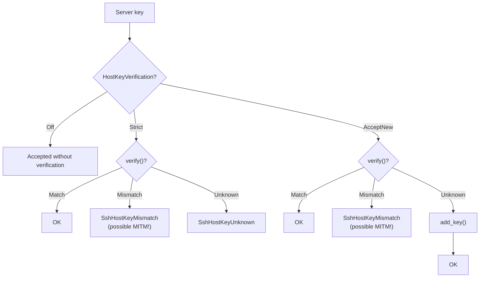

### 🔧 Troubleshooting

```bash
# "Unknown host key" in Strict mode
ssh-keyscan hostname >> ~/.ssh/known_hosts

# "Host key mismatch" (verify MITM first!)
ssh-keygen -R hostname
ssh-keyscan hostname >> ~/.ssh/known_hosts
```

## 🧪 Tests

```bash
# All SSH tests
cargo test ssh::

# By module
cargo test ssh::pool::tests
cargo test ssh::retry::tests
cargo test ssh::known_hosts::tests
```

### 📋 Available Tests

| Module | Tests |
|--------|-------|
| **pool** | `test_pool_config_default`, `test_pool_stats_empty`, `test_pool_cleanup_empty`, `test_pool_close_all_empty` |
| **retry** | `test_retry_config_default`, `test_retry_config_no_retry`, `test_delay_calculation`, `test_is_retryable_error`, `test_with_retry_*` |
| **known_hosts** | `test_verify_result_*`, `test_host_key_verification_*` |
| **session** | `test_session_manager_creation`, `test_parse_exec_output_*`, `test_list_empty`, `test_close_nonexistent`, `test_exec_nonexistent`, `test_cleanup_empty`, `test_close_all_empty` |

## 🎨 Design Patterns

| Pattern | Application |
|---------|-------------|
| 🏊 **Object Pool** | `ConnectionPool` reuses connections |
| 🛡️ **RAII Guard** | `PooledConnectionGuard` auto-returns to pool |
| 🔄 **Retry** | Exponential backoff with jitter |
| 🏭 **Factory** | `SshClient::connect()` |
| 🎯 **Strategy** | Key verification modes |

## 🏰 Jump Hosts (Bastion)

Support for SSH connections via a bastion server (jump host).

### ⚙️ Configuration

```yaml
hosts:
  bastion:
    hostname: bastion.example.com
    port: 22
    user: admin
    auth:
      type: agent

  prod-db:
    hostname: 10.0.0.5  # Private IP
    port: 22
    user: deploy
    proxy_jump: bastion  # Go through bastion
    auth:
      type: key
      path: ~/.ssh/id_ed25519
```

### How It Works

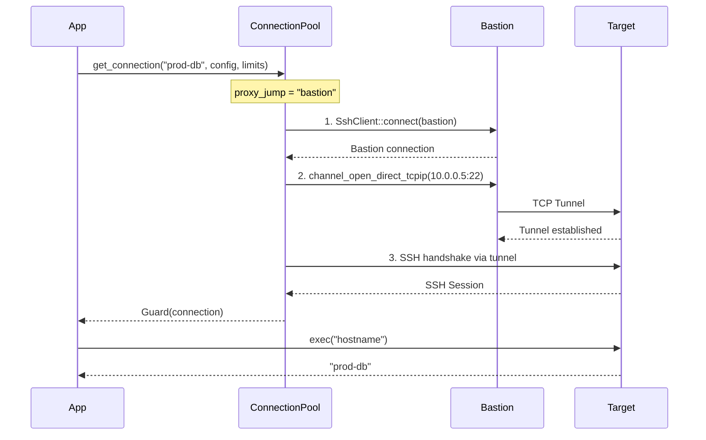

### Notes

- The `jump_client` is kept in `SshClient` to maintain the tunnel
- Connection uses `ChannelStream` which implements `AsyncRead`/`AsyncWrite`
- The pool automatically resolves jump host chains

## 📦 SessionManager (`session.rs`)

Manager for persistent interactive shell sessions on remote hosts.

### Principle

Sessions maintain state between commands: working directory (cwd), environment variables.
Each command is wrapped with markers to parse the exit code and cwd:

```rust
let wrapped = format!(
    "{command}\n__sshb_rc=$?\necho \"{begin_marker}\"\necho $__sshb_rc\npwd\necho \"{end_marker}\"\n"
);
```

### 🔧 API

```rust
impl SessionManager {
    /// Creates a new SessionManager
    #[must_use]
    pub fn new() -> Self

    /// Creates an interactive session on a remote host
    pub async fn create(&self, host: &str, config: &HostConfig, limits: &LimitsConfig)
        -> Result<SessionInfo>

    /// Executes a command in an existing session
    pub async fn exec(&self, session_id: &str, command: &str)
        -> Result<SessionExecResult>

    /// Lists all active sessions
    pub fn list(&self) -> Vec<SessionInfo>

    /// Closes a session
    pub async fn close(&self, session_id: &str) -> Result<()>

    /// Cleans up expired sessions (idle/age)
    pub async fn cleanup(&self)

    /// Closes all sessions
    pub async fn close_all(&self)
}
```

### 🔄 Lifecycle

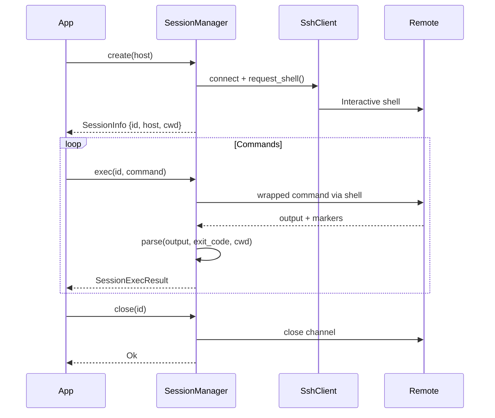

### Behavior

- **Thread-safe**: Uses `Arc<Mutex<...>>` for concurrent sharing
- **Automatic cleanup**: Expired sessions are closed (configurable `max_idle`, `max_age`)
- **Marker parsing**: Exit code and cwd are extracted from wrapped output
- **Non-persistent**: Sessions are lost on server restart

## 🧦 SOCKS Proxy

Support for SSH connections through a SOCKS4/5 proxy server (alternative to jump hosts).

### ⚙️ Configuration

```yaml
hosts:
  remote-via-proxy:
    hostname: 10.0.0.5
    port: 22
    user: deploy
    socks_proxy:
      hostname: proxy.example.com
      port: 1080          # Default
      version: socks5     # socks5 (default) or socks4
      username: proxyuser # Optional (SOCKS5 only)
      password: proxypass # Optional (SOCKS5 only)
    auth:
      type: key
      path: ~/.ssh/id_ed25519
```

### How It Works

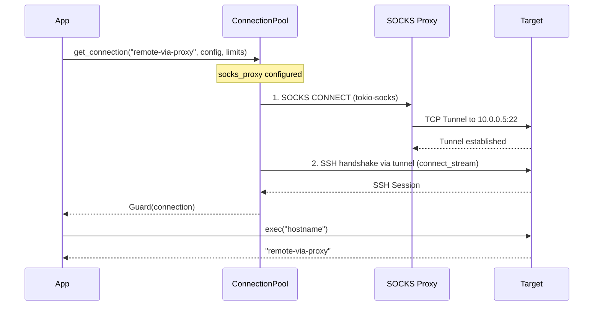

### Notes

- Uses `tokio-socks` crate for async SOCKS4/5 implementation
- The TCP stream from `Socks5Stream::into_inner()` is passed to russh's `connect_stream()`
- SOCKS5 supports optional username/password authentication
- `proxy_jump` and `socks_proxy` are mutually exclusive (validated at config load)

## ⚠️ Important Notes

> [!IMPORTANT]
> **Thread-safety**: `ConnectionPool` uses `Arc<Mutex<...>>` for sharing.

> [!IMPORTANT]
> **SSH Agent**: Works only on Unix via `SSH_AUTH_SOCK`.

> [!NOTE]
> **Timeout**: Configured via `LimitsConfig.connection_timeout_seconds` and `command_timeout_seconds`.

> [!NOTE]
> **Keepalive**: Automatically enabled via `keepalive_interval_seconds`.

> [!NOTE]
> **Jump Hosts**: Configured via `proxy_jump` in the target host config.

> [!NOTE]
> **SOCKS Proxy**: Configured via `socks_proxy` in the target host config. Mutually exclusive with `proxy_jump`.

> [!IMPORTANT]
> **Exit Code**: `read_command_output()` waits for `None` (channel close) and not `Eof` to correctly capture the SSH exit code.
