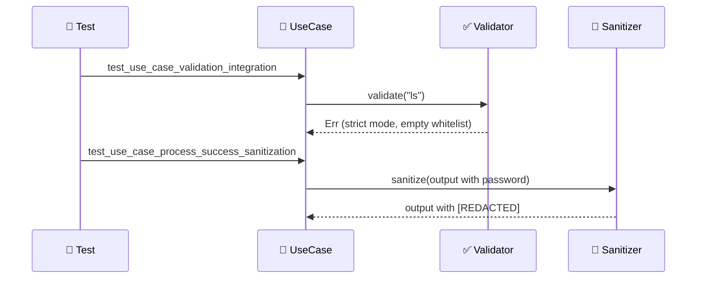
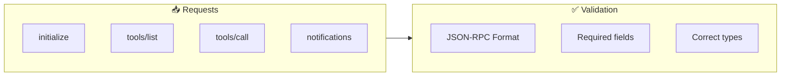
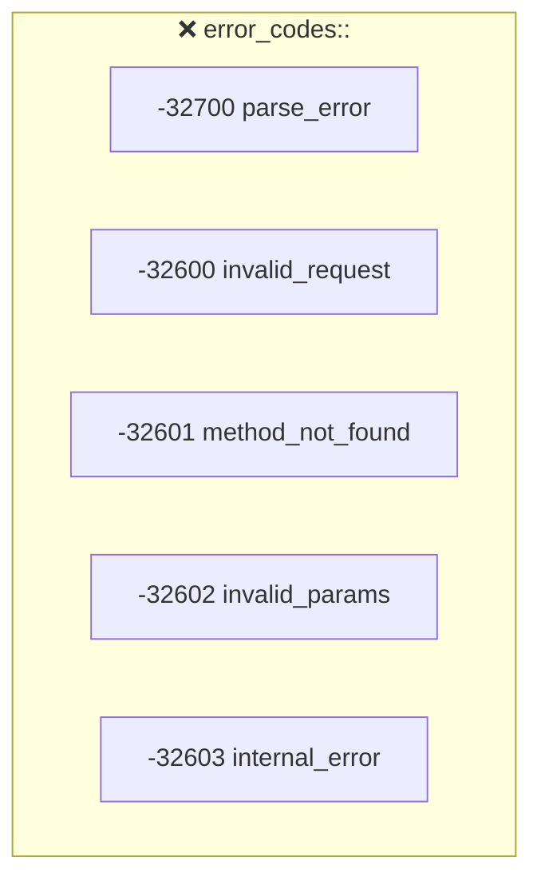
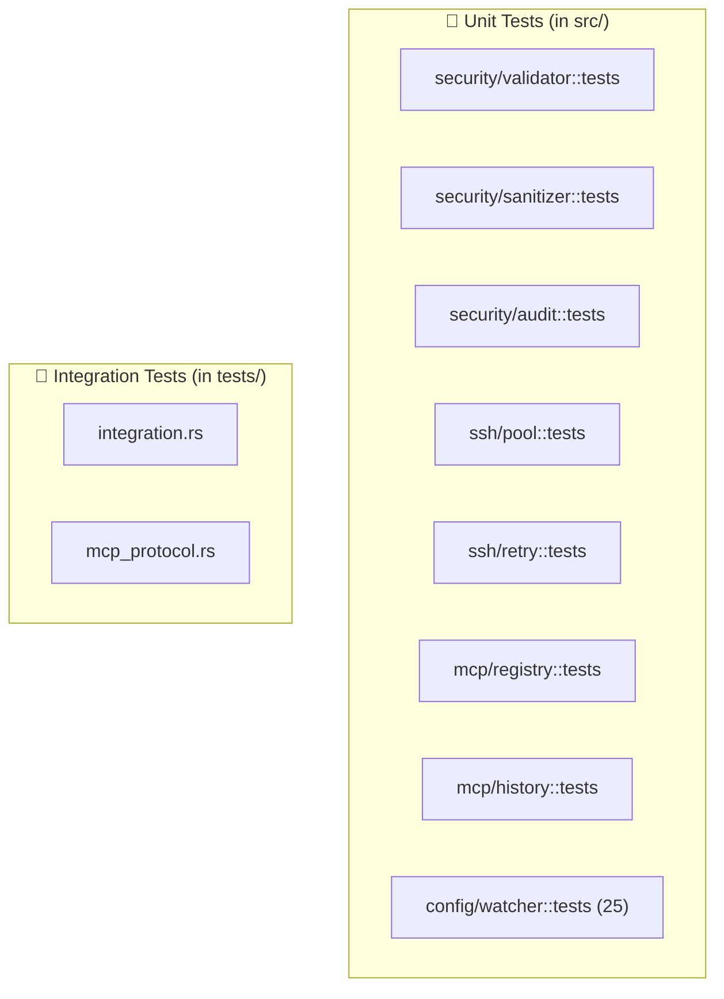

# 🧪 Integration Tests

Integration tests for MCP SSH Bridge.

## 📁 Structure

```
tests/
├── 📄 integration.rs              → General integration tests
├── 📄 mcp_protocol.rs             → MCP JSON-RPC protocol tests
├── 📄 ssh_integration.rs          → SSH connection integration tests
├── 📄 sftp_integration.rs         → SFTP file transfer tests
├── 📄 security_audit.rs           → Security audit tests
├── 📄 stress_tests.rs             → Concurrent stress tests (validation, sanitization, pool, sessions)
├── 📄 config_validation.rs        → Configuration validation tests
├── 📄 error_propagation.rs        → Error propagation and handling tests
├── 📄 output_cache_integration.rs → Output cache and pagination tests
├── 📄 tool_filtering.rs           → Tool group filtering tests
├── 📄 proptest_commands.rs        → Property-based command builder tests
├── 📄 snapshot_commands.rs        → Snapshot tests for command outputs (insta)
└── 📄 e2e_raspberry.rs            → E2E tests on Raspberry Pi (56 tests, 20 phases)
```

## 🚀 Execution

```bash
# All tests (unit + integration)
cargo test

# Integration tests only
cargo test --test integration
cargo test --test mcp_protocol

# With detailed output
cargo test -- --nocapture

# Specific test
cargo test test_security_config_modes
```

## 🏗️ Test Architecture

```mermaid
graph TB
    subgraph Tests["🧪 tests/"]
        INT["📄 integration.rs"]
        MCP["📄 mcp_protocol.rs"]
        SSH_INT["📄 ssh_integration.rs"]
        SFTP_INT["📄 sftp_integration.rs"]
        SEC_AUD["📄 security_audit.rs"]
        STRESS["📄 stress_tests.rs"]
        CFG_VAL["📄 config_validation.rs"]
        ERR_PROP["📄 error_propagation.rs"]
        OUT_CACHE["📄 output_cache_integration.rs"]
        TOOL_FILT["📄 tool_filtering.rs"]
        PROPTEST["📄 proptest_commands.rs"]
        SNAPSHOT["📄 snapshot_commands.rs"]
        E2E["📄 e2e_raspberry.rs"]
    end

    subgraph Tested["📦 Tested Modules"]
        CONFIG["⚙️ config/"]
        SECURITY["🔒 security/"]
        DOMAIN["💎 domain/"]
        PROTOCOL["📡 mcp/protocol"]
        HISTORY["📜 mcp/history"]
        SSH_MOD["🔑 ssh/"]
        HANDLERS["🔧 tool_handlers/"]
        REGISTRY["📋 mcp/registry"]
    end

    INT --> CONFIG
    INT --> SECURITY
    INT --> DOMAIN
    INT --> HISTORY

    MCP --> PROTOCOL
    SSH_INT --> SSH_MOD
    SFTP_INT --> SSH_MOD
    CFG_VAL --> CONFIG
    ERR_PROP --> DOMAIN
    OUT_CACHE --> DOMAIN
    TOOL_FILT --> REGISTRY
    PROPTEST --> DOMAIN
    SNAPSHOT --> DOMAIN
    E2E --> HANDLERS
```



## 📄 integration.rs

Integration tests for main components.

### 🔒 Configuration Tests

| Test | Description |
|------|-------------|
| `test_default_security_config` | Default security configuration |
| `test_security_config_modes` | Strict/permissive modes |
| `test_config_host_lookup` | Host lookup |
| `test_host_key_verification_config` | Verification modes |
| `test_limits_config_defaults` | Default limit values |
| `test_limits_config_retry_config_conversion` | Conversion to `RetryConfig` |
| `test_auth_config_variants` | Authentication variants |

### 💎 Domain Tests



| Test | Description |
|------|-------------|
| `test_use_case_validation_integration` | Validation via UseCase |
| `test_use_case_process_success_sanitization` | Output sanitization |
| `test_use_case_process_success_with_stderr` | Stdout + stderr handling |
| `test_use_case_process_success_nonzero_exit` | Non-zero exit code |

### 📜 History Tests

| Test | Description |
|------|-------------|
| `test_command_history_integration` | Recording and retrieval |
| `test_sanitizer_patterns` | Sanitization patterns |

## 📄 mcp_protocol.rs

MCP JSON-RPC 2.0 protocol tests.

### 📋 Format Tests



| Test | Description |
|------|-------------|
| `test_initialize_request_format` | `initialize` request format |
| `test_tools_list_request_format` | `tools/list` request format |
| `test_tools_call_request_format` | `tools/call` request format |
| `test_notification_format` | Notification format |

### ✅ Response Tests

| Test | Description |
|------|-------------|
| `test_response_validation_success` | Valid success response |
| `test_response_validation_error` | Valid error response |
| `test_response_validation_wrong_id` | Incorrect ID detection |

### ❌ Error Code Tests



| Test | Code | Description |
|------|------|-------------|
| `test_parse_error_response` | -32700 | Invalid JSON |
| `test_invalid_request_response` | -32600 | Malformed request |
| `test_method_not_found_response` | -32601 | Unknown method |
| `test_invalid_params_response` | -32602 | Invalid parameters |
| `test_internal_error_response` | -32603 | Internal error |

### 🔧 Tool Definition Tests

| Test | Description |
|------|-------------|
| `test_ssh_exec_tool_schema` | `ssh_exec` schema |
| `test_ssh_status_tool_schema` | `ssh_status` schema |

## ➕ Adding a Test

### Integration Test

```rust
// tests/integration.rs

#[test]
fn test_my_integration() {
    use mcp_ssh_bridge::config::SecurityConfig;
    use mcp_ssh_bridge::security::CommandValidator;

    let config = SecurityConfig::default();
    let validator = CommandValidator::new(&config);

    // Strict mode + empty whitelist = all denied
    assert!(validator.validate("ls").is_err());
}
```

### Protocol Test

```rust
// tests/mcp_protocol.rs

#[test]
fn test_my_format() {
    use serde_json::json;

    let request = json!({
        "jsonrpc": "2.0",
        "id": 1,
        "method": "my_method",
        "params": {}
    });

    assert_eq!(request["jsonrpc"], "2.0");
}
```

## 📄 e2e_raspberry.rs

End-to-end tests against a real Raspberry Pi (`192.168.1.51`). All tests are `#[ignore]` and require `--ignored` flag.

```bash
cargo test --test e2e_raspberry -- --ignored --test-threads=1
```

### Test Phases (20 phases, 56 tests)

| Phase | Group | Tests | Description |
|-------|-------|-------|-------------|
| 1 | Connection | 2 | SSH connect, command execution |
| 2 | File Transfer | 3 | Upload, download, sync |
| 3 | Sessions | 3 | Create, exec, list, close |
| 4 | Monitoring | 2 | Metrics, tail |
| 5 | Database | 1 | SQLite query |
| 6 | Backup | 2 | Create, list |
| 7 | Security | 2 | Blacklist, sanitization |
| 8 | Docker | 1 | Docker ps (optional) |
| 9 | Git | 2 | Status, log |
| 10 | Output | 2 | Save/fetch output cache |
| 11 | Systemd | 3 | Service status, list, logs |
| 12 | Network | 6 | Connections, interfaces, routes, ping, traceroute, dns |
| 13 | Process | 2 | Process list, top |
| 14 | Package | 2 | Package list, search |
| 15 | Cron | 1 | Cron list |
| 16 | Certificates | 3 | Cert check, info, expiry |
| 17 | Firewall | 2 | Firewall status, list |
| 18 | Nginx | 3 | Status, test, list sites |
| 19 | Redis | 2 | Info, keys |
| 20 | Security validation | 5 | Input injection rejection |

## 🧪 Unit Tests

Unit tests are in each source module (`#[cfg(test)]`).



| Location | Type | Command |
|----------|------|---------|
| `src/**/*.rs` | Unit | `cargo test` |
| `tests/*.rs` | Integration | `cargo test --test integration` |

## 📊 Coverage

```bash
# With cargo-tarpaulin (if installed)
cargo tarpaulin --out Html

# Open target/tarpaulin/tarpaulin-report.html
```

## 🎨 Best Practices

| Practice | Description |
|----------|-------------|
| 🔬 Isolation | Each test is independent |
| 📝 Descriptive names | `test_<what>_<condition>_<expected>` |
| ✅ Clear assertions | One assert = one verification |
| 🧹 No side effects | Don't modify global state |
